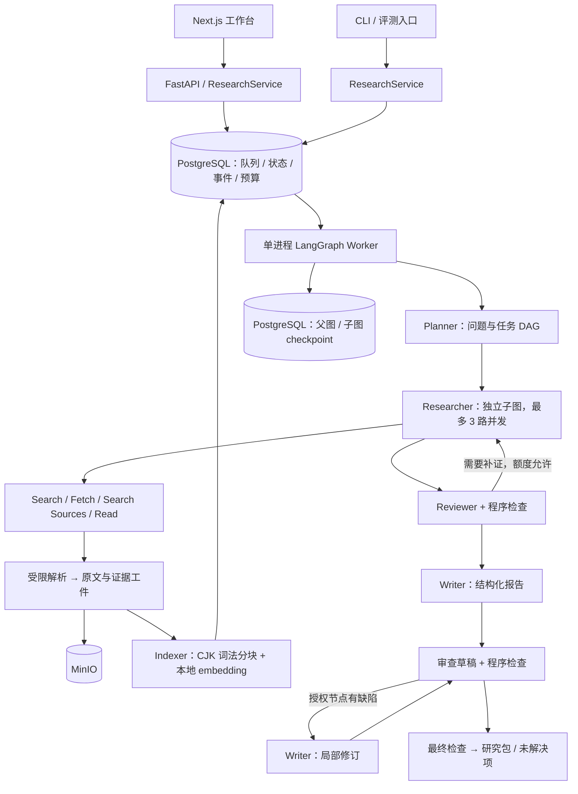

# Deep Research Agent · 可追溯的多 Agent 研究工作台

面向需要比较技术方案、产品或研究方法的工程师与研究人员：输入研究问题、约束和参考资料，系统规划任务、阅读原文、整理证据、审查结论并生成可点击引用的研究报告。主验收场景是**中文技术知识库的关键词／向量／混合检索与重排选型**。

项目重点是 Agent 应用工程：如何在多个模型调用、工具失败、预算限制和进程中断下交付一份可检查的研究包。它不是搜索结果的拼接器，也没有自动执行论文代码。

**当前状态：V1 工程闭环已实现，真实 API 联调已接通。** 四角色协作、证据版本、持久化恢复、调用预算、两租户隔离、工作台和评测入口均可运行。真实研究仍会产生 `needs_review` 报告；准确率、多 Agent 收益和大规模保留集质量实验尚未完成。后端单元／集成测试、真实浏览器测试及合成流程评测均保留为可重复入口。实现与实测边界见 [验证结果](docs/verification-results.md)。

仓库正在向 V2 的“论文工作编排器”演进：自由输入会先编译为 `ResearchIntent`，再按 Introduction、Related Work、Method、Experiment 等模块选择方法和交付物；模块区分最终交付与内部支撑，并通过依赖 DAG 协作。设计边界与迁移顺序见 [Research Agent V2 设计](docs/research-agent-v2-design.md)。旧模板字段暂时保留用于 API 和历史运行兼容。

## 1. 能做什么

三个模板共用一个研究引擎，差异体现在 brief、来源偏好、审查标准和报告结构。

| 模板 | 典型输入 | 主要输出 |
|---|---|---|
| `technical_comparison` | 比较检索方法，关注错误码、语义改写、长文档和成本 | 比较矩阵、适用条件、推荐依据、反证、未知项与验证建议 |
| `paper_review` | 上传文本型 PDF，或提供论文／实验报告 URL | 问题与贡献、方法原理、实现流程、实验设计、结果解释、局限与研究建议 |
| `general_research` | 带范围、时间或来源约束的研究问题 | 问题拆解、证据支撑的解释、分歧、结论和待解决项 |

论文研读区分**作者陈述、系统推断和待验证假设**。研究建议包含动机、假设、实验、基线、指标、预期信号和失败风险；新颖性标为未验证，实验状态为 `not_executed`。默认最多补充 3 个非种子来源。论文中的实验数字是作者报告值，不能当作本项目复现结果。

输入支持公开 HTML、Markdown、文本型或扫描型 PDF 和上传文件。PDF 默认异步使用本地 Docling + RapidOCR 增强解析，超时会返回可轮询的 upload ID；失败时回退 pdfplumber。输出研究包包含报告 AST／Markdown、Claim、EvidenceSpan、SourceVersion、配置与来源哈希、质量状态及未解决项。工作台能查看计划、任务、来源原文、PDF 页、引用片段、解析／索引状态、研究建议、事件和费用。

## 2. 架构与执行流程



代码采用模块化单体，API、Worker、Parser 和 Web 是独立进程；没有在 V1 引入 Temporal、Kubernetes 或参考仓库运行依赖。

| 组件 | 实现与边界 | 主要代码 |
|---|---|---|
| Planner | 生成结构化问题、任务与依赖；Pydantic 验证 DAG、数量和字段 | `graph.py`、`contracts.py` |
| Researcher | 每任务独立状态与消息，先在授权来源内混合检索，再执行有界 `search`、`fetch`、`search_sources`、`read_source` 循环并抽取 claim | `graph.py`、`retrieval.py` |
| Reviewer | 检查支持关系、覆盖、冲突、来源独立性及论文解释；输出补证任务或报告修改位置 | `graph.py` |
| Writer | 用已接受证据写 AST；局部修订只能替换授权节点，保留其他稳定 ID | `graph.py`、`evidence.py` |
| ModelProvider / Gateway | DeepSeek 适配、协议字段保留、schema 校验、有限重试、调用计量与预留 | `providers.py`、`gateway.py` |
| ContextBuilder | 固定 brief 和约束，按角色选入证据工件，记录省略项和保守大小估计 | `context.py`、`graph.py` |
| ResearchService | API、CLI、评测共用的运行创建、上传、读取和导出入口 | `service.py` |
| 执行与存储 | 队列、租约、fence、预算、事件、RLS、父子图 checkpoint、私有对象 | `db.py`、`checkpoints.py`、`worker.py`、`storage.py` |

### Workflow 与 harness 分别是什么

**Workflow** 是研究步骤和状态转移：intake → plan → research → review → gaps／write → patch／publish。任务依赖满足后才能派发；补证、修订和并发均受上限约束。Reviewer 的建议不是执行命令，确定性调度器检查权限、数量、依赖和剩余额度后才执行。

**Harness** 是包围 Agent 的执行设施，在本项目中由多个模块共同实现：输入契约、工具白名单、预算预留、超时与重试、状态持久化、任务验收、事件、证据检查和评测入口。它决定模型可以做什么、什么时候停止、失败如何保留结果；不是一个额外的“万能 Agent”。

结构检查在报告审查和发布时共用：模型遗漏表格单元格引用时，程序将其转为具体节点的修订要求。额度或轮数耗尽后仍有缺陷，就交付 `needs_review` 和未解决项，不把失败隐藏成完整结论。

## 3. Memory、上下文与缓存

本项目没有把“聊天历史”“数据库持久化”和“长期语义记忆”混为一谈。

| 层次 | V1 实际保存／使用的内容 | 生命周期与用途 |
|---|---|---|
| 短期工作记忆 | 当前任务、已读范围、工具消息、候选 URL、研究进度、当前审查和草稿 | run／Researcher 子图状态；通过 checkpoint 支持恢复 |
| 模型上下文 | 固定 brief／用户约束、角色任务、任务状态、精选证据、必要工具历史 | 每次请求重新装配；模型只能看到当次被选入的内容 |
| 持久化研究记忆 | 原文、解析版本、claim／span、finding、报告版本、上下文快照、调用账本和事件 | PostgreSQL + MinIO；运行结束后保留，可审计、回读和导出 |
| 跨 run 资料复用 | 同租户上传／来源 ID，可在新 brief 的 `upload_ids` 中显式引用 | 显式复用原文资料；不自动把旧报告结论当成新证据 |
| 文档语义检索 | PostgreSQL FTS + pgvector；CJK 双字 token、精确标识符、768 维本地 embedding、RRF 与重叠去重 | 同租户、当前任务授权来源内发现段落；检索 hit 不是证据 |
| 长期 Agent 记忆 | **尚未实现**用户画像、自动跨 run 记忆写回、遗忘与冲突合并 | 本项目的文档检索不等于 Mem0／Letta 一类长期记忆 |

### 上下文怎样控制

1. 完整原文保存到对象存储，不反复塞进全部 Agent 消息。
2. 固定 brief、用户约束和任务目标优先保留；Planner／Reviewer／Writer 使用不同的证据输入。
3. Researcher 在最多 24 个任务授权来源中先做词法／向量混合检索，再按 source ID 和字符范围回读命中前后原文；检索结果明确标记 `evidence=false`，不能直接生成 Claim。
4. claim 与其 span 成组进入可选工件，避免主张和引用分离；未选入审查请求的主张不得被接受。`evidence` 策略选入证据工件；`full` 策略按稳定顺序尝试装入完整来源，两者受相同输入上限约束。省略记录在 `ContextSnapshot`，原工件仍保留。
5. 大小检查使用 **UTF-8 字节保守上界**，不是供应商 tokenizer。默认请求上界 64k，并为 system、schema 与序列化预留空间。固定内容本身超限时明确停止并保留部分结果。

这属于应用侧上下文筛选和重建，V1 没有递归 LLM 摘要，也没有修改模型 KV cache。DeepSeek 服务端缓存由供应商实现，分别记录 `cache_hit_tokens`／`cache_miss_tokens`；不能把缓存命中解释为本项目压缩带来的收益。

原文仍在不代表模型一定理解或记住：检索遗漏、选段错误、忽略否定条件和抽取失真都可能发生。上下文快照提供定位依据；质量影响与省略比例需要在明确样本上测量。

## 4. 证据链如何实现

```text
ReportNode / table cell
        ↓ claim_ids / cell_claim_ids["0.列名"]
Claim（原子主张、立场、局限）
        ↓ span_ids
EvidenceSpan（source_id、parsed_hash、start/end、quote_hash、page/bbox）
        ↓
SourceVersion（原文字节哈希、解析版本、私有对象 key、来源地址）
```

- Tavily 摘要用于发现 URL，报告事实要引用实际获取的原文。
- 抓取保存不可变原始文件和解析 JSON。来源 ID 包含租户、内容、解析器版本与来源标识，解析器升级不会覆盖旧证据。
- 原文按可定位 block 划分为最多约 800 字符的候选 passage。模型选择 `passage_id`；**程序从原文复制 quote 并绑定字符偏移**，避免模型凭记忆重写“引文”。
- 发布时检查来源版本、偏移、quote 哈希、claim 引用、accepted-claim 状态、表格单元格引用及数字存在性。Reviewer 另外检查语义支持关系。
- PDF 提供页码和提取到的 block／table bbox；文本片段精确对应解析文本。页面 bbox 可能覆盖整页，不能宣称每个引用都有精确到词的视觉框。
- 同域来源或字节相同的跨域副本保守合并为来源组；尚无语义近重复检测。

**可定位不等于逻辑支持。** 一段真实原文可能并不支持 claim 的附加从句；数字存在也不代表实验条件一致。自动门禁不是事实认证，界面保留 `needs_review` 和人工核验入口。

PDF 的 `auto` 模式优先使用完全本地的 Docling、RapidOCR、TableFormer、公式 enrichment 和 SmolVLM 图片描述，并保存 extraction method、置信度、页码、bbox 与视觉 crop；模型生成的图片描述只按 `system_inferred` 使用。增强解析不可用时回退 pdfplumber 并明确标记。解析能力仍不等于论文代码执行，低置信度 OCR／公式引用必须人工视觉确认。

## 5. 可靠性、预算和隔离

### 恢复与幂等

- PostgreSQL 持久化队列；全局最多 1 个活跃 run，等待队列最多 10 个。Worker 每 10 秒续约，租约 45 秒。
- 每次领取产生递增 fencing token；业务结果和 LangGraph checkpoint 写入均检查当前租约与 token，旧 Worker 不能覆盖新结果。
- 父图和每个 Researcher 子图均持久化。稳定 logical action key 使恢复复用已提交模型／工具结果；未知外部结果保留预留，无法保证供应商侧 exactly-once。
- 创建 API 要求 `Idempotency-Key`：同租户、同 key、同请求复用原 run；同 key 不同请求返回冲突。
- 取消先持久化并使旧 fence 失效，再停止派发／接受结果。浏览器断线不等于取消；无法承诺供应商正在处理的请求立即停止计费。
- `interrupted` 可恢复，累计预算和时间不重置。代码指纹不匹配会在调用模型前中断，需使用原构建恢复或创建新 run。
- 报告节点 ID 稳定，修订保存新草稿，原草稿不可覆盖；当前 UI 主要显示最终研究包，尚无完整可视化版本 diff。
- SSE 用持久化 seq、`Last-Event-ID`／`after_seq` 补读，客户端按 seq 去重。

执行状态（如 `completed`）、停止原因（如 `budget:tokens`）和质量状态（`passed`／`needs_review`／`unchecked`）独立保存。`completed` 只表示本次执行终止，不保证质量通过。合成报告标为 `unchecked`。

### 默认开发 profile

| 限制 | 默认值 |
|---|---:|
| Researcher 并发／累计任务 | 3／8 |
| 补证／局部修订 | 最多各 2 轮 |
| 搜索／全部工具／模型调用 | 12／80／40 |
| 单任务工具／搜索 | 12／3（B0 可使用全局额度） |
| 累计输入＋输出 token | 250,000 |
| 时限／单 run 费用 | 20 分钟／$2 |
| 单动作重试 | 最多 2 次，重试也计入额度 |
| 结构化初始输出上限／截断后最高上限 | 16,384／32,768 token，包含 thinking 消耗 |
| 初次 live campaign | 累计 $10，包含未结算预留 |

模型、工具调用前用数据库事务原子预留，返回后按实际用量结算；20% 的费用、模型次数和累计 token 配额留给写作／验证。缺少费用结果时保留预留。到达上限可生成部分研究包，并披露未完成项。

费用按配置价格估算；Tavily 按单次搜索保守估价，DeepSeek 根据返回用量区分缓存。估算不是供应商账单，也不是金融结算系统。$10 上限是本地账本控制，不能约束这个 API Key 在其他项目中的使用。

### 隔离与安全边界

运行时 PostgreSQL 角色没有 BYPASSRLS，业务表及 checkpoint 强制 RLS；API 身份决定租户，不接受请求体自选租户。两个测试租户覆盖运行、文件、来源、证据、事件和 checkpoint 授权。MinIO 使用私有桶和租户对象命名空间，访问必须经过应用鉴权。

抓取只允许 HTTP(S) 公网地址和 80／443 端口，检查全部 DNS 结果并固定连接 IP，每次重定向重新检查；限制响应大小、类型和超时。Parser 在 Compose 内部网络、受限子进程及只读文件系统中运行，不配置模型、数据库或对象存储密钥。本地进程开发模式没有容器网络隔离。

工作台通过服务端代理访问 API，租户 Key 使用 HttpOnly／SameSite cookie；来源作为不可信文本渲染，PDF 用本地 worker 绘制。HTML 原文下载采用附件和 sandbox 头。提示注入不能获得额外工具权限，但模型仍可能被内容误导，因此保留证据审查和未解决项。

这是可验证的本地多租户 V1，不是已通过生产合规认证的 SaaS。SSO、企业连接器、对象 GC、任意旧 checkpoint 迁移和跨集群调度尚未实现。

## 6. 首次运行：Docker Compose（推荐）

需要 Git、Docker Engine／Docker Desktop 和 Compose v2。Docker 运行路径无需在主机安装 Python／Node；会拉取镜像和锁定的依赖。以下命令均在本仓库根目录执行，含空格路径必须加引号。

```sh
cd "/path/to/deep-research-agent"
git switch research-blueprint-v1

# 已有 .env 时保留，不覆盖已填写的密钥。
if [ ! -f .env ]; then cp .env.example .env; fi
chmod 600 .env

# 首先验证不消耗 API 额度的合成流程。
RESEARCH_MODE=fixture docker compose up --build -d

# 首次生成两个本地测试租户；只把输出写入本机私有文件。
umask 077
mkdir -p .local
if [ ! -s .local/test-tenants.jsonl ]; then
  docker compose run --rm -T migrate research seed > .local/test-tenants.jsonl
fi
chmod 600 .local/test-tenants.jsonl
```

打开 **<http://localhost:13000>**，从本机 `.local/test-tenants.jsonl` 选择一条记录的 `api_key` 登录。这里使用的是 **本项目租户 Key**，不是 DeepSeek 或 Tavily Key。文件不纳入 Git；不要上传到 issue 或截图公开。`research seed` 再次运行会新增有效密钥，不是无副作用的读取命令。

在页面选择“技术方案比较”，输入研究问题并开始研究。fixture 报告明确显示 `SYNTHETIC`，证明组件协同工作；合成内容不应作为选型依据。

| 服务 | 本机地址 |
|---|---|
| 工作台 | http://localhost:13000 |
| API / OpenAPI | http://localhost:18000 / http://localhost:18000/docs |
| PostgreSQL | localhost:15432 |
| MinIO API / Console | http://localhost:19000 / http://localhost:19001 |
| Parser / Embedding | 只在 Compose 内部网络访问 |

Compose 自动先执行迁移。数据库和对象存储使用 `research-agent-v1` 专属命名卷；`docker compose down` 保留数据，`down -v` 会删除本项目卷。默认数据库／MinIO 凭证只用于回环地址上的本地开发，不应原样暴露到公网。

### 配置真实 DeepSeek／Tavily

在 `.env` 填写：

```dotenv
RESEARCH_MODE=live
DEEPSEEK_API_KEY=<your-deepseek-key>
TAVILY_API_KEY=<your-tavily-key>
DEEPSEEK_BASE_URL=https://api.deepseek.com
DEEPSEEK_MODEL=deepseek-flash
DEEPSEEK_THINKING=enabled
DEEPSEEK_EFFORT=low
LIVE_CAMPAIGN_USD=10
```

价格配置在 `.env.example` 的 `MODEL_*_USD_PER_MILLION` 和 `SEARCH_USD_PER_CALL`。先核对账号可用模型及当前价格再开始实验；新 run 保存配置快照，恢复不会悄悄切到新模型／价格。供应商消息协议参考 [DeepSeek thinking mode](https://api-docs.deepseek.com/guides/thinking_mode/)。

```sh
# API、Worker、Parser 必须使用同一版后端代码。
RESEARCH_MODE=live docker compose up --build -d api worker parser web
docker compose run --rm -T migrate research doctor
curl --fail http://localhost:18000/health
```

`doctor` 只显示是否已配置，不打印密钥、不调用付费 API。运行中缺少密钥会明确失败，**没有自动切换 fixture 的兜底**。真实联调通过下一节的 `smoke_live.py` 控制为每次最多 $0.50。

## 7. 本地独立开发环境

版本基线：Python 3.12（当前验证 3.12.14）、uv 0.12.13、Node.js 22、pnpm 10.28.2。后端锁为 `uv.lock`，前端锁为 `apps/web/pnpm-lock.yaml`；Dockerfile 固定 Python／Node 基础镜像摘要。不要只按 `pyproject.toml` 的范围重新解依赖。

```sh
# 已安装 uv；自动创建／复用仓库内 .venv。
uv sync --extra dev --frozen
source .venv/bin/activate
research doctor

# Node 22 安装完成后，使用项目声明的 pnpm 版本。
corepack enable
cd apps/web
pnpm install --frozen-lockfile
pnpm run prebuild
cd ../..
```

`prebuild` 把 PDF.js worker 复制到本地 public；首次热开发也需运行一次。退出 Python 环境使用 `deactivate`。依赖安装仅写入本项目 `.venv`／`node_modules`，不向系统 Python 安装项目包。

先避免与 Compose 的 API／Worker／Web 争用端口，然后启动基础设施：

```sh
docker compose stop api worker web
make infra
make migrate
```

三个终端均从仓库根目录运行：

```sh
make api
```

```sh
make worker
```

```sh
make web
```

使用 `.env` 的 `RESEARCH_MODE`。切换模式后重启 API 和 Worker；仅修改文件不会更新已启动的进程。若主机端口改动，同步修改 `.env`、Compose 端口和前端内部 API 地址，避免连接到其他项目数据库。

## 8. API、CLI 与运行产物

API 除 `/health` 和文档外使用 `Authorization: Bearer <tenant-api-key>`。接口契约以运行中的 OpenAPI 和 `contracts.py` 为准。

| 接口 | 用途 |
|---|---|
| `POST /research-runs` | 创建；必需 `Idempotency-Key`，body 为 `CreateRun` |
| `GET /research-runs`、`GET /research-runs/{id}` | 运行列表、计划／任务／审查／来源／上下文摘要 |
| `POST /research-runs/{id}/cancel`、`/resume` | 取消、恢复中断运行 |
| `POST /uploads` | multipart `file` 上传，返回来源版本 |
| `GET /sources/{id}`、`/raw` | 解析文本和原始工件 |
| `GET /evidence-spans/{id}` | 精确证据及定位信息 |
| `GET /research-runs/{id}/events` | SSE；支持 `after_seq` 和 `Last-Event-ID` |
| `GET /research-runs/{id}/usage` | 调用结果、用量、重试和诊断元数据 |
| `GET /research-runs/{id}/report` | 默认 JSON；`format=markdown` 导出；可指定已保存研究包的 revision |

`evals/smoke-paper.json` 是可直接提交的 `CreateRun` 示例。CLI 不依赖 Web，需在进程环境安全配置 `RESEARCH_API_KEY`：

```sh
research submit evals/smoke-paper.json
research worker --once
research evaluate --help
```

提交只入队，需要 Worker 执行；不要与常驻 Worker 同时使用独立评测／smoke 执行器。模型供应商的 Key 和租户 Key 是两套不同权限。

原文／解析件在 MinIO，状态与版本在 PostgreSQL；不是仅存在本地目录。以下目录是测试和评测导出的可检查副本，默认 Git 忽略：

```text
artifacts/live/                 # 真实 smoke：研究包、Markdown、metrics
artifacts/fixture-evaluation/   # 合成基线／消融：JSONL 与研究包
artifacts/recovery/             # 真实进程中断实验记录
artifacts/ui/                   # 浏览器验证截图
.local/test-tenants.jsonl       # 本地租户凭证，禁止公开
```

## 9. 测试、联调和评测复现

### 后端与故障测试（不消耗 API 额度）

安装 `dev` 依赖，启动 PostgreSQL／MinIO 并完成迁移。停止常驻 Worker、结束本地 Worker，并确保没有正在执行或排队的研究，避免争用全局单活跃槽位。

```sh
docker compose stop worker
make infra
make migrate
make test                       # 不需要真实服务的单元测试
make integration                # 全套，使用真实 PostgreSQL / MinIO
.venv/bin/ruff check src migrations tests scripts
```

集成测试创建随机独立租户并清理自己的数据库行，不清空已有研究。对象存储可能保留无数据库引用的测试对象，V1 尚无自动 GC。

故障覆盖包括：真实 Worker SIGKILL、旧 fence／迟到提交、原子预算竞争、429／超时／非法 JSON、跨租户读写、SSE 补读、SSRF 重定向、源文解析和局部修订。恢复测试由管理员注入租约过期以缩短等待，不能把测试耗时说成真实故障检测时延。

### 浏览器验证（完整 fixture 栈）

```sh
.venv/bin/python scripts/create_demo_pdf.py
RESEARCH_MODE=fixture docker compose up --build -d
cd apps/web
pnpm exec playwright test
pnpm build
cd ../..
```

测试读取本地租户文件，覆盖创建研究、证据定位、Markdown 下载、会话恢复和移动端 PDF。默认使用 macOS 已安装的 Chrome；Linux／Windows 请设置 `CHROME_PATH` 为可执行文件路径。不要对 live 模式运行这些创建研究的 UI 测试。CI 当前执行后端套件与前端生产构建，浏览器端到端测试需按以上命令运行。

### 24 次合成流程／消融验证

```sh
docker compose stop worker
.venv/bin/python scripts/evaluate_fixtures.py
```

该脚本使用第二个测试租户，执行 B2 的全部 20 个开发 briefs，再各跑一次 B0、B1、B2 串行、B2 全文策略。无需供应商 API Key，结果明确为合成；调用数和时延只验证评测工具，不代表真实 Agent 的质量或性能。

### 真实小规模联调（消耗 API 额度）

配置两家供应商 Key、保留种子租户文件，队列空闲后运行：

```sh
docker compose stop worker
.venv/bin/python scripts/smoke_live.py
.venv/bin/python scripts/smoke_live.py evals/smoke-paper.json
```

每个 smoke 上限 $0.50，纳入 $10 campaign；脚本输出 run ID、进度、用量和产物位置，失败也记录已知用量。它们使用实时网络资料，不是控制变量实验。完成独立测试后恢复常驻服务：

```sh
RESEARCH_MODE=live docker compose up -d api worker
```

### 真正的质量对照

`evals/dev.json` 有 20 个开发 briefs，`evals/heldout.json` 有 10 个保留 briefs，覆盖三个模板。保留集不参与提示词调优。B0 是单 Researcher，B1 是无全局补证的多 Researcher，B2 是完整系统；同模型、同来源快照、同总额度比较，并消融并发和上下文策略。

```sh
# local-source-urls.txt 是自行准备的 URL 列表，每行一条。
research freeze evals/local-source-urls.txt --output artifacts/corpus.json
research evaluate --live --corpus-manifest artifacts/corpus.json --split dev --variant B0 --limit 1
research evaluate --live --corpus-manifest artifacts/corpus.json --split dev --variant B2 --limit 1
```

冻结语料保留哈希和租户来源 ID，所有实验臂使用相同 manifest；冻结搜索使用同一确定性词项匹配实现，不调用实时 Tavily 排名。默认 `evaluate` 不带 `--live` 时为 fixture。完整方案、人工评分表和限制见 [evals/README.md](evals/README.md)。

质量指标需人工核验，未评分的 citation precision、事实支持率、论文解释准确性和研究建议可操作性保持 `null`。报告“带引用比例”不能冒充“引用正确率”，也不能用合成实验得出多 Agent 优于单 Agent 的结论。

## 10. 排障与可复现边界

| 现象 | 检查与处理 |
|---|---|
| 登录失败 | 使用本项目租户 Key；检查 API 和数据库，不要把 DeepSeek Key 填入工作台 |
| 一直 queued | Worker 是否启动、是否有另一个活跃 run；查看运行详情与 `docker compose logs --tail=80 worker` |
| `runtime_version_mismatch` | 同步构建 API／Worker；旧 run 用原构建恢复，或创建新 run；不要修改数据库指纹绕过 |
| 报告 `needs_review` | 查看 unresolved 和具体检查原因；这不是页面错误，可能是证据不足或额度耗尽 |
| PDF 解析失败／没有正文 | 确认是文本 PDF，查看 source warnings；扫描件或复杂布局需人工整理后重新上传 |
| token 超限／结构化截断 | 查看 usage 的 finish_reason、重试和上下文快照；thinking 也消耗输出额度，缩小研究范围优先于无限重试 |
| 未知费用预留未归零 | 有超时／中断请求尚不能确认是否计费；保留并人工对账，不能作为免费调用处理 |
| 端口占用 | 不要同时启动 Compose 与本地同端口服务；检查 13000／18000／15432／19000 |

“可复现”指可重建环境、运行工作流、检查原文与调用记录，并以冻结语料和配置复做实验。实时网页、搜索排序和模型采样会变化，不能保证报告逐字一致。保存 run ID、代码指纹、模型／价格配置、语料哈希、依赖锁和命令；本机私有工件没有随 Git 分发，需要按步骤重新生成。

## 11. 仓库导航与进一步阅读

```text
src/research_agent/   领域契约、Agent 图、工具／模型网关、存储、服务、评测
apps/web/            Next.js 工作台、同源代理、PDF 查看、浏览器测试
migrations/          PostgreSQL 领域迁移
infra/docker/        镜像与本地数据库初始化
compose.yaml         本地完整栈
scripts/             真实 smoke、合成评测、演示 PDF
tests/              单元、集成、故障和回归测试
evals/               开发／保留 briefs、实验协议与论文 smoke 输入
docs/                蓝图、开发日志、验证记录、运行手册、面试深挖
```

- [架构蓝图](docs/deep-research-agent-blueprint.md)：第 1.3 节定义 V1，其余包含长期路线；不要把路线图当成已交付功能。
- [开发日志](docs/development-log.md)：区分实际发生、故障注入、代码检查和待验证风险；保留 run／trace 与复测结果。
- [验证结果](docs/verification-results.md)：实际测试、真实联调、预算和未完成实验。
- [本地运行手册](docs/runbooks/local-development.md)：环境、部署、恢复、演示和可观测性。
- [面试深挖](docs/interview-deep-dive.md)：原始设计依据、开发问题、事后实验结论分别陈述。

## 参考项目

| 项目 | 参考重点 | 本次材料范围 |
|---|---|---|
| [HelloAgents](https://github.com/datawhalechina/hello-agents/tree/4f7682ceafe573d07cd8a7d0b89908500e83227d) | TODO 任务拆解、独立任务上下文、笔记交接、进度事件 | 第 14 章文档及对应实现 |
| [DeerFlow 2.0](https://github.com/bytedance/deer-flow/tree/3f0b6ecc811190481897f1ed02c2ba0c1f69799e) | 子 Agent 调度、运行状态、验收、上下文管理、持久化事件 | 本地源码静态检查；区别于早期 1.x Deep Research 框架 |
| [Hyperresearch](https://github.com/jordan-gibbs/hyperresearch/tree/cbaaaf7841e35005796d58e25dcac38fc9cf3326) | 研究方法、证据库、引用验证 | 原蓝图保留的历史分析与固定版本链接 |
| [OpenResearch](https://github.com/alphaXiv/OpenResearch/tree/3736d7e03842f572be417d2e4de79ed5b06ef012) | Agent 工作区、实验树、运行与工件管理 | 原蓝图保留的历史分析与固定版本链接 |

本次检查的 HelloAgents 与 DeerFlow 位于工作区相邻的 `../reference repo/`，未纳入本仓库。仓库内不存在 `references/hyperresearch/` 或 `references/OpenResearch/`；独立克隆本仓库时请使用上表固定版本链接。详细来源与代码边界见蓝图第 2 节和 Sources。
