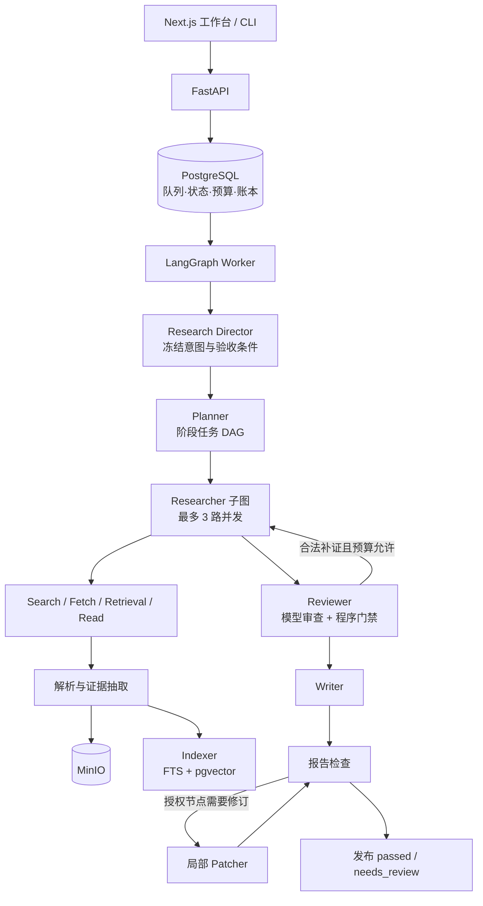

# Deep Research Agent

一个证据优先、可恢复、受预算约束的多 Agent 深度研究工作台。系统把研究意图编译成任务 DAG，在授权来源内检索与阅读，生成可定位的 Claim / EvidenceSpan，经审查和写作后交付带引用的结构化报告。

当前版本：**v0.4.0-rc.1（2026-09-15）**。

v0.4.0-rc.1 完成 PRD 的 P0/MVP，并加入 EvoMemory v2：消息、助手占位和 Run 原子创建，创建类接口统一幂等；删除项目立即隐藏全部子资源并保留 30 天恢复期；会话使用闭合协议语义摘要、PostgreSQL checkpoint、受治理 Profile 与 Observation；项目记忆采用全文、精确和向量检索的 RRF 融合。论文周报直接接入 OpenAlex、Crossref、arXiv 和 PubMed，保存候选、跨平台 provenance、分项评分、证据范围、连接器尝试与站内通知。旧 `/research-runs`、历史报告和证据链保持兼容。

v0.2.0 的重点不是增加更多 Agent，而是让现有协作链在真实运行中可控收口：跨轮对话改为紧凑进度 capsule、token 按阶段保留、非法补证不再导致 Run 崩溃、Embedding 可在离线容器中稳定启动，并且即使研究或审查预算耗尽，也会经过质量门禁生成可解释的 `needs_review` 报告。

项目已有真实 DeepSeek / Tavily 联调和浏览器工作台，但仍是本地开发与研究系统，不是生产合规 SaaS。`completed` 表示执行结束，不表示研究结论已被人工认证；fixture 输出为合成内容，不能作为真实选型依据。实测范围见 [验证结果](docs/verification-results.md)。

## 核心能力

- 支持 `technical_comparison`、`paper_review`、`general_research` 三类研究模板。
- 将自由输入编译为 `ResearchIntent`、阶段任务和依赖 DAG，按依赖并发派发 Researcher。
- 支持公开 HTML、Markdown、文本型或扫描型 PDF、上传文件和显式种子 URL。
- 在同租户、当前 Run 授权来源内执行 CJK 词法检索、768 维向量检索、RRF 融合和范围回读。
- 以 `SourceVersion → EvidenceSpan → Claim → ReportNode` 保存证据链，可回到原文字符偏移、页码和可用 bbox。
- Reviewer 同时执行模型审查和程序门禁；Writer / Patcher 只能使用被提供的 Claim / Span，局部修订受稳定节点 ID 限制。
- PostgreSQL 持久化队列、租约、fencing token、父图/子图 checkpoint、动作账本、预算和 SSE 事件。
- 工作台展示计划、任务、来源、引用、报告、用量、缓存命中、阶段预算和降级原因。
- 支持两租户 RLS 隔离、私有 MinIO 工件、受限公网抓取和离线 Parser / Embedding 容器。
- 以 `Project → Conversation → Message → Research Run` 组织持续研究；项目资产、记忆、画像信号和订阅均受同一租户 RLS 边界保护。
- 支持项目内统一搜索、候选记忆确认/拒绝、画像学习独立开关，以及获取真实元数据候选的每周论文订阅。
- 支持快速回答与深度研究两种消息模式、会话 SSE 断线补读、稳定列表游标、通知已读和待核验周报人工发布。

## 项目化工作流

1. 创建项目，填写研究目标、标签和排除项；系统同时创建默认对话，并把显式目标写入已确认项目记忆。
2. 上传 PDF、Markdown、HTML 或文本到项目资产池；启动 Run 时冻结可用的 `source_version_id` 集合。
3. 在同一项目内建立多个对话。每轮 Run 自动装配最近闭合消息、已确认项目记忆、相关画像信号和项目来源。
4. Run 完成后生成可追溯的候选结论记忆，用户可在项目记忆页确认或拒绝。
5. 创建论文周报订阅并试运行查询。预览实际获取并保存论文元数据候选，但不进入正式的八周去重窗口；“立即生成周报”按订阅本地周期幂等创建 `paper_review` Run，完成后按质量门禁进入 `published` 或 `needs_review`。

### EvoMemory v2 混合记忆

新建数据使用 v2 读取链路；迁移前的摘要、项目记忆和画像保留为 `legacy`，可查看但不会自动进入模型上下文，也不进行双写或历史回填。

- `messages` 仍是会话事实源；`conversation:{conversation_id}:v2` LangGraph PostgreSQL checkpoint 只保存可重建的会话运行状态。
- 每次装配按 `min(24k, prompt limit × 20%)` 分配最近六轮、累计语义摘要、已确认项目知识、已确认 Observation 和 active Profile；实际注入 ID、hash、分数与预算省略原因进入 Run 快照。
- Profile 分为 `assistant_style`、`user_profile`、`research_taste` 和 `project_profile`。Observation 分为 semantic、procedural、episodic，可处于项目或当前用户全局作用域，并支持 complements、contradicts、supersedes 关系。
- 自动蒸馏只在用户显式开启长期学习后运行，所有产物先进入 candidate；拒绝或未确认内容不自动注入。对话语义压缩不受长期学习开关影响。
- 同一 Conversation 只允许一个 queued/running Run。记忆任务独立重试并进入 dead letter，不改变研究报告的完成状态。
- Agent 可用 `search_memory` / `read_memory` 精读候选，但这些内容只是规划线索，不能替代原始来源和 Claim/EvidenceSpan 引用。

记忆页提供“项目知识、Profile、Observations、待确认”四个视图；`POST /conversations/{id}/compact` 可手动入队压缩，`GET /conversations/{id}/memory-state` 可查看版本、revision、摘要和后台任务。

自动排程是可选 Compose profile；开启后会按订阅时区和星期补跑本周尚未创建的任务，同一订阅同一周期不会重复入队：

```sh
docker compose --profile automation up -d digest-scheduler
```

论文候选通过 OpenAlex、Crossref、arXiv 和 PubMed 官方公开接口独立获取；单个平台超时不会中止其他平台。arXiv 请求全局串行且至少间隔 3 秒，PubMed 无密钥时限制到每秒 3 请求以内。默认测试使用冻结 fixture，不访问外网或付费模型。

## 执行流程



角色只负责语义判断；URL 权限、工具白名单、预算、引用复制、哈希、调度和状态转移由程序控制。Reviewer 提议的补证任务必须满足冻结的 `stage → allowed methods` 矩阵。非法任务会记录 warning 和 `review.gap_rejected` 事件，不会被静默映射，也不会再触发一次模型“修复”。如果没有合法补证，流程直接进入 Writer，并在最终报告披露缺口。

## 上下文与 Token 策略

### ResearchProgress capsule

每个合法工具批次结束后，下一轮不再重放完整消息历史，而是从固定 system / brief、当前任务、紧凑 `ResearchProgress` 和相关证据重新构造请求。capsule 只保存：

- 授权 source ID 与候选 URL；
- 已读且合并后的字符范围；
- 检索命中、验收条件覆盖和未解决项；
- 最近工具结果和连续无增益轮数。

完整模型请求、响应和工具结果仍保存在受 RLS 保护的 action 账本中，用于恢复与审计。带工具调用的一轮会保留 assistant/tool 配对及必要 `reasoning_content`，只在协议闭合后切换 capsule。跨 Agent 默认最多传递 16 组按相关性稳定排序的 Claim / EvidenceSpan bundle，其余证据保留在数据库并记录 omission。

连续两轮没有新增来源、Claim、Span、冲突或验收覆盖时，Researcher 提前停止工具循环。易变的剩余额度放在消息尾部，固定提示保持稳定顺序，以减少重复输入并提高供应商缓存可复用性。

### 默认预算

外部 `RunProfile.max_tokens=250000` 仍是绝对硬上限；内部 soft target 为 180,000 token，不新增用户配置项。

| budget group | soft budget | 典型角色 |
|---|---:|---|
| Scope / Plan | 18,000 | Research Director、Planner |
| Research / Extraction | 90,000 | Researcher、Source Analyst |
| Review / Gap | 24,000 | Reviewer、补证调度 |
| Writer / Patch | 39,000 | Writer、Patcher |
| Contingency | 9,000 | 前序阶段重试与波动 |

未使用额度只向后流转；Writer / Patch 的 39k 不会被前期研究占用。阶段累计门槛为 27k / 117k / 141k / 180k。系统分开记录：

- `serialized_bytes`：请求尺寸诊断；
- `estimated_input_tokens`：soft target 调度；
- provider actual tokens：最终账本和 250k hard cap。

70% 时强制 capsule 并裁剪重复证据；85% 时停止发现新来源；95% 时停止补证并进入 Review → Writer。研究预算或 retrieval 配额耗尽会停止继续派发，取消依赖失败任务，并交付按任务阶段组织的 `needs_review` 报告；不会再绕过 Reviewer / Writer 生成无结构的 `revision 999` 任意 Claim 列表。

## 证据与索引

```text
ReportNode / table cell
        ↓ claim_ids / cell_claim_ids
Claim（原子主张、立场、局限）
        ↓ span_ids
EvidenceSpan（source_id、parsed_hash、start/end、quote_hash、page/bbox）
        ↓
SourceVersion（原文字节哈希、解析版本、对象 key、来源地址）
```

搜索摘要只用于发现 URL，不能直接成为报告事实。模型从已读原文的稳定 `passage_id` 中选择片段，程序复制原文并绑定偏移，避免模型改写“引文”。发布时检查来源版本、偏移、quote 哈希、accepted Claim、表格单元格引用和数字存在性。

精确定位不等于语义支持：真实原文片段仍可能不支持 Claim 的附加从句。Reviewer 和最终人工复核仍是必要环节。

Embedding 固定使用 `Alibaba-NLP/gte-multilingual-base@9bbca17` 和 768 维索引。镜像构建时还固定 `Alibaba-NLP/new-impl@40ced75c3017eb27626c9d4ea981bde21a2662f4`，复制动态模块并完成真实 warm-load；运行时只读、离线。`/health` 必须完成短文本推理并得到有限、非零、归一化的 768 维向量才返回 ready。Indexer 对暂时性 503 做 1/2/4 秒有界退避，保留 `lexical_ready`，恢复后用新 index version 补建，不覆盖旧可用版本。

PDF `auto` 模式优先使用本地 Docling、RapidOCR、TableFormer、公式 enrichment 和 SmolVLM 图片描述；不可用时回退 pdfplumber 并标记 extraction method。复杂公式、OCR、表格和页级 bbox 仍需人工视觉确认。

## 快速启动

需要 Git、Docker Engine / Docker Desktop 和 Compose v2。以下命令在仓库根目录执行：

```sh
cd "/path/to/deep-research-agent"
git switch main

if [ ! -f .env ]; then cp .env.example .env; fi
chmod 600 .env

# 首先运行不消耗模型额度的完整 fixture 栈。
RESEARCH_MODE=fixture docker compose up --build -d

# 首次创建本地测试租户。
umask 077
mkdir -p .local
docker compose run --rm -T migrate research seed > .local/test-tenants.jsonl
chmod 600 .local/test-tenants.jsonl
```

上述命令会把当前同名 Compose 栈切换到合成测试模式。测试结束后必须执行下方 live 启动命令重新创建 API、Worker 和 Indexer；仅刷新页面或重启旧容器不会改变已经冻结的环境变量。工作台会持续显示“合成测试模式”或“真实研究模式”，历史 fixture Run 也会保留合成标记。

首次构建 Parser / Embedding 会下载并 warm-load 锁定模型，通常明显慢于后续构建。启动完成后打开 <http://localhost:13000>，使用 `.local/test-tenants.jsonl` 中的一条 `api_key` 登录。该 Key 是本项目的租户凭证，不是 DeepSeek / Tavily Key；不要提交或公开。

| 服务 | 地址 |
|---|---|
| 工作台 | <http://localhost:13000> |
| API / OpenAPI | <http://localhost:18000> / <http://localhost:18000/docs> |
| PostgreSQL | `localhost:15432` |
| MinIO API / Console | <http://localhost:19000> / <http://localhost:19001> |
| Parser / Embedding | 仅 Compose 内部网络 |

健康检查：

```sh
docker compose ps
curl --fail http://localhost:18000/health
docker compose logs --tail=100 api worker indexer embedding
```

只执行 `docker compose restart` 不会把本地新代码写入旧镜像。代码或 Dockerfile 更新后使用 `docker compose up --build -d`；需要强制重建时使用 `docker compose build --no-cache <service>`。`docker compose down` 保留命名卷，`docker compose down -v` 会删除项目数据库和对象存储数据。

### 真实 DeepSeek / Tavily

在 `.env` 填写：

```dotenv
RESEARCH_MODE=live
DEEPSEEK_API_KEY=<your-deepseek-key>
TAVILY_API_KEY=<your-tavily-key>
DEEPSEEK_BASE_URL=https://api.deepseek.com
DEEPSEEK_MODEL=deepseek-flash
DEEPSEEK_THINKING=enabled
DEEPSEEK_EFFORT=low
MEMORY_API_KEY=<independent-memory-model-key>
MEMORY_BASE_URL=https://api.deepseek.com
MEMORY_MODEL=<independent-memory-model>
LIVE_CAMPAIGN_USD=10
```

然后同步重建所有依赖后端代码的服务：

```sh
RESEARCH_MODE=live docker compose up --build -d api worker indexer migrate parser embedding web
docker compose run --rm -T migrate research doctor
curl --fail http://localhost:18000/health
```

`doctor` 不打印密钥，也不发起付费调用。live 模式缺少凭证时会明确失败，不会静默切换 fixture。新 Run 会冻结非密钥配置和 runtime fingerprint；修复前 checkpoint 不允许由新代码继续执行，请创建新 Run。旧 Run 仍可查询和导出。

## 本地开发

验证基线为 Python 3.12、uv、Node.js 22 和 pnpm 10。后端依赖锁定在 `uv.lock`，前端锁定在 `apps/web/pnpm-lock.yaml`。

```sh
uv sync --extra dev --frozen
corepack enable
pnpm --dir apps/web install --frozen-lockfile
pnpm --dir apps/web run prebuild

docker compose stop api worker web
make infra
make migrate
```

分别启动：

```sh
make api
make worker
make indexer
make web
```

修改 `.env`、运行模式或代码后，需要重启对应本地进程。不要让本地和 Compose 的 API / Worker 同时消费同一个数据库队列。

## API 与用量

除 `/health` 和 OpenAPI 外，接口使用 `Authorization: Bearer <tenant-api-key>`。

| 接口 | 用途 |
|---|---|
| `POST /research-runs` | 用 `Idempotency-Key` 创建 Run |
| `GET /research-runs`、`GET /research-runs/{id}` | 列表、状态、计划、任务和来源摘要 |
| `POST /research-runs/{id}/cancel`、`/resume` | 取消或恢复可恢复的 Run |
| `GET /research-runs/{id}/usage` | 向后兼容的 action 用量数组 |
| `GET /research-runs/{id}/usage-summary` | totals、soft/hard 剩余量、分组调用/缓存/费用和 degradation events |
| `GET /research-runs/{id}/events` | 持久化事件和 SSE 补读 |
| `POST /uploads`、`GET /uploads/{id}` | 上传与异步解析状态 |
| `GET /sources/{id}`、`/raw` | 来源元数据和受保护原文 |
| `GET /evidence-spans/{id}`、`/crop` | 引用片段和可用视觉 crop |
| `GET /research-runs/{id}/report` | 研究包或指定 revision |
| `POST /projects`、`GET /projects` | 创建、筛选和列出项目 |
| `GET/PATCH/DELETE /projects/{id}` | 项目详情、编辑、归档与 30 天软删除 |
| `POST/GET /projects/{id}/conversations` | 创建和列出项目对话 |
| `POST /conversations/{id}/messages` | 发送消息并按需创建项目内 Run |
| `GET /conversations/{id}/memory-state`、`POST /compact` | 查看 v2 会话状态并手动入队语义压缩 |
| `POST/GET /projects/{id}/artifacts` | 管理项目长期资产池 |
| `POST /projects/{id}/search` | 搜索文件、消息、记忆、Claim、报告和周报 |
| `GET/POST/PATCH /projects/{id}/memories` | 查看、创建、确认或拒绝项目记忆 |
| `GET/POST/PATCH /projects/{id}/observations` | 管理 semantic / procedural / episodic Observation |
| `GET /memory-jobs/{id}` | 查看记忆蒸馏、关联或 embedding 任务 |
| `GET/PATCH /users/me/research-profile` | 查看和控制研究画像 |
| `POST/GET /projects/{id}/subscriptions` | 创建和列出论文周报订阅 |
| `POST /subscriptions/{id}/preview` | 生成不调用外部平台的试运行查询快照 |
| `POST /subscriptions/{id}/run` | 幂等创建本周期周报研究任务 |

接口契约以运行中的 OpenAPI 和 `src/research_agent/contracts.py` 为准。

## 验证

后端完整测试会使用真实 PostgreSQL / MinIO，但不调用付费模型。必须先停止常驻 Worker，否则它可能领取集成测试创建的 queued Run，破坏队列和故障恢复测试时序。

```sh
docker compose stop worker
make infra
make migrate

.venv/bin/ruff check src tests migrations scripts
.venv/bin/pytest -q -m 'not integration'
RUN_INTEGRATION=1 .venv/bin/pytest -q
docker compose config -q
git diff --check

# 推荐：独立 PostgreSQL/MinIO，不会被常驻 Worker 抢占
make integration-isolated
```

前端与浏览器：

```sh
pnpm --dir apps/web build
pnpm --dir apps/web exec playwright test
```

RC 验证覆盖独立 PostgreSQL/MinIO 完整后端、迁移回滚/前进、容量门禁、Ruff、Compose、TypeScript、生产构建和浏览器流程。fixture 结果只证明工程闭环，不等于真实论文质量；连续四周 shadow 仍是升版 `v0.4.0` 的必要条件。精确结果见 [验证结果](docs/verification-results.md) 与 [PRD 可追踪矩阵](docs/prd-traceability-v0.4.0-rc.1.md)。

## 可靠性与安全边界

- 全局最多 1 个活跃 Run、10 个等待 Run；Worker 使用租约和递增 fencing token 防止旧进程覆盖新结果。
- action ID 稳定；已提交外部结果可在 checkpoint 恢复时复用。供应商响应返回但尚未落库的窗口无法保证 exactly-once，未知费用保留预留。
- 取消会先持久化并使旧 fence 失效；浏览器断线不等于取消，供应商中的请求也不保证立即停止计费。
- PostgreSQL 业务表和 checkpoint 强制 RLS；MinIO 使用私有桶和租户命名空间。
- 抓取只允许公网 HTTP(S) 80/443，检查 DNS 和重定向，限制大小、类型和超时。
- Parser / Embedding 使用内部网络、只读文件系统、cap drop 和无密钥环境；本地主机进程模式不具备相同网络隔离。

## 已知限制

- 真实 heldout 质量评测、B0/B1/B2 同预算对照、citation precision 和人工事实支持率尚未完成。
- Reviewer 与 Writer 可能使用同一模型，存在相关性错误；`passed` 也不替代人工核验。
- 搜索结果可能遇到反爬、导航页、客户端挑战或低质量聚合页；当前不会把抓取失败伪装成有效证据。
- 新来源建立语义索引存在异步延迟；未 ready 时仅使用 lexical fallback，不等于 Embedding 服务故障。
- 自动长期记忆依赖独立辅助模型，尚未完成真实 heldout 的记忆召回质量评测；不迁移旧 checkpoint，也没有 SSO、对象 GC 或跨集群调度。
- 系统不执行论文代码，不验证论文新颖性，也不能保证复杂 PDF、公式、OCR 和表格理解正确。

## 仓库导航

| 路径 | 内容 |
|---|---|
| `src/research_agent/graph.py` | 研究图、角色边界、预算收口和降级报告 |
| `src/research_agent/context.py` | capsule、上下文装配、证据选择和 soft target |
| `src/research_agent/memory.py` | 会话语义压缩、MemoryBroker、蒸馏/关联/embedding 后台任务 |
| `src/research_agent/gateway.py` | 模型/工具动作、预留、结算和协议诊断 |
| `src/research_agent/db.py` | RLS 数据访问、队列、索引、账本与 usage summary |
| `src/research_agent/evidence.py` | 来源版本、passage、Claim / Span 和报告渲染 |
| `src/research_agent/indexer.py` | 词法/向量索引与恢复 |
| `apps/web/` | Next.js 工作台和 Playwright 测试 |
| `migrations/` | PostgreSQL schema 与数据迁移 |
| `evals/`、`scripts/` | fixture、smoke、冻结语料和评测入口 |
| `docs/` | 设计、开发事故、验证结果与实现边界 |

进一步阅读：

- [多 Agent Token 策略](docs/multi-agent-token-strategy.md)
- [Multi-Agent 工程实现说明](docs/multi-agent-engineering.md)
- [检索与解析](docs/retrieval-and-parsing.md)
- [开发日志](docs/development-log.md)
- [面试深挖：实现、事故与证据边界](docs/interview-deep-dive.md)
- [验证结果](docs/verification-results.md)
- [Research Agent V2 设计](docs/research-agent-v2-design.md)

## 参考仓库

以下仓库用于架构研究与实现取舍，本项目不依赖其运行时；详细映射见 [设计蓝图](docs/deep-research-agent-blueprint.md)。

- [Hyperresearch（固定参考版本）](https://github.com/jordan-gibbs/hyperresearch/tree/cbaaaf7841e35005796d58e25dcac38fc9cf3326)
- [OpenResearch（固定参考版本）](https://github.com/alphaXiv/OpenResearch/tree/3736d7e03842f572be417d2e4de79ed5b06ef012)
- [HelloAgents DeepResearch（固定参考版本）](https://github.com/datawhalechina/hello-agents/tree/4f7682ceafe573d07cd8a7d0b89908500e83227d/code/chapter14/helloagents-deepresearch)
- [DeerFlow（固定参考版本）](https://github.com/bytedance/deer-flow/tree/3f0b6ecc811190481897f1ed02c2ba0c1f69799e)
