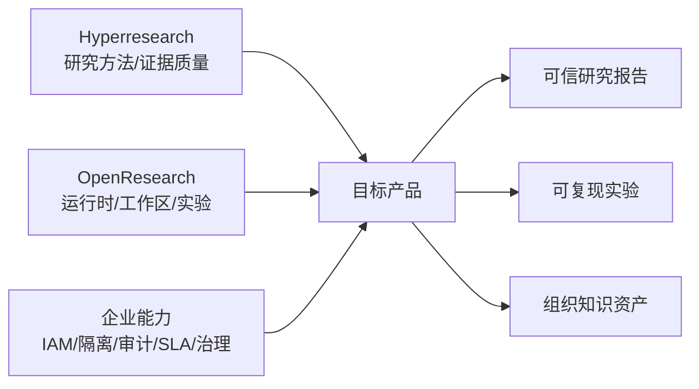
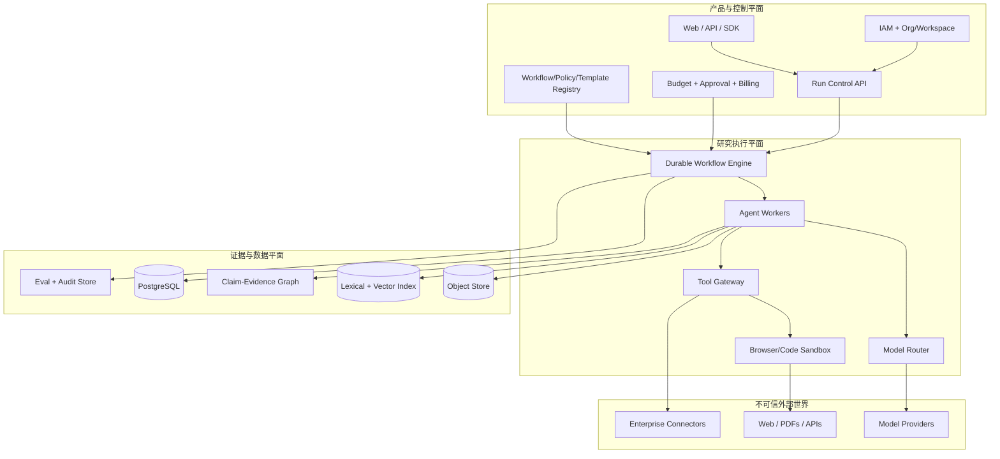
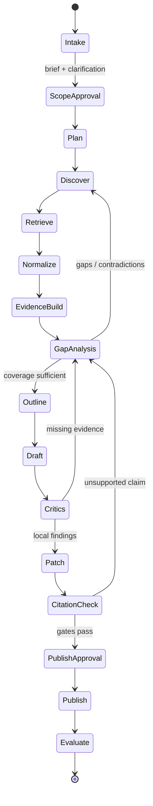

# 企业级 Deep Research Agent 架构蓝图

## 执行摘要

Deep Research Agent 不是“带搜索的聊天机器人”，也不是把多个 Agent 串起来就结束。一个完备系统必须同时解决四件事：把模糊问题转化为可验证的研究任务；在不可信且不断变化的数据源中获得足够、独立、可追溯的证据；以可恢复、可预算、可审计的方式完成长时工作流；把结果变成企业可以批准、复查、复用和治理的资产。

Hyperresearch 与 OpenResearch 恰好覆盖了两个互补方向。Hyperresearch 是“研究方法与证据质量引擎”：分解、广搜、矛盾分析、深挖、批判、补洞、引用核验和持久知识库。OpenResearch 是“研究 Agent 工作区与实验执行平台”：不同 Agent harness、Git worktree 隔离、实验树、日志证据、异构计算后端和本地产品界面。前者回答“怎样做出更可信的研究报告”，后者回答“怎样让多个研究/实验任务被可靠地运行和管理”。[1][2]

企业产品应把两者的思想组合成三个平面，而不是直接 fork 后继续堆功能：

1. **产品与控制平面**：组织、身份、项目、策略、预算、审批、模板、运行管理和 API。
2. **研究执行平面**：Durable Workflow、Agent workers、检索/浏览/代码执行沙箱、模型路由与并发控制。
3. **证据与数据平面**：来源快照、文档解析、claim-evidence 图、引用、报告版本、审计和评测数据。

第一阶段不要从微服务开始。推荐“模块化单体控制面 + 独立沙箱 Worker + PostgreSQL + 对象存储 + Durable Workflow”。研究流程稳定、租户规模和隔离需求明确后，再沿着执行沙箱、连接器、索引和评测这几个天然边界拆分服务。

---

## 1. 什么才算一个完备的 Deep Research Agent

### 1.1 产品契约

一个研究任务的输入不仅是 `query`，还应是一个显式的 `ResearchBrief`：

- 研究问题、决策背景、目标读者；
- 范围、时间窗口、地域、行业和排除项；
- 允许/禁止使用的数据源；
- 输出类型、长度、引用规范和截止时间；
- 成本、时延、数据敏感级别；
- 需要人工批准的动作；
- 完成标准与质量门禁。

输出也不应只有一段 Markdown，而是一个 `ResearchPackage`：

- 最终报告与机器可读摘要；
- 来源清单、来源版本/获取时间和内容哈希；
- 原子 claims 与 supporting/contradicting evidence；
- 引用到原文片段的精确绑定；
- 未解决问题、假设、冲突和置信度；
- 执行轨迹、成本、模型/工具版本、审批记录；
- 质量评测结果和可复现 run manifest。

这两个契约是系统最重要的稳定边界。模型、搜索 API 和编排框架都会变，契约应该尽量不变。

### 1.2 与普通 RAG 的差别

普通 RAG 通常是一次检索后回答；Deep Research 是一个闭环：规划问题、并行检索、阅读与提取证据、发现矛盾和缺口、再次检索、形成论证、批判与修补、逐条验证引用。BrowseComp 专门测试“需要持续浏览才能找到的难检索事实”，而 DeepResearch Bench 同时评估长篇报告质量、有效引用数和引用准确性，说明检索与长篇综合必须分别测试。[3][4]

因此，系统的核心抽象应是“有状态研究运行”，不是“聊天消息”。

---

## 2. 两个参考项目的结构化拆解

分析基于 2026-09-11 下载的源码快照：Hyperresearch `cbaaaf7`（v0.11.0）与 OpenResearch `3736d7e`（v0.2.0）。两者均为 MIT License。

### 2.1 Hyperresearch：研究质量流水线

Hyperresearch 的入口是一个轻量路由 skill，实际步骤按需加载，避免长上下文中逐步遗忘流程。完整 profile 包含 16 个主要步骤：问题分解、广度检索、矛盾图、论证焦点分析、深度调查、跨焦点调和、来源分歧、语料批判、证据摘要、三稿并行、综合、四类批判者、缺口补抓、局部修补、引用核验、润色和可读性审计。它还按 light/full/dissertation 做规模路由，把 source budget、并发度、字数、critic 数量与 Agent 模型放进 profile，而不是散落在 prompt 中。[1]

值得复用的设计：

| 设计 | 为什么重要 | 企业版应如何吸收 |
|---|---|---|
| Canonical query 持久化 | 后续 Agent 不会被包装指令或上下文漂移带偏 | 升级为版本化 `ResearchBrief`，任何范围变化产生新版本与审计事件 |
| 分阶段、按需加载 skill | 控制长工作流的上下文腐烂 | Workflow 节点只加载自己的政策、输入 schema 和最小证据集 |
| 宽搜→深挖→批判→补洞 | 研究是反馈闭环而非线性生成 | 把 gap analysis 作为一等节点，可回边到 search/read |
| Claims 表与全文索引 | 将“读过的文档”转为可查询知识 | 建立 claim-evidence graph，引用必须绑定 evidence span |
| 引用句绑定与 cite-check | “有引用”不等于“引用支持该句” | 发布门禁逐 claim 检查 entailment、来源状态和引用可达性 |
| 独立性/转载聚类 | 多个转载不能伪装为共识 | 引入 provenance cluster 与独立来源计数 |
| 抓取内容标记为不可信 | 防止网页中的指令劫持 Agent | 数据与指令通道隔离，配合工具最小权限和恶意样本评测 |
| SSRF、大小、重定向检查 | 浏览工具本质上是联网执行能力 | 网络 egress gateway、DNS/IP 再验证、MIME/大小限制、域名策略 |
| Run manifest 与 resume | 长任务崩溃后可继续 | 交给 Durable Workflow，并要求每个外部动作幂等 |
| Patch, never regenerate | 审稿后避免整篇重写引入新错误 | 用报告 AST/段落 ID 做结构化 patch，保留 diff 和审批 |

Hyperresearch 的局限也很重要：它主要是 Claude Code 上的单机 harness，核心状态是 Markdown + SQLite；许多编排约束由 skills/prompts 实现；其 README 中的榜单领先说法明确标注为内部 pilot 的前瞻推算、尚待第三方验证。[1] 这非常适合学习研究方法，但不能直接等同于企业 SaaS 的多租户可靠性、SLA、数据治理或独立评测。

### 2.2 OpenResearch：Agent 工作区与实验运行时

OpenResearch 用 Rust 实现本地 CLI/服务，Axum 提供 JSON/SSE/WebSocket API，React/Vite 构建界面，SQLite WAL 保存项目、实验、run、chat、spawn 和 lease。它把 Claude Code、Codex、OpenCode 等封装成统一 harness；每个会话使用独立 Git worktree；实验以不可变 commit/branch 形成树；run 可以提交到本地、SSH、Slurm、Kubernetes、Ray、Hugging Face、Modal 等后端，并持久化日志与提交快照。[2]

值得复用的设计：

| 设计 | 为什么重要 | 企业版应如何吸收 |
|---|---|---|
| Harness interface | Agent/模型供应商可替换 | 定义 `ModelProvider` 与 `AgentRuntime` 两层 SPI，避免绑定某一 CLI |
| 独立 worktree | 并行 Agent 不互相踩代码 | 文档研究用 workspace namespace；代码/实验任务用 ephemeral worktree |
| 实验树与冻结节点 | 每个结论对应不可变代码版本 | 将 workflow/report/source/policy/model 都版本化，形成 lineage DAG |
| Store + watcher + lease | 短命令与长任务解耦，崩溃可回收 | 使用 durable queue/workflow；所有 claim 都有 lease TTL 和幂等键 |
| 固定 run contract | 不同实验结果可比 | 每个评测 suite 固定数据集、runner、grader 与环境镜像 |
| 多计算后端 | 研究可自然延伸到代码与实验 | 定义 `ExecutionBackend`，统一 submit/status/log/cancel/artifact |
| 日志是证据渠道 | 不凭“成功状态”推断结果 | 结构化 evidence events + 原始日志双轨保存 |
| 本地优先 | 敏感研究可保留在客户环境 | 企业版提供 SaaS、单租户 VPC、on-prem 三种部署拓扑 |

局限是：OpenResearch 的强项偏向科研代码与算力实验，而不是通用网页研究的 claim/citation 质量；本地服务默认绑定 loopback 且没有面向多用户的应用认证；公开仓库也明确把组织、账户、沙箱供应与托管算力放在伴随服务中。[2][5] 因此它是“运行时和产品形态”参考，而不是企业控制面的完整开源答案。

### 2.3 组合结论



不要把 16 步机械翻译成 16 个微服务，也不要让“一个角色一个 Agent”成为目标。角色是权限和上下文的边界；当两个角色需要相同工具、相同上下文且顺序执行时，可以由同一 Worker 完成。只有独立性、并行度、隔离或模型差异带来明确价值时才拆成多个 Agent。

---

## 3. 目标架构

### 3.1 三个平面与一个信任边界



外部网页、连接器返回值、上传文件和模型输出都属于不可信数据。只有系统政策、经过授权的用户指令和已验证的工具 schema 能进入指令通道。Hyperresearch 已经对 fetched body 做 `<untrusted-source>` fencing 并实施 SSRF 防护；AgentDojo 的 629 个安全测试也说明，外部工具返回的数据可以通过间接 prompt injection 劫持 Agent。[1][6]

### 3.2 产品与控制平面

建议第一版用 TypeScript/Next.js 或 React 做 Web，Python/FastAPI + Pydantic 做 API 与领域服务。重点不是语言，而是模块边界：

- `identity`：SSO/OIDC、SCIM、用户、服务账号、组织与 workspace；
- `projects`：研究项目、brief、资料库、报告与共享；
- `workflows`：模板、run、task、checkpoint、pause/resume/cancel；
- `policies`：RBAC/ABAC、数据分类、模型/域名/工具/地域策略；
- `approvals`：高风险工具调用、预算升级、发布审批；
- `connectors`：OAuth、secret reference、同步游标和权限映射；
- `usage`：token、search、browser、storage、compute 成本和配额；
- `evaluation`：离线 suite、在线抽样、回归、发布门禁；
- `audit`：append-only 审计事件与导出。

企业多租户不能只依赖登录。AWS SaaS Lens 明确区分 authentication/authorization 与 tenant isolation，并建议按不同服务的负载和隔离需求组合 pool/silo；Kubernetes 对严格隔离场景建议从 default-deny 网络策略开始。[7][8] 推荐采用 bridge model：控制面共享；数据库默认按 tenant key + Row Level Security；对象存储按 tenant prefix/KMS key；高敏感客户的 Worker、索引和数据存储可以切到单租户部署。

### 3.3 研究执行平面

长时研究必须是可恢复状态机。可以有两种实现路径：

- **MVP/图式 Agent**：LangGraph 管理研究图、checkpoint、streaming 与 human-in-the-loop。其定位本身就是长时、有状态 Agent 的低层编排运行时。[9]
- **企业 Durable Workflow**：Temporal 管理跨小时/天的可靠执行，Activity 承载模型、抓取、连接器和沙箱等副作用。Temporal 通过持久化工作流历史在崩溃或基础设施中断后恢复执行。[10]

推荐折中：Temporal 负责“外层业务过程”（run、审批、重试、定时、SLA、取消、补偿），研究图作为一个版本化 domain module 运行在 Worker 内。小团队也可以先只用 LangGraph，但业务表里必须保留显式 task/checkpoint/event，避免未来迁移时状态只存在框架内部。

关键运行规则：

- 每个节点输入/输出使用版本化 schema；
- 每个外部动作带 `tenant_id + run_id + task_id + idempotency_key`；
- 模型调用只自动重试明确的瞬时错误，不能把未知结果重复提交为副作用；
- 搜索、下载、解析、embedding、模型调用分别计费与限流；
- soft budget 触发降档或询问，hard budget 立即停止新任务；
- cancellation 从 workflow 传播到模型流、浏览器、子 Agent 和 compute job；
- checkpoint 只保存结构化状态和 artifact references，不把全部网页正文塞进 workflow history；
- worker 只获得当前任务需要的短期凭证和网络权限。

### 3.4 工具网关与 MCP

工具不应由 Agent 直接持有永久凭证。所有工具调用经过 Tool Gateway：参数 schema 校验、主体与租户解析、策略决策、速率/预算控制、secret exchange、执行、结果净化、审计和幂等处理。

MCP 适合作为外部工具协议，但不是权限系统的替代品。HTTP MCP 的授权规范要求访问令牌绑定目标资源、服务端验证 token audience，并禁止把收到的 token 直接透传给下游 API；这正好支持“网关使用连接器专属下游凭证”的设计。[11] 对删除、发送、支付、发布、写入 CRM 等动作，默认 `human_approval=required`。OWASP 将给 Agent 过多功能、权限或自主范围归为 Excessive Agency 风险，建议通过最小权限与人工批准压缩影响面。[12]

工具能力建议分级：

| 等级 | 示例 | 默认策略 |
|---|---|---|
| R0 纯计算 | tokenize、排序、格式转换 | 自动 |
| R1 只读公开数据 | web search、公开网页、论文库 | 自动，受 egress/预算限制 |
| R2 只读企业数据 | Drive/Slack/Confluence/数据库查询 | 继承用户权限，记录数据标签 |
| W1 可逆写 | 建草稿、创建临时文件 | 可按 workspace 策略自动 |
| W2 外部影响 | 发消息、改记录、发布报告 | 人工批准 |
| W3 高风险 | 删除、交易、权限变更、运行任意代码 | 强审批或禁用 |

### 3.5 证据与数据平面

不要把向量数据库当作主数据库。建议：

- PostgreSQL：事务状态、租户、run/task、来源元数据、claims、citations、策略和审计索引；
- S3 兼容对象存储：网页/PDF 原始快照、解析文本、截图、报告和运行工件；
- PostgreSQL FTS/OpenSearch：精确词项、实体、日期和过滤检索；
- pgvector/独立向量库：语义召回，但结果必须回到 source version；
- Redis（可选）：短期 cache、rate limit，不作为事实来源；
- 图关系先用 PostgreSQL edge tables；确有复杂图遍历需求后再引入图数据库。

核心数据模型：

| 实体 | 关键字段/关系 |
|---|---|
| `organization/workspace` | region、retention、isolation tier、policy set |
| `research_brief_version` | canonical question、scope、constraints、acceptance criteria |
| `research_run` | workflow version、status、budget、initiator、parent run |
| `research_task` | type、state、attempt、lease、input/output artifact、idempotency key |
| `source` | canonical URL/connector ID、publisher、provenance cluster |
| `source_version` | fetched_at、content hash、MIME、raw/parsed artifacts、access policy |
| `chunk/evidence_span` | source version、offset/page/DOM anchor、exact excerpt hash |
| `claim` | normalized text、type、confidence、status、authoring agent |
| `claim_evidence_edge` | supports/contradicts/context、strength、entailment score |
| `report/report_revision` | template、AST、rendered artifacts、diff、approval |
| `citation` | report node → claim → evidence span → source version |
| `model/tool_call` | provider、version、tokens、latency、cost、policy decision |
| `evaluation_result` | suite/case/grader versions、scores、failure taxonomy |
| `audit_event` | actor、action、resource、decision、timestamp、trace ID |

`source_version` 而不是 URL 才是引用的真实对象。网页会变化，同一个 URL 在不同时间可能支持不同结论。最终报告展示人类可读 URL，但内部保留快照、时间、哈希和定位信息。

---

## 4. 端到端研究状态机



### 4.1 Intake 与范围确认

`Intake Agent` 只负责把用户输入标准化为 brief，不能开始大规模搜索。它输出歧义、范围建议、预估成本和完成标准。对于高成本/高风险运行，进入 `ScopeApproval`。确定后的 canonical brief 不可静默修改；用户新增要求产生 v2，并明确哪些任务需要失效或复用。

### 4.2 Plan 与覆盖矩阵

`Planner` 将问题拆成原子 research questions，生成 coverage matrix：问题、所需证据类型、首选来源、时效性、反方/替代解释、完成条件和预算。计划是可执行 DAG，但允许 GapAnalysis 动态添加任务。计划质量的核心不是“步骤多”，而是每个问题都有可观察的证据门槛。

### 4.3 Discover、Retrieve、Normalize

`Search Strategist` 生成多视角查询：定义/事实、时间、地区、支持、反驳、原始数据、监管、学术和专家观点。查询去重后并行发送到 Web、学术库和企业连接器。

`Retriever` 与 `Browser Worker` 获取候选内容。下载前执行 URL scheme、DNS/IP、重定向、MIME、大小、robots/许可和 workspace 域名策略；动态页面或登录源进入隔离浏览器。CAPTCHA、2FA 和新的授权同意应交还人类，而不是自动绕过。

`Normalizer` 保存原始快照，解析正文、表格、PDF 页码、标题、作者、发布时间、更新时间和 canonical URL，随后做内容哈希、近重复、转载/依赖关系与来源质量标注。解析失败不能静默降级成空文档。

### 4.4 EvidenceBuild

`Source Analyst` 以单一来源为上下文，提取：

- 原子 claim；
- 原文 evidence span 与定位；
- 数字、单位、样本、时间范围；
- evidence type（primary data、official statement、peer review、commentary 等）；
- 限制条件与潜在偏差；
- 对研究问题的 stance；
- 需要追踪的引用或关联来源。

此阶段只抽取“来源说了什么”，不承担跨来源最终结论。这样可以降低早期摘要对后续推理的污染。

### 4.5 GapAnalysis 与停止条件

`Corpus Critic` 检查：coverage 是否达标、是否缺少原始来源、是否只有同源转载、是否存在未解释矛盾、时效性是否满足、哪条新证据最可能推翻当前结论。它输出有预算的 gap tasks，而不是泛泛地说“继续搜索”。

停止不是“搜索次数达到 N”，而是同时满足：

- 每个必答 research question 达到证据门槛；
- 关键 claim 至少有一个合格 supporting span；高风险 claim 需要两个独立来源或明确标注单一来源；
- 主要反例/冲突已处理；
- 新一轮检索的边际信息增益低于阈值；
- 预算/时限未触发更早停止；
- 未解决项被显式记录。

### 4.6 Outline、Draft、Critics 与 Patch

`Outline Agent` 只使用 claims/evidence graph 设计论证结构，先确定每节回答什么、使用哪些 claims、如何处理冲突。`Writer` 根据批准的 outline 写结构化 Report AST，不能直接自由访问所有工具。

Critics 至少覆盖四个独立角度：

- evidence critic：结论是否超出证据；
- coverage critic：是否漏答或缺少关键视角；
- dialectic critic：是否公平处理反例和冲突；
- instruction/policy critic：是否满足 brief、格式、合规和数据政策。

Critic 只产生带位置、严重度、原因、建议和所需证据的 finding。Patcher 只能修改被授权的 AST 节点；重大结构问题回到 outline/draft，不能伪装成“小修”。这一点继承 Hyperresearch 的 patch-not-regenerate 思想，同时比文本 diff 更适合稳定产品。[1]

### 4.7 CitationCheck 与发布门禁

每个外部事实 claim 都应完成以下检查：

1. citation 能解析到当前租户可访问的 source version；
2. evidence span 存在且定位仍有效；
3. evidence 对 claim 是支持、反驳还是仅背景；
4. 数字、单位、时间、主体和限定词一致；
5. 来源未撤稿/失效，或报告已披露；
6. 来源独立性满足风险级别；
7. 报告中的链接和参考文献完整。

自动 entailment 评分只能排序和预警，不能替代确定性检查或高风险人工复核。报告发布后保存 immutable revision；任何修改创建新 revision 和引用复检。

---

## 5. Agent、模型与上下文设计

### 5.1 推荐角色

| 角色 | 输入 | 工具 | 输出 | 权限边界 |
|---|---|---|---|---|
| Intake | 用户请求、workspace policy | 无外部写工具 | Brief | 不搜索、不发布 |
| Planner | Brief、历史 run 摘要 | 只读 registry | Plan DAG | 不抓取正文 |
| Search Strategist | 单个 research question | 搜索工具 | Candidate refs | 不写报告 |
| Retriever/Browser | URL/connector ref | 网络/浏览器 | Source version | 无模型长期记忆 |
| Source Analyst | 单个 source version | 只读解析器 | Claims/spans | 不跨来源下结论 |
| Corpus Critic | coverage + graph | 只读搜索元数据 | Gaps | 只创建任务建议 |
| Writer | outline + curated evidence | 无搜索/写外部系统 | Report AST | 只能引用给定证据 |
| Critics | report + brief + evidence | 只读 | Findings | 不能直接改稿 |
| Patcher | findings + AST | 结构化 patch | New revision | 只改允许节点 |
| Citation Verifier | claims/citations/spans | 只读 | Gate results | 与写作模型隔离 |
| Publisher | approved revision | export tools | Artifacts | 需要政策/人工批准 |

### 5.2 模型路由

模型选择应该是策略，而不是写死在角色名里：

- 轻模型：查询扩展、分类、去重候选、格式校验；
- 强推理模型：计划、gap analysis、跨来源综合、关键批判；
- 长上下文模型：必要的多文档比较，但仍输入精选证据而非整个语料库；
- embedding/reranker：召回与排序；
- 本地/私有模型：高敏数据或数据驻留场景；
- fallback 模型：供应商故障或预算降级。

每次调用记录 provider/model/version、prompt template version、temperature/effort、输入 artifact hashes、tokens、latency、cost 和 trace。不要记录未脱敏的 secret；是否记录原始 prompt/response 由数据分类策略决定。

### 5.3 上下文分层

把上下文分为五层：

1. **Policy context**：系统安全和组织政策，最高优先级、不可由数据覆盖；
2. **Task context**：当前节点目标、schema、预算和允许工具；
3. **Research context**：brief、coverage、精选 claims/evidence；
4. **Working memory**：当前节点短期草稿和 tool results；
5. **Long-term memory**：经验证的来源、组织知识与历史运行。

长时 Agent 最常见的错误之一是把五层混在消息历史里。正确做法是每个节点重新构造最小上下文，显式引用 artifacts；历史 reasoning 不作为事实，只有结构化产物能流向下游。

---

## 6. 企业级非功能能力

### 6.1 安全与隔离

- OIDC/SAML SSO、SCIM、MFA、service accounts；
- RBAC 负责角色，ABAC 结合 tenant、项目、数据级别、地域、工具与动作；
- PostgreSQL RLS + 应用层 tenant context 双重约束；
- 每租户对象前缀/KMS key，敏感客户独立 bucket/DB/cluster；
- Worker 使用短期身份，secret 存 Vault/KMS，Agent 只见 opaque reference；
- 浏览器与代码执行在无特权容器/微虚机，rootless、只读基础镜像、CPU/内存/时间/磁盘限额；
- 网络默认拒绝，按 task 开 egress allowlist；私网连接器走专用 gateway；
- 上传文件做类型校验、恶意软件扫描、解压炸弹/宏/嵌入对象限制；
- prompt injection 检测是辅助层，真正边界是 data/instruction separation + least privilege + approval；
- 审计日志 append-only，支持 SIEM 导出和 legal hold。

NIST AI RMF 将治理、映射、测量和管理贯穿 AI 生命周期；其 Generative AI Profile 专门补充生成式 AI 的风险管理动作。企业交付时可以把本系统的 policies、evals、incident process 和 evidence records 映射到这四类能力，而不是只做一张“合规功能清单”。[13]

### 6.2 可靠性

- Run 状态必须有单向合法迁移；任何 task 可被安全重放或明确标记不可重试；
- workflow/activity heartbeat、lease TTL、dead-letter 和人工恢复；
- 模型/搜索/连接器 circuit breaker 与 provider failover；
- source fetch 使用 content-addressed cache，但遵守权限和时效；
- 报告发布与审计写入使用 transactional outbox；
- RPO/RTO、备份恢复演练和跨区域策略按租户等级定义；
- 控制面 SLO 与长时 run completion SLO 分开；
- graceful degradation：少一个搜索 provider 不应让整个运行失败，但必须披露覆盖影响。

### 6.3 可观测性与 FinOps

使用一个 `trace_id` 贯穿 API request → workflow → task → agent/model/tool → artifact。OpenTelemetry 的语义约定为跨语言 traces、metrics、logs 提供统一命名；GenAI 字段仍需注意版本稳定性，因此内部事件 schema 要版本化。[14]

关键指标：

- 产品：run success、time-to-first-plan、time-to-report、approval wait；
- 研究：coverage、有效独立来源、claim support、citation precision、contradiction resolution；
- 模型：tokens、latency、retry、fallback、structured-output failure；
- 工具：search hit、fetch success、parse quality、connector throttling；
- 系统：queue delay、workflow replay、worker saturation、sandbox failure；
- 成本：每 run/tenant/stage/provider 成本，单位有效 claim 成本；
- 安全：policy deny、approval、prompt-injection canary、跨租户访问测试。

任何日志字段都要先做 data classification；默认不把网页全文、企业文档或 prompt 原文塞进可观测平台。

---

## 7. 评测与发布门禁

评测要分层，否则“最终报告看起来不错”会掩盖检索、证据或安全失败。

### 7.1 离线评测矩阵

| 层 | 指标 | 数据集/方法 |
|---|---|---|
| 规划 | coverage、约束遵循、任务可执行性 | 人工 rubric + 业务 golden briefs |
| 检索 | recall@k、unique primary sources、freshness | 冻结 corpus；BrowseComp 测难检索事实[3] |
| 解析 | 正文/表格/PDF 定位准确率 | 带页码/DOM anchor 的解析集 |
| 证据 | claim-span precision/recall、数字一致 | 双人标注 evidence set；FACTS Grounding 辅助长文 groundedness[15] |
| 综合 | 完整性、洞察、冲突处理、可读性 | DeepResearch Bench/RACE 类 rubric[4] |
| 引用 | citation correctness、completeness、independence | 确定性解析 + 人工抽检 |
| Agent | tool success、recovery、budget adherence | 故障注入、provider timeout、resume/cancel |
| 安全 | attack success、unauthorized tool calls、data leak | AgentDojo 类注入样本 + 自建 connector attacks[6] |
| 企业 | tenant isolation、audit completeness、retention | 自动跨租户负向测试、灾备演练 |

### 7.2 必须分开的四个分数

- `retrieval_score`：有没有找到应找的材料；
- `grounding_score`：claim 是否被证据支持；
- `synthesis_score`：是否组织出正确、有用的解释；
- `operational_score`：是否在预算、安全、恢复和时限内完成。

不要把它们压成一个无法诊断的总分。总分只适合发布看板，工程回归必须能定位 failure taxonomy。

### 7.3 发布门禁建议

MVP 的最低门禁：

- 100% citation 可解析；
- 外部事实 claim support coverage ≥ 95%；
- 抽样 citation precision ≥ 95%；
- 关键 claim 无 unresolved high-severity finding；
- 无越权工具调用；
- run manifest、成本、来源清单齐全；
- 任何预算/范围/数据策略降级已披露。

具体阈值要按业务风险校准。医学、法律、金融等高风险领域还需要领域专家审批，且系统不应把“通过自动门禁”表述为专业意见认证。

---

## 8. 如何在这套架构上设计自定义功能

自定义不应等同于“改 system prompt”。建议提供六类稳定扩展点。

### 8.1 Connector Plugin

用于 Web、论文库、数据库、Slack、Confluence、SharePoint、CRM 等数据源。统一接口：

```python
class Connector:
    def capabilities(self) -> ConnectorCapabilities: ...
    async def search(self, query: SearchQuery, ctx: AccessContext) -> list[SourceRef]: ...
    async def fetch(self, ref: SourceRef, ctx: AccessContext) -> SourcePayload: ...
    async def checkpoint(self) -> SyncCursor | None: ...
```

必须返回 provenance、ACL/data labels、freshness、content type 和稳定 source identity。连接器不能自行决定把数据注入 prompt；所有结果先进入 normalization 和 policy pipeline。

### 8.2 Domain Pack

把行业知识封装成数据而非 fork：

- source preference/deny list；
- evidence taxonomy 和 source quality rubric；
- domain-specific claim schema；
- freshness、独立来源和审批门槛；
- query expansion vocabulary；
- critic rubrics；
- report sections；
- benchmark cases。

例：医药 pack 区分 clinical trial、systematic review、guideline、preprint；投研 pack 区分监管披露、公司材料、数据供应商、媒体和 sell-side commentary。不同 evidence type 不能用同一个权重模板。

### 8.3 Workflow Template

用版本化 DSL 描述阶段和门禁，不允许用户任意注入可执行代码：

```yaml
apiVersion: research.example/v1
kind: WorkflowTemplate
metadata:
  name: vendor-due-diligence
  version: 1.2.0
spec:
  profile: full
  stages:
    - intake
    - plan
    - discover: {parallelism: 8, sourceTarget: 40}
    - evidence_build
    - gap_analysis: {maxLoops: 2}
    - draft
    - critics: [evidence, security, commercial]
    - citation_check
    - publish
  policies:
    allowedConnectors: [web, sec-edgar, company-drive]
    maxBudgetUsd: 35
    publishApproval: required
```

编译器把 DSL 转为内部 DAG，静态检查环路上限、权限、预算和 schema 兼容性。运行时只执行 registry 中签名/批准的节点实现。

### 8.4 Agent Skill

Skill 是角色内可复用的方法模块，包含：触发条件、输入/输出 schema、procedure、允许工具、最大预算、失败策略和 eval cases。Prompt 只是其中一部分。发布 skill 新版本必须跑回归；旧 run 永远记录并可重放其原始版本。

### 8.5 Model Routing Policy

按数据敏感度、任务类型、语言、上下文长度、成本、时延和历史质量选择模型。策略示例：`restricted` 数据只能走客户 VPC 模型；citation verifier 与 writer 不使用同一 provider；低风险分类器优先廉价模型；structured-output 连续失败后升级模型。路由结果必须进入审计和成本明细。

### 8.6 Report 与 Evaluation Pack

报告模板使用 typed AST 和 renderer，支持 Markdown、DOCX、PDF、PPTX、JSON，但 citation nodes 不能被模板任意删除。Evaluation Pack 与 Domain Pack 同版本发布，至少包含 golden briefs、预期 sources/claims、rubric、security attacks 和成本基线。

### 8.7 自定义功能的决策顺序

设计一个新能力时依次回答：

1. 它改变的是数据源、研究方法、流程、模型策略、输出还是治理？
2. 新增的输入/输出 schema 是什么？
3. 需要哪些最小权限和 secret？
4. 哪个 tenant/data boundary 内运行？
5. 如何重试、取消、恢复与幂等？
6. 产生什么 provenance、audit 和 cost events？
7. 什么评测证明它优于原方案？
8. 失败时如何降级和向报告披露？

只有这些答案齐全后才写 prompt。这样自定义功能才是产品能力，而不是难以维护的提示词实验。

---

## 9. 推荐技术栈与仓库结构

### 9.1 起步栈

| 层 | 推荐 | 备注 |
|---|---|---|
| Web | React/Next.js + TypeScript | run timeline、证据检查器、报告 diff、审批 |
| API/领域 | Python 3.12、FastAPI、Pydantic、SQLAlchemy/Alembic | 与 LLM/解析生态衔接快 |
| Workflow | Temporal（企业目标）或 LangGraph（早期 MVP） | 外层 durable，内层研究图 |
| Queue | Temporal task queues；必要时 Kafka | 不要同时引入多个队列 |
| Database | PostgreSQL + RLS + pgvector | 事务主库与小规模向量检索 |
| Search | PostgreSQL FTS 起步，OpenSearch 后置 | 先验证语料量和过滤需求 |
| Artifacts | S3/MinIO | content-addressed、versioned、加密 |
| Browser | Playwright in isolated containers | egress policy、download quarantine |
| Parsing | Apache Tika/Unstructured + 专用 PDF/table parser | 保存页码/结构定位 |
| Policy | OPA/Cedar 类 PDP + 自有 PEP | 决策点集中在 Tool Gateway/API |
| Observability | OpenTelemetry + Prometheus/Grafana + log backend | 内容字段默认脱敏 |
| Deployment | Docker Compose 开发；Kubernetes 企业部署 | Worker 按任务类型拆队列 |

“推荐”不代表必须一次性安装。第一版只需要 Postgres、对象存储、一个 workflow runtime、API、Worker 和 Web；搜索集群、Kafka、图数据库等都等真实瓶颈出现再加。

### 9.2 目标仓库结构

```text
apps/
  api/                  # REST/GraphQL/SSE, auth context, approvals
  web/                  # research workspace UI
  worker/               # workflow/activity/agent workers
packages/
  contracts/            # versioned Pydantic/JSON schemas
  research_graph/       # nodes, transitions, stop conditions
  agents/               # role definitions, prompts, tool policies
  evidence/             # claims, spans, citations, independence
  connectors/           # connector SPI + built-ins
  tool_gateway/         # authz, secrets, idempotency, audit
  model_gateway/        # provider adapters and routing
  evaluation/           # datasets, graders, regression CLI
  observability/        # OTel conventions, redaction
  domain_packs/         # vertical-specific policies and rubrics
infra/
  docker/
  kubernetes/
  terraform/
docs/
  adr/
  threat-model/
  runbooks/
tests/
  contract/
  integration/
  evals/
  security/
references/
  hyperresearch/
  OpenResearch/
```

架构依赖方向应是 `apps → packages`，领域 contracts/evidence 不依赖具体模型 SDK；providers、connectors 和 workflow adapters 位于外圈。

---

## 10. 从零到企业版的实施路线

### Phase 0：基线与学习（1–2 周）

- 跑通两个参考项目的最小示例；
- 选 20 个真实业务问题，人工制作 brief、关键 sources 和质量 rubric；
- 定义 `ResearchBrief`、`SourceVersion`、`Claim`、`EvidenceSpan`、`Citation`、`ResearchPackage`；
- 写第一版 threat model 与数据分类；
- 建最小评测 runner。

退出条件：团队能用同一套 schema 描述一次研究，且知道如何判定结果好坏。

### Phase 1：单租户、单流程 MVP（3–5 周）

- API + Worker + Postgres + object store；
- intake → plan → search → fetch → parse → claim extraction → draft → citation check；
- 一个 Web search provider、一个 scholar provider；
- source snapshots、claim-span links、run events、成本统计；
- Markdown 报告与来源页；
- 故障后 resume、cancel 和 hard budget。

退出条件：20 个 golden tasks 可重复运行，引用可定位，崩溃后能恢复。

### Phase 2：质量闭环（3–4 周）

- coverage matrix、independence cluster、contradiction/gap loop；
- critics + structured patch；
- 搜索/抓取/解析失败分类；
- BrowseComp 子集、DeepResearch Bench 风格报告评测、AgentDojo 安全集；
- prompt/model/workflow version regression。

退出条件：改动能通过离线回归证明质量收益，而不只是 demo 感觉更好。

### Phase 3：企业连接与协作（4–6 周）

- organization/workspace、OIDC SSO、RBAC/ABAC；
- 两个企业连接器，严格继承源 ACL；
- approval inbox、report revisions/diff/comments；
- audit export、retention、DLP/redaction；
- tenant budget/rate limit 和管理控制台。

退出条件：完成跨租户负向测试、权限撤销测试和审计追踪演练。

### Phase 4：隔离与规模（4–8 周）

- Temporal/Kubernetes 多队列 Worker；
- sandbox、network policy、短期凭证；
- pool/silo 部署档位、data residency、BYOK；
- SLO、告警、容量模型、灾备；
- provider failover 与离线降级。

退出条件：负载、故障注入、恢复、备份和 noisy-neighbor 测试达标。

### Phase 5：平台化与垂直产品

- connector/domain/workflow/skill/report/eval registries；
- SDK/CLI、签名扩展包、版本兼容；
- 第一个垂直领域 pack 与专属 benchmark；
- usage-based metering、套餐和客户 runbooks；
- on-prem/VPC 安装、升级与支持流程。

退出条件：新增垂直能力不需要 fork 核心流程，客户能在治理边界内配置而非改代码。

---

## 11. 一个具体自定义案例：供应商尽调

假设首个商业场景是企业软件供应商尽调。

`ResearchBrief` 增加：目标供应商、使用场景、数据类别、地区、评估周期和风险偏好。Domain Pack 定义安全、隐私、财务、产品、运营、诉讼和声誉七个 research questions；来源优先级是监管/法院/公司披露/安全认证/状态页/可信媒体/社区；所有公司自述默认不是独立证据。

新增连接器：SEC/Companies House、公司 Drive 中的 RFP、Confluence 架构说明和安全问卷。新增 tools 仍保持只读；如果要把结论写回 GRC 系统，作为 W2 动作单独审批。

新增 critics：

- security critic：SOC 2/ISO 证据是否只是声明，证书范围是否匹配产品；
- privacy critic：subprocessors、跨境、retention、DPA 是否相互一致；
- commercial critic：定价/客户/融资材料的时间和来源独立性；
- red-team critic：主动寻找事故、诉讼、停机和反面用户证据。

输出不是一个分数，而是 decision memo + risk register + evidence appendix。每条风险包含 likelihood、impact、owner、mitigation、evidence links、unresolved questions 和 expiry date。评测集用历史上已经完成的人类尽调项目脱敏构造，检查关键风险 recall、证据准确、误报、成本和完成时间。

这个案例展示了正确的扩展方式：核心 engine 不变；增加 brief schema extension、domain pack、connectors、critics、report/eval pack。权限与审计仍由平台统一执行。

---

## 12. 关键取舍与反模式

### 应该坚持

- workflow 是确定性骨架，Agent 只在需要判断的节点发挥自治；
- evidence 先于 prose；claim 与 evidence span 是一等数据；
- critic 和 writer 分权；发布后 immutable revision；
- 数据平面保存原始快照，控制平面保存可恢复状态；
- 扩展点有 schema、权限、版本、评测和审计；
- 企业隔离从设计开始，不在最后“加个 tenant_id”。

### 应该避免

- 一个巨型 prompt 完成所有研究；
- 让 Agent 自己决定无限递归、无限搜索或无限 spawn；
- 只按来源数量衡量质量；
- 把搜索摘要当成已阅读证据；
- 引用 URL 但不保存版本和原文位置；
- Writer 同时拥有高风险写工具；
- 自动重试非幂等外部动作；
- 将整段 chain-of-thought 当作审计记录；
- MVP 就拆十几个微服务、引入三种数据库和多套队列；
- 用 LLM-as-a-judge 的单一分数替代人工抽检与确定性验证。

---

## 结论

最稳健的建设顺序是：先定义研究与证据契约，再实现可恢复状态机；先把单个垂直场景的 citation/claim/evidence 做对，再扩展多 Agent 和连接器；先用评测证明每个环节的价值，再投入多租户规模化。Hyperresearch 提供了一套值得借鉴的研究质量闭环，OpenResearch 提供了可复现、可并行的 Agent/实验运行形态，而企业产品的真正护城河会来自三者之外的整合：组织私有数据上的权限继承、证据级可审计性、持续评测、工作流可定制性，以及对成本、安全和可靠性的系统化控制。

最适合本仓库的下一步不是立即写 UI，而是完成 Phase 0 的六个核心 schema、20 个 golden briefs 和一条最小可恢复流程。它们会决定后续模型、框架、连接器和前端是否能稳定演进。

---

## Sources

1. Jordan Gibbs. “[Hyperresearch README and source, commit cbaaaf7](https://github.com/jordan-gibbs/hyperresearch/tree/cbaaaf7841e35005796d58e25dcac38fc9cf3326).” 2026-09-11. 参考了 16 步流水线、profiles、run manifest、claims/cite-check、untrusted-source 与 SSRF 设计；README 的 benchmark 声明包含作者自己的未独立验证说明。
2. alphaXiv. “[OpenResearch README and source, commit 3736d7e](https://github.com/alphaXiv/OpenResearch/tree/3736d7e03842f572be417d2e4de79ed5b06ef012).” 2026-09-11. 参考了 harness、Git worktree、实验树、SQLite/WAL、Agent spawn/lease、UI/API 与多计算后端。
3. OpenAI. “[BrowseComp: a benchmark for browsing agents](https://openai.com/index/browsecomp/).” 2025-04-10.
4. Mingxuan Du et al. “[DeepResearch Bench: A Comprehensive Benchmark for Deep Research Agents](https://arxiv.org/abs/2506.11763).” 2025-06-13.
5. alphaXiv. “[OpenResearch Repository Guide](https://github.com/alphaXiv/OpenResearch/blob/3736d7e03842f572be417d2e4de79ed5b06ef012/AGENTS.md).” 2026-09-11. 说明本地 CLI 与伴随云服务的职责边界。
6. Edoardo Debenedetti et al. “[AgentDojo: A Dynamic Environment to Evaluate Prompt Injection Attacks and Defenses for LLM Agents](https://arxiv.org/abs/2406.13352).” 2024-06-19.
7. AWS. “[The isolation mindset — SaaS Lens](https://docs.aws.amazon.com/wellarchitected/latest/saas-lens/isolation-mindset.html).” Accessed 2026-09-11.
8. Kubernetes. “[Multi-tenancy](https://kubernetes.io/docs/concepts/security/multi-tenancy/).” Accessed 2026-09-11.
9. LangChain. “[LangGraph overview](https://docs.langchain.com/oss/python/langgraph/overview).” Accessed 2026-09-11.
10. Temporal. “[Temporal Platform Documentation](https://docs.temporal.io/).” Accessed 2026-09-11.
11. Model Context Protocol. “[Authorization](https://modelcontextprotocol.io/specification/2025-06-18/basic/authorization).” 2025-06-18. 生产实施前应再次核对当前 MCP 规范版本。
12. OWASP. “[LLM06:2025 Excessive Agency](https://owasp.org/www-project-top-10-for-large-language-model-applications/2_0_vulns/LLM06_ExcessiveAgency.html).” Accessed 2026-09-11.
13. NIST. “[AI Risk Management Framework](https://www.nist.gov/itl/ai-risk-management-framework).” 包括 2024-07-26 发布的 NIST AI 600-1 Generative AI Profile；Accessed 2026-09-11.
14. OpenTelemetry. “[Semantic Conventions](https://opentelemetry.io/docs/concepts/semantic-conventions/).” Accessed 2026-09-11.
15. Google DeepMind. “[FACTS Grounding: A new benchmark for evaluating the factuality of large language models](https://deepmind.google/blog/facts-grounding-a-new-benchmark-for-evaluating-the-factuality-of-large-language-models/).” 2024-12-17.
