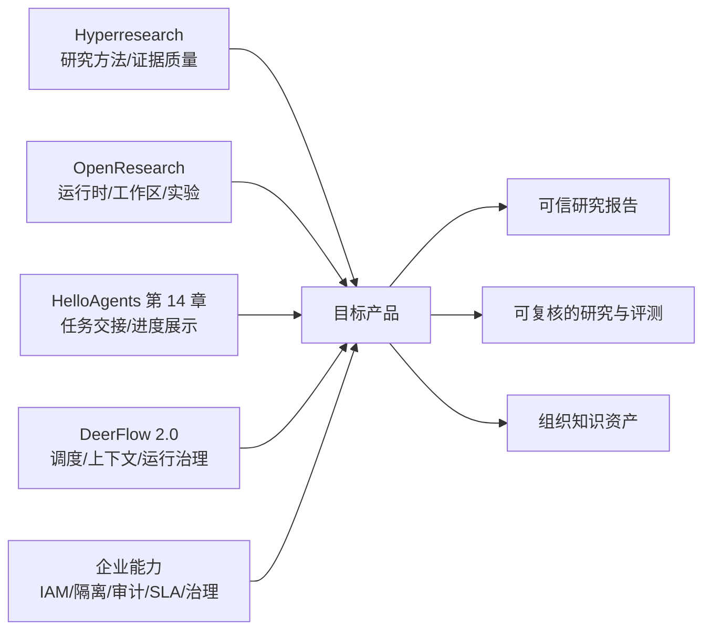
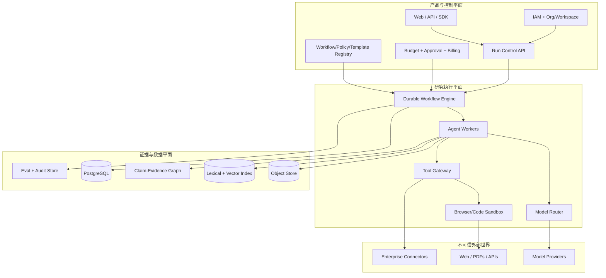
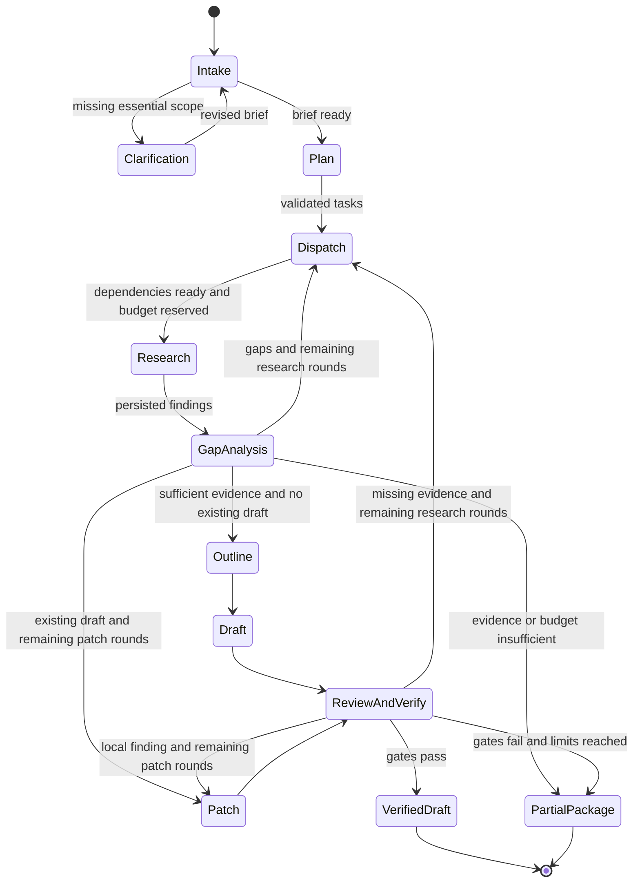

# 企业级 Deep Research Agent 架构蓝图

> 状态：V1 已建立可运行实现，正在进行真实 API 联调与验收。2026-09-11 修订：保留参考源码分析和长期架构，补充当前实现边界。第 1.3 节是首版范围的准绳；实测记录见 development-log.md，运行说明见 runbooks/local-development.md。本文中的质量目标、排期和性能预期不是实测成绩。

## 执行摘要

Deep Research Agent 不是“带搜索的聊天机器人”，也不是把多个 Agent 串起来就结束。一个完备系统必须同时解决四件事：把模糊问题转化为可验证的研究任务；在不可信且不断变化的数据源中获得足够、独立、可追溯的证据；以可恢复、可预算、可审计的方式完成长时工作流；把结果变成企业可以批准、复查、复用和治理的资产。

Hyperresearch 与 OpenResearch 恰好覆盖了两个互补方向。Hyperresearch 是“研究方法与证据质量引擎”：分解、广搜、矛盾分析、深挖、批判、补洞、引用核验和持久知识库。OpenResearch 是“研究 Agent 工作区与实验执行平台”：不同 Agent harness、Git worktree 隔离、实验树、日志证据、异构计算后端和本地产品界面。前者回答“怎样做出更可信的研究报告”，后者回答“怎样让多个研究/实验任务被可靠地运行和管理”。[1][2]

新增参考中，HelloAgents 第 14 章帮助把研究拆成可展示的任务与中间成果；DeerFlow 2.0 则提供子 Agent 容量控制、上下文管理、结果验收和运行事件的具体实现。[16][17] 企业产品可把这四个参考方向组合成三个平面：

1. **产品与控制平面**：组织、身份、项目、策略、预算、审批、模板、运行管理和 API。
2. **研究执行平面**：Durable Workflow、Agent workers、检索/浏览/代码执行沙箱、模型路由与并发控制。
3. **证据与数据平面**：来源快照、文档解析、claim-evidence 图、引用、报告版本、审计和评测数据。

V1 固定使用“FastAPI 模块化控制面 + 单进程 LangGraph 研究 Worker + PostgreSQL + S3 兼容对象存储 + Next.js/TypeScript 工作台”，以 Docker Compose 运行。研究主线是技术选型与竞品研究，同时用同一引擎支持论文／实验报告研读和通用深度研究。先验证多 Agent 的收益、证据质量、故障恢复、预算与隔离；真实企业连接、Temporal、多集群沙箱和完整治理按后续需求分期。

---

## 1. 什么才算一个完备的 Deep Research Agent

### 1.1 产品契约

一个研究任务的输入不仅是 `query`，还应是一个显式的 `ResearchBrief`：

- 研究问题、决策背景、目标读者；
- 范围、时间窗口、地域、行业和排除项；
- 允许/禁止使用的数据源；
- 输出类型、长度、引用规范和截止时间；
- 成本、时延、数据敏感级别；
- 需要人工批准的动作；
- 完成标准与质量门禁。

输出也不应只有一段 Markdown，而是一个 `ResearchPackage`：

- 最终报告与机器可读摘要；
- 来源清单、来源版本/获取时间和内容哈希；
- 原子 claims 与 supporting/contradicting evidence；
- 引用到原文片段的精确绑定；
- 未解决问题、假设、冲突和置信度；
- 执行轨迹、成本、模型/工具版本、审批记录；
- 质量评测结果和可复现 run manifest。

这两个契约是系统最重要的稳定边界。模型、搜索 API 和编排框架都会变，契约应该尽量不变。

### 1.2 与普通 RAG 的差别

普通 RAG 通常是一次检索后回答；Deep Research 是一个闭环：规划问题、并行检索、阅读与提取证据、发现矛盾和缺口、再次检索、形成论证、批判与修补、逐条验证引用。BrowseComp 专门测试“需要持续浏览才能找到的难检索事实”，而 DeepResearch Bench 同时评估长篇报告质量、有效引用数和引用准确性，说明检索与长篇综合必须分别测试。[3][4]

因此，系统的核心抽象应是“有状态研究运行”，不是“聊天消息”。

### 1.3 V1 交付契约：6–8 周的可验证系统

目标用户是需要比较技术方案、产品或研究方法的工程师与研究人员；项目展示重点是 Agent 应用工程。首版按个人开发、6 周形成核心闭环、8 周完成评测与展示安排。

| 维度 | V1 必须交付 | 后续扩展 |
|---|---|---|
| 研究能力 | 技术比较、论文／实验报告研读、通用研究；使用同一引擎 | 供应商尽调等更多领域包 |
| 输入输出 | 公开 HTML、可提取文本的 PDF、Markdown；结构化研究包、Markdown 报告与 Web 证据视图 | OCR、登录浏览器、DOCX/PPTX 导出 |
| Agent | Planner、Researcher、Reviewer、Writer；有界自主检索和补证 | 根据消融结果再拆更多专业角色 |
| 运行 | PostgreSQL checkpoint、重启恢复、取消、预算、有限调度、持久化事件 | Temporal、跨机器调度与跨天业务审批 |
| 隔离 | 两个测试租户；API、RLS、文件、证据、缓存、事件的负向测试 | SSO/SCIM、真实企业连接器与源 ACL 撤销 |
| 评测 | 20 个开发 briefs + 10 个保留 briefs；基线、消融、故障与安全用例 | 扩大样本及领域专家评审 |

首版论文研读首先总结问题与贡献，解释方法原理、实现流程、实验设计和结果含义，帮助用户快速理解论文；区分作者陈述的局限与系统推断，提出包含假设、baseline、指标、预期信号和失败风险的研究建议，并明确新颖性尚未验证。相关文献默认最多补充 3 个来源。同时检查实验设置、数据集、baseline、指标、消融与局限，判断结论是否被报告的证据支持。它不运行论文仓库、不重算上传 CSV，也不将作者报告的结果描述为本系统已复现。复杂扫描件、不可访问来源和解析失败必须明确披露。

完成标准是：用户能看到计划和任务进度，追溯报告结论到原文片段，理解未解决项；Worker 中断后能恢复；质量、成本和时延有可复核的实验记录。通过测试的原型不等同于已有企业客户、生产 SLA 或合规认证。

---

## 2. 参考项目的结构化拆解

原蓝图记录了 Hyperresearch `cbaaaf7`（v0.11.0）与 OpenResearch `3736d7e`（v0.2.0）的历史源码分析，两者均为 MIT License。本次保留该分析及固定版本链接，未重新检查这两个项目的源码；当前仓库不包含其 `references/` 目录。

本次新增分析基于工作区 `reference repo/` 中的 HelloAgents `4f7682ceafe573d07cd8a7d0b89908500e83227d` 和 DeerFlow `3f0b6ecc811190481897f1ed02c2ba0c1f69799e`，检查日期为 2026-09-11。HelloAgents 限于第 14 章与对应代码；DeerFlow 限于相关架构、子 Agent、上下文和运行机制。结论来自静态阅读，未启动参考系统，也未将其文档中的性能描述作为本项目成绩。

### 2.1 Hyperresearch：研究质量流水线

Hyperresearch 的入口是一个轻量路由 skill，实际步骤按需加载，避免长上下文中逐步遗忘流程。完整 profile 包含 16 个主要步骤：问题分解、广度检索、矛盾图、论证焦点分析、深度调查、跨焦点调和、来源分歧、语料批判、证据摘要、三稿并行、综合、四类批判者、缺口补抓、局部修补、引用核验、润色和可读性审计。它还按 light/full/dissertation 做规模路由，把 source budget、并发度、字数、critic 数量与 Agent 模型放进 profile，而不是散落在 prompt 中。[1]

值得复用的设计：

| 设计 | 为什么重要 | 企业版应如何吸收 |
|---|---|---|
| Canonical query 持久化 | 后续 Agent 不会被包装指令或上下文漂移带偏 | 升级为版本化 `ResearchBrief`，任何范围变化产生新版本与审计事件 |
| 分阶段、按需加载 skill | 控制长工作流的上下文腐烂 | Workflow 节点只加载自己的政策、输入 schema 和最小证据集 |
| 宽搜→深挖→批判→补洞 | 研究是反馈闭环而非线性生成 | 把 gap analysis 作为一等节点，可回边到 search/read |
| Claims 表与全文索引 | 将“读过的文档”转为可查询知识 | 建立 claim-evidence graph，引用必须绑定 evidence span |
| 引用句绑定与 cite-check | “有引用”不等于“引用支持该句” | 发布门禁逐 claim 检查 entailment、来源状态和引用可达性 |
| 独立性/转载聚类 | 多个转载不能伪装为共识 | 引入 provenance cluster 与独立来源计数 |
| 抓取内容标记为不可信 | 防止网页中的指令劫持 Agent | 数据与指令通道隔离，配合工具最小权限和恶意样本评测 |
| SSRF、大小、重定向检查 | 浏览工具本质上是联网执行能力 | 网络 egress gateway、DNS/IP 再验证、MIME/大小限制、域名策略 |
| Run manifest 与 resume | 长任务崩溃后可继续 | 交给 Durable Workflow，并要求每个外部动作幂等 |
| Patch, never regenerate | 审稿后避免整篇重写引入新错误 | 用报告 AST/段落 ID 做结构化 patch，保留 diff 和审批 |

Hyperresearch 的局限也很重要：它主要是 Claude Code 上的单机 harness，核心状态是 Markdown + SQLite；许多编排约束由 skills/prompts 实现；其 README 中的榜单领先说法明确标注为内部 pilot 的前瞻推算、尚待第三方验证。[1] 这非常适合学习研究方法，但不能直接等同于企业 SaaS 的多租户可靠性、SLA、数据治理或独立评测。

### 2.2 OpenResearch：Agent 工作区与实验运行时

OpenResearch 用 Rust 实现本地 CLI/服务，Axum 提供 JSON/SSE/WebSocket API，React/Vite 构建界面，SQLite WAL 保存项目、实验、run、chat、spawn 和 lease。它把 Claude Code、Codex、OpenCode 等封装成统一 harness；每个会话使用独立 Git worktree；实验以不可变 commit/branch 形成树；run 可以提交到本地、SSH、Slurm、Kubernetes、Ray、Hugging Face、Modal 等后端，并持久化日志与提交快照。[2]

值得复用的设计：

| 设计 | 为什么重要 | 企业版应如何吸收 |
|---|---|---|
| Harness interface | Agent/模型供应商可替换 | 定义 `ModelProvider` 与 `AgentRuntime` 两层 SPI，避免绑定某一 CLI |
| 独立 worktree | 并行 Agent 不互相踩代码 | 文档研究用 workspace namespace；代码/实验任务用 ephemeral worktree |
| 实验树与冻结节点 | 每个结论对应不可变代码版本 | 将 workflow/report/source/policy/model 都版本化，形成 lineage DAG |
| Store + watcher + lease | 短命令与长任务解耦，崩溃可回收 | 使用 durable queue/workflow；任务领取有 lease TTL 和幂等键，与证据 Claim 区分 |
| 固定 run contract | 不同实验结果可比 | 每个评测 suite 固定数据集、runner、grader 与环境镜像 |
| 多计算后端 | 研究可自然延伸到代码与实验 | 定义 `ExecutionBackend`，统一 submit/status/log/cancel/artifact |
| 日志是证据渠道 | 不凭“成功状态”推断结果 | 结构化 evidence events + 原始日志双轨保存 |
| 本地优先 | 敏感研究可保留在客户环境 | 企业版提供 SaaS、单租户 VPC、on-prem 三种部署拓扑 |

局限是：OpenResearch 的强项偏向科研代码与算力实验，而不是通用网页研究的 claim/citation 质量；本地服务默认绑定 loopback 且没有面向多用户的应用认证；公开仓库也明确把组织、账户、沙箱供应与托管算力放在伴随服务中。[2][5] 因此它是“运行时和产品形态”参考，而不是企业控制面的完整开源答案。

### 2.3 HelloAgents 第 14 章：研究任务与产品流程

该实现以 TODO Planner、Task Summarizer 和 Report Writer 组织“规划→任务研究→汇总”，通过 SearchTool 获取材料，NoteTool 保存笔记，SSE 展示任务、来源和工具事件。`SummarizationService` 为每个任务创建新的 Agent 实例，提供了任务上下文隔离的具体起点。[16]

| 参考机制 | 对本项目的补充 | V1 吸收方式 |
|---|---|---|
| TODO 包含 title、intent、query | 把 coverage matrix 转为可执行任务 | 增加依赖、范围、预算与完成条件，形成 `ResearchTask` |
| 每任务独立 Summarizer | 控制无关上下文干扰 | 每个 Researcher 有独立消息历史，只接收任务和证据引用 |
| NoteTool 与任务笔记交接 | 让中间结果可见、可复查 | 用结构化 `ResearchFinding` 持久化；笔记作为其展示视图 |
| task/status/sources/tool events | 将研究过程展示到前端 | 统一为持久化 `RunEvent`，驱动任务视图和证据检查器 |

适用边界：

- 第 14 章文档描述多轮研究与反思，但当前 `agent.py` 的主要路径是每任务搜索、摘要后汇总，未实现与本蓝图同等完整的跨来源缺口循环和逐 claim 引用验证。
- `run_stream()` 为每个 TODO 创建线程，状态与事件队列主要在进程内；保存笔记不等于可从工作流 checkpoint 恢复。
- `reporter.py` 主要消费任务摘要、来源概览与笔记；`search.py` 还可能把搜索服务的 AI 答案放入上下文。本项目将这类答案仅作为检索线索，最终证据必须回到已保存原文。
- 静态检查发现 `run()` 没有消费 `_execute_task()` 返回的生成器；由于后者包含 `yield`，仅调用不会执行任务体。该观察未通过运行参考项目验证，提示同步与流式入口应复用同一实际执行路径。[16]

### 2.4 DeerFlow 2.0：子 Agent 运行与治理机制

本地快照是 2.0 通用 Agent harness，README 明确说明其与 1.x 不共用代码。它的直接价值是可落地的运行机制，研究领域的 claim/evidence 质量仍由本项目负责。[17]

| 参考机制与源码入口 | 对本项目的补充 | V1 吸收方式 |
|---|---|---|
| benefit-based routing；`test_subagent_routing_prompt.py` | 用委派收益解释为何需要多个 Agent | 计划记录并行、专业能力或上下文隔离理由；有依赖的任务按顺序执行 |
| `subagents/capacity.py`；FIFO 容量与有限队列 | 并发数不能替代累计工作量限制 | 同时限制并发、总委派、工具调用、时间与预算 |
| `SubagentResult.status` + `stop_reason` | 正常结束与被上限截断有不同含义 | 保留部分成果，记录超时／取消／预算等停止原因 |
| `batch_acceptance.py` 与对应测试 | 产物验收独立于执行状态 | `execution_status`、`stop_reason`、`acceptance` 三者分别保存 |
| `tool_output_budget_middleware.py`、`durable_context_middleware.py` | 长结果外置，压缩后仍保留任务记录与工件引用 | `ContextBuilder` 注入精选证据，完整来源保存在对象存储 |
| `RUN_EVENT_STREAM.md` | 历史、调试、子任务界面读取同一事件记录 | 数据库事件为持久记录，SSE 支持按游标补读 |
| Harness/App 单向依赖与边界测试 | 同一引擎可被 API、CLI、评测使用 | `apps → packages`，领域层不导入 Web 框架或供应商 SDK |

源码边界必须一起保留：普通子 Agent 在 `executor.py` 中使用 `checkpointer=False`；durable batch 另有持久化条目和租约服务，其恢复也不能等同于恢复普通子 Agent 内部每一步。`capacity.py` 的共享上限是进程级上限，不能宣称跨机器全局配额。验收无条件、检查器故障或缺少证据时，不能因执行结束就推断通过。[18][19]

上下文隔离用于减少相互干扰，目录隔离用于组织文件，容器隔离用于限制执行，租户权限隔离用于控制数据访问；四者不能互相替代。首版不照搬任意代码执行、长期记忆、插件市场和渠道集成。

### 2.5 组合结论



不要把 16 步机械翻译成 16 个微服务，也不要让“一个角色一个 Agent”成为目标。角色是权限和上下文的边界；当两个角色需要相同工具、相同上下文且顺序执行时，可以由同一 Worker 完成。只有独立性、并行度、隔离或模型差异带来明确价值时才拆成多个 Agent。

现有蓝图保留证据平面与企业目标；新增重点是任务交接、可验证的运行契约和多 Agent 对照实验。参考实现中的测试仅证明其测试所覆盖的条件，本项目需要在自己的实现上重新验证。

---

## 3. 目标架构

### 3.1 三个平面与一个信任边界

下图是长期企业目标，包含尚未进入 V1 的 IAM、Billing、企业连接器和代码沙箱。V1 沿用三个平面的依赖方向，具体组件以第 9.1 节为准，运行流程见第 4 节。



外部网页、连接器返回值、上传文件和模型输出都属于不可信数据。只有系统政策、经过授权的用户指令和已验证的工具 schema 能进入指令通道。Hyperresearch 已经对 fetched body 做 `<untrusted-source>` fencing 并实施 SSRF 防护；AgentDojo 的 629 个安全测试也说明，外部工具返回的数据可以通过间接 prompt injection 劫持 Agent。[1][6]

### 3.2 产品与控制平面

V1 使用 Next.js/TypeScript 做 Web，Python/FastAPI + Pydantic 做 API 与领域服务。以下是领域模块的长期职责，完整 SSO、审批管理、连接器同步与计费产品不属于 V1：

- `identity`：SSO/OIDC、SCIM、用户、服务账号、组织与 workspace；
- `projects`：研究项目、brief、资料库、报告与共享；
- `workflows`：模板、run、task、checkpoint、pause/resume/cancel；
- `policies`：RBAC/ABAC、数据分类、模型/域名/工具/地域策略；
- `approvals`：高风险工具调用、预算升级、发布审批；
- `connectors`：OAuth、secret reference、同步游标和权限映射；
- `usage`：token、search、browser、storage、compute 成本和配额；
- `evaluation`：离线 suite、在线抽样、回归、发布门禁；
- `audit`：append-only 审计事件与导出。

企业多租户不能只依赖登录。AWS SaaS Lens 明确区分 authentication/authorization 与 tenant isolation，并建议按不同服务的负载和隔离需求组合 pool/silo；Kubernetes 对严格隔离场景建议从 default-deny 网络策略开始。[7][8] 推荐采用 bridge model：控制面共享；数据库默认按 tenant key + Row Level Security；对象存储按 tenant prefix/KMS key；高敏感客户的 Worker、索引和数据存储可以切到单租户部署。

### 3.3 研究执行平面

**V1 只用 LangGraph 作为图内编排运行时。** PostgreSQL checkpointer 保存研究图和 Researcher 子图的进度；API 将 run 持久化到 PostgreSQL 队列，独立 Worker 领取并执行。首版部署单 Worker 进程，进程内部有界并发。LangGraph 的 checkpoint 和子图提供恢复基础，但仍需要应用实现运行领取、取消、幂等与权限边界。[9][21][22]

| 机制 | 负责的状态 | 不承担的职责 |
|---|---|---|
| Run 队列、租约与 fencing token | 运行领取、存活、取消请求、重启接管 | 不决定图内下一个研究节点 |
| LangGraph checkpoint | 阶段、任务依赖、子图进度和补证／修订计数 | 不保存网页全文或充当领域证据库 |
| 业务 task/call/artifact 表 | 可查询的任务投影、调用记录、已提交结果及幂等键 | 不再实现一套竞争性的图内调度器 |

Researcher 子图按框架支持的独立 checkpoint namespace 持久化；不照搬 DeerFlow 普通子 Agent 的 `checkpointer=False`。将搜索、抓取、抽取等外部步骤拆成可检查的节点边界，避免整个研究循环只有一个大节点。checkpoint 中保存稳定的 `brief_version`、`task_id`、artifact references 与 `workflow_version`。

Worker 领取 run 时原子获取租约及递增 fencing token，执行中 heartbeat；所有业务结果提交必须验证当前 token。重启后只接管过期运行，旧执行者的迟到结果不能覆盖新状态。已落库产物可被重放节点复用；checkpoint 与业务写入之间的崩溃窗口靠幂等提交和恢复核对处理，不假设跨两个存储接口天然原子。

#### 调度、预算与取消

- 默认最多 3 个 Researcher 并发、1 层委派、2 轮补证；子 Agent 无再次 spawn 权限。Reviewer 和 Writer 的阶段调用同样消耗 run 预算。局部修订最多 2 轮，不能通过修订重新获得补证额度。
- 版本化运行 profile 必须给出累计 Researcher 任务数、每任务工具调用数、模型调用／token 上限、重试上限、排队容量、时限和金额上限；缺失必填上限时拒绝启动。任务计数随创建增长，实际重试继续消耗调用与时间额度，重启不能重置计数。
- Planner 提出任务、依赖和委派理由；调度器检查 DAG 无环、权限、剩余额度及独立性后执行。简单问题可使用一个 Researcher；累计任务上限与并发上限分别检查。
- 模型和工具调用前原子预留预计最大成本，完成后按已知用量结算；供应商结果未知时保留未结算预留并记录 `unknown`，不能释放后重复消费。外部计费可能无法即时确认，界面区分已知成本与待结算额度。
- soft budget 停止扩展新研究方向并优先收尾；hard budget 停止新调用。profile 为汇总和验证单独预留额度；额度不足时输出确定性的部分研究包与未解决项，不能绕过预算调用模型。
- 取消先写入持久状态，再传播到图、模型流和抓取／解析任务；不再派发新工作，迟到结果通过 fencing 与状态检查拒绝提交。取消无法保证供应商立即停止计费。
- 每个外部动作关联 tenant/run/task/call ID 和幂等键。仅对可识别瞬时错误进行有界重试；未知结果不能视作未执行。系统保证自身有效产物提交的幂等，不承诺外部 API exactly-once。

Temporal 作为后续 ADR：只有跨天业务审批、定时运行或跨服务恢复需求明确时再评估。若引入，它管理外层业务生命周期，LangGraph 保留研究逻辑；ADR 必须说明两者的状态所有权、重试和取消边界，避免双重恢复。[10]

### 3.4 工具网关与 MCP

工具不应由 Agent 直接持有永久凭证。所有工具调用经过 Tool Gateway：参数 schema 校验、主体与租户解析、策略决策、速率/预算控制、secret exchange、执行、结果净化、审计和幂等处理。

V1 的 Tool Gateway 是领域模块，统一执行“身份／schema → 权限 → 预算预留 → 执行 → 结果保存／净化 → 用量结算／事件”。工具只包括搜索、抓取、来源阅读与受控解析；Provider 凭证留在服务端，Agent 只见工具契约。MCP 保留适配器边界，暂不构建动态工具市场或暴露外部写动作。

MCP 适合作为外部工具协议，但不是权限系统的替代品。HTTP MCP 的授权规范要求访问令牌绑定目标资源、服务端验证 token audience，并禁止把收到的 token 直接透传给下游 API；这正好支持“网关使用连接器专属下游凭证”的设计。[11] 对删除、发送、支付、发布、写入 CRM 等动作，默认 `human_approval=required`。OWASP 将给 Agent 过多功能、权限或自主范围归为 Excessive Agency 风险，建议通过最小权限与人工批准压缩影响面。[12]

工具能力建议分级：

| 等级 | 示例 | 默认策略 |
|---|---|---|
| R0 纯计算 | tokenize、排序、格式转换 | 自动 |
| R1 只读公开数据 | web search、公开网页、论文库 | 自动，受 egress/预算限制 |
| R2 只读企业数据 | Drive/Slack/Confluence/数据库查询 | 继承用户权限，记录数据标签 |
| W1 可逆写 | 建草稿、创建临时文件 | 可按 workspace 策略自动 |
| W2 外部影响 | 发消息、改记录、发布报告 | 人工批准 |
| W3 高风险 | 删除、交易、权限变更、运行任意代码 | 强审批或禁用 |

### 3.5 证据与数据平面

不要把向量数据库当作主数据库。建议：

- PostgreSQL：事务状态、租户、run/task、来源元数据、claims、citations、策略和审计索引；
- S3 兼容对象存储：网页/PDF 原始快照、解析文本、截图、报告和运行工件；
- PostgreSQL FTS/OpenSearch：精确词项、实体、日期和过滤检索；
- pgvector/独立向量库：语义召回，但结果必须回到 source version；
- Redis（可选）：短期 cache、rate limit，不作为事实来源；
- 图关系先用 PostgreSQL edge tables；确有复杂图遍历需求后再引入图数据库。

核心数据模型：

| 实体 | 关键字段/关系 |
|---|---|
| `organization/workspace` | region、retention、isolation tier、policy set |
| `research_brief_version` | canonical question、scope、constraints、acceptance criteria |
| `research_run` | workflow version、status、budget、initiator、parent run |
| `research_task` | type、state、attempt、lease、input/output artifact、idempotency key |
| `source` | canonical URL/connector ID、publisher、provenance cluster |
| `source_version` | fetched_at、content hash、MIME、raw/parsed artifacts、access policy |
| `chunk/evidence_span` | source version、offset/page/DOM anchor、exact excerpt hash |
| `claim` | normalized text、type、confidence、status、authoring agent |
| `claim_evidence_edge` | supports/contradicts/context、strength、entailment score |
| `report/report_revision` | template、AST、rendered artifacts、diff、approval |
| `citation` | report node → claim → evidence span → source version |
| `model/tool_call` | provider、version、tokens、latency、cost、policy decision |
| `evaluation_result` | suite/case/grader versions、scores、failure taxonomy |
| `audit_event` | actor、action、resource、decision、timestamp、trace ID |

`source_version` 而不是 URL 才是引用的真实对象。网页会变化，同一个 URL 在不同时间可能支持不同结论。最终报告展示人类可读 URL，但内部保留快照、时间、哈希和定位信息。

V1 将原始字节哈希与解析文本版本分别保存；`EvidenceSpan` 指向具体解析版本的字符区间，PDF 另存页码和表格／单元格定位。重新解析生成新版本，不原地移动旧引用。近重复归并保留原始出处；同一论文或供应商材料的转载不能算多个独立证据。搜索 snippet、搜索服务生成的答案和 Agent 摘要只能作为线索，不能替代原文证据。

### 3.6 V1 运行 API 与事件契约

| 接口 | 最小行为 |
|---|---|
| `POST /research-runs` | 接收 brief、模板、已授权上传引用和 profile；幂等创建并立即返回 `202 + run_id` |
| `GET /research-runs/{run_id}` | 返回阶段、任务状态、执行状态、停止原因、质量状态和已知／待结算成本 |
| `GET /research-runs/{run_id}/events?after_seq=…` | SSE 订阅与补读；支持 `Last-Event-ID`，同时提供历史重建所需事件 |
| `POST /research-runs/{run_id}/cancel` | 幂等记录取消请求；重复请求返回当前状态 |
| `POST /research-runs/{run_id}/resume` | 恢复可恢复的中断；Intake 等待澄清时可提交答案，冻结后沿用同一 brief；保留 checkpoint 和已消费预算，不重复启动活跃 run |
| `POST /uploads`、`GET /evidence-spans/{span_id}` | 租户内上传及原文片段读取；对象存储路径不作为调用者的授权凭证 |
| `GET /research-runs/{run_id}/report` | 返回不可变报告 revision、引用和未解决项，尚无报告时给出明确状态 |

上述运行、上传、报告、证据与 SSE 接口已在 src/research_agent/api.py 实现，另有运行列表、来源读取、用量及 Markdown 导出；具体字段以 /openapi.json 和 contracts.py 为准。当前创建接口接收完整 brief 并立即冻结，resume 只恢复中断运行；下文的对话式 Intake 澄清是尚未实现的交互扩展。CLI、评测 runner 与 HTTP 复用相同的 `ResearchService` 和研究图。上传文件和恢复操作都先验证服务端身份与资源归属；运行中修改 scope 产生新 brief 版本和新 run，首版不热改活跃图。复用快照时重新检查权限与时效。

`RunEvent` 最小字段为 `schema_version, tenant_id, run_id, seq, event_type, task_id?, attempt_id?, trace_id, occurred_at, payload`。`seq` 在 run 内严格递增，事件覆盖计划、任务、证据引用、审查、预算、错误及终态。序号由持久存储分配；任务状态变更与对应事件同事务提交，数据库提交后才对外发送。

SSE 是传输层，数据库事件是历史事实。事件允许重复交付，客户端按 `(run_id, seq)` 去重并补读；浏览器断线不会取消研究。token 流可作为临时展示，最终任务结果、用量和终态必须持久化。事件与日志默认只含脱敏元数据和授权工件引用，不包含原文全文、凭证或隐藏推理过程。

---

## 4. 端到端研究状态机

以下是 V1 研究流程。执行状态与报告质量另行记录：完成执行不自动意味着证据通过验收。授权、预算或基础设施错误可从任意运行阶段进入中断／失败处理，故障语义见第 3.3、6.2 节。



Researcher 子图执行 `选择查询 → 搜索 → 抓取／解析 → 单来源证据提取 → 判断下一步` 的有界循环。下载、解析和定位是程序工具；查询选择、追踪引用、提取与判断由 Researcher 完成。不同 Researcher 返回结构化证据，经合并和审查后进入报告阶段。

### 4.1 Intake 与范围确认

Intake 是 Planner 的能力之一，负责标准化 brief、歧义、范围和完成标准，不独立新增 Agent。只有缺少影响研究方向的必要信息才中断等待澄清；已完整的请求直接规划。Intake 暂存未冻结的 draft brief，澄清答案通过 resume 提交；进入 Plan 前冻结 canonical brief。冻结后的范围变化产生新版本与新 run。长期企业版的高风险 `ScopeApproval` 和外部 `PublishApproval` 是单独扩展；V1 生成租户内报告不需要额外发布审批。

### 4.2 Plan 与覆盖矩阵

`Planner` 将问题拆成原子 research questions，生成 coverage matrix：问题、所需证据类型、首选来源、时效性、反方/替代解释、完成条件和预算。计划是可执行 DAG，但允许 GapAnalysis 动态添加任务。计划质量的核心不是“步骤多”，而是每个问题都有可观察的证据门槛。

### 4.3 Discover、Retrieve、Normalize

Researcher 承担 Search Strategist 职责，生成定义／事实、时间、支持、反驳、原始数据和学术等多视角查询。V1 使用一个 Web search provider 和公开来源获取工具，论文可通过公开 URL／上传读取；专用学术与企业连接器后置。

Retriever 工具获取候选内容，校验 URL scheme、DNS/IP、重定向、MIME、大小、访问规则与域名策略。V1 不能读取的动态页面或登录来源明确标注为不可访问。后续若增加隔离浏览器，CAPTCHA、2FA 和新的授权同意应交还人类。

`Normalizer` 保存原始快照，解析正文、表格、PDF 页码、标题、作者、发布时间、更新时间和 canonical URL，随后做内容哈希、近重复、转载/依赖关系与来源质量标注。解析失败不能静默降级成空文档。

### 4.4 EvidenceBuild

Researcher 的 Source Analyst 步骤以单一来源为上下文，提取：

- 原子 claim；
- 原文 evidence span 与定位；
- 数字、单位、样本、时间范围；
- evidence type（primary data、official statement、peer review、commentary 等）；
- 限制条件与潜在偏差；
- 对研究问题的 stance；
- 需要追踪的引用或关联来源。

此阶段只抽取“来源说了什么”，不承担跨来源最终结论。这样可以降低早期摘要对后续推理的污染。

### 4.5 GapAnalysis 与停止条件

Reviewer 承担 Corpus Critic 职责，检查 coverage、原始来源、转载依赖、未解释矛盾和时效性，提出最有可能影响结论的 gap tasks；Planner 整理任务范围，调度器再次校验预算与权限。Reviewer 不能自行派发无上限的新工作。

质量充分的正常停止需要满足：

- 每个必答 research question 达到证据门槛；
- 关键 claim 至少有一个合格 supporting span；高风险 claim 需要两个独立来源或明确标注单一来源；
- 主要反例/冲突已处理；
- 未解决项被显式记录。

V1 将“边际信息增益”具体化为本轮是否增加新的有效证据、独立来源，或改变问题覆盖／冲突状态。没有这些变化时停止重复检索；若质量仍不足，转为待核验的部分研究包。最多 2 轮补证是全 run 累计上限，初始研究之后的任何回搜都消费该额度，不能通过换阶段重置。

预算、时限、取消和任务上限可提前结束研究，但必须留下独立的 `stop_reason`。未完成的必答问题不能通过删除问题或省略关键结论来伪装达标。事实查无证据时报告证据不足；允许保留有定位证据的冲突，不要求强行得出一致结论。

### 4.6 Outline、Draft、Critics 与 Patch

Writer 的 Outline 步骤使用已验收 claims/evidence 设计论证结构，再生成报告。V1 的 Report AST 限于带稳定 ID 的 section、paragraph、comparison table 与 citation nodes；保存 Markdown 渲染结果，不先做通用文档编辑平台。Writer 只能按授权引用读取证据，不能自由搜索或写外部系统。

Reviewer 按四类 rubric 检查，首版不强制启动四个独立 Critic：

- evidence critic：结论是否超出证据；
- coverage critic：是否漏答或缺少关键视角；
- dialectic critic：是否公平处理反例和冲突；
- instruction/policy critic：是否满足 brief、格式、合规和数据政策。

Critic 只产生带位置、严重度、原因、建议和所需证据的 finding。Patcher 只能修改被授权的 AST 节点；重大结构问题不能伪装成“小修”。这一点继承 Hyperresearch 的 patch-not-regenerate 思想，同时比文本 diff 更适合稳定产品。[1]

V1 由 Writer 承担 Patcher 职责，每次修改产生新 revision；局部修订最多 2 轮，改动结论及相关引用必须重新检查。已有报告的运行在补证后进入 Patch，不重新生成全文；没有修订额度则保留草稿并标记 `needs_review`。重大结构问题由新 run 处理；自动重建 outline/draft 属于后续扩展。来源陈述、系统推断与证据不足使用明确类型，系统推断需要展示推导依据和限制条件。

### 4.7 CitationCheck 与发布门禁

每个外部事实 claim 都应完成以下检查：

1. citation 能解析到当前租户可访问的 source version；
2. evidence span 存在且定位仍有效；
3. evidence 对 claim 是支持、反驳还是仅背景；
4. 数字、单位、时间、主体和限定词一致；
5. 来源未撤稿/失效，或报告已披露；
6. 来源独立性满足风险级别；
7. 报告中的链接和参考文献完整。

V1 程序检查引用归属、解析版本、span 哈希／定位、数字与日期一致性；Reviewer 检查语义支持、覆盖与冲突。自动 entailment 评分不能替代确定性检查或人工抽检。来源当前可达性、撤稿与失效信息无法确认时记录为未知，不能默认有效。报告 revision 不可变；任何修改创建新 revision 和引用复检。`VerifiedDraft` 表示通过当前自动门禁，仍是可供复核的草稿，不是事实或专业意见认证。

---

## 5. Agent、模型与上下文设计

### 5.1 V1 四类 Agent 与确定性工具

| 角色 | 输入与自主判断 | 输出 | 权限与原职责映射 |
|---|---|---|---|
| Planner | 用户请求、brief、profile；拆解问题、任务依赖与委派理由 | Brief、Plan DAG、覆盖矩阵 | 合并 Intake 与 Planner；只提出计划，由程序检查权限和资源 |
| Researcher | 单个任务、精选证据；自主选择查询、追踪引用、单来源提取及局部停止 | `ResearchFinding`、claims/spans、缺口与限制 | 合并 Search Strategist、Source Analyst；只读研究工具，无 spawn 和报告写权限 |
| Reviewer | Brief、覆盖矩阵、证据及可选报告；判断支持、冲突和遗漏 | `ReviewFinding`、gap task 建议、语义验收意见 | 合并 Corpus Critic 与各类 Critics；不能改稿、改证据或直接派发任务 |
| Writer | 已验收的证据、outline、findings；组织论证和局部修订 | Report AST、不可变 revision | 合并 Outline、Writer、Patcher；无搜索及外部写权限 |

Retriever、Normalizer、预算、调度、权限、哈希／引用定位检查和 renderer 是确定性工具或服务。需要模型判断的语义核验归 Reviewer，不能将纯代码检查包装成额外 Agent。Reviewer 与 Writer 使用独立上下文和权限，但同模型的不同角色不等于统计独立，也不能保证互相纠错。

### 5.2 模型路由

模型选择应该是策略，而不是写死在角色名里：

- 轻模型：查询扩展、分类、去重候选、格式校验；
- 强推理模型：计划、gap analysis、跨来源综合、关键批判；
- 长上下文模型：必要的多文档比较，但仍输入精选证据而非整个语料库；
- embedding/reranker：召回与排序；
- 本地/私有模型：高敏数据或数据驻留场景；
- fallback 模型：供应商故障或预算降级。

每次调用记录 provider/model/version、prompt template version、temperature/effort、输入 artifact hashes、tokens、latency、cost 和 trace。不要记录未脱敏的 secret；是否记录原始 prompt/response 由数据分类策略决定。

V1 默认先用一套固定模型配置建立基线，角色差异由任务、上下文和工具权限体现；运行 manifest 固定有效配置。多供应商校验与模型自动升级后置，只有对照实验能够证明收益后再启用，避免同时改变架构与模型导致无法归因。

### 5.3 上下文分层

把上下文分为五层：

1. **Policy context**：系统安全和组织政策，最高优先级、不可由数据覆盖；
2. **Task context**：当前节点目标、schema、预算和允许工具；
3. **Research context**：brief、coverage、精选 claims/evidence；
4. **Working memory**：当前节点短期草稿和 tool results；
5. **Long-term memory**：经验证的来源、组织知识与历史运行。

长时 Agent 最常见的错误之一是把五层混在消息历史里。正确做法是每个节点重新构造最小上下文，显式引用 artifacts；历史 reasoning 不作为事实，只有结构化产物能流向下游。

V1 通过 `ContextBuilder(role, task, evidence_refs, profile)` 实现前四层；跨 run 长期记忆不启用。完整工具输出进入对象存储，返回带 artifact ID、内容哈希、长度和截断标记的摘要；Agent 可在预算内请求指定片段。无法保存的结果不能伪装成完整可追溯证据。[20]

压缩不修改 canonical brief、任务状态、接受条件或证据原文；委派记录和证据引用保留在结构化状态中。网页、工具、摘要和子 Agent 文本始终是数据，不能因进入摘要就提升为系统政策。Writer 输入精选 claims/spans，但 Reviewer 必须能回读原文核验，防止摘要失真沿链路放大。

### 5.4 任务、交接与验收契约

在 `ResearchBrief`、`SourceVersion`、`Claim`、`EvidenceSpan`、`Citation`、`ResearchPackage` 六个证据核心类型之外，V1 增加以下契约，使用 Pydantic／JSON Schema 校验并记录版本：

| 类型 | 必要内容 | 校验与交接责任 |
|---|---|---|
| `ResearchTask` | task/run/brief version ID、question ID、objective、scope、depends_on、source policy、tool allowlist、budget、acceptance criteria | Planner 提议；调度器校验依赖、身份、权限与额度；执行后不允许静默改目标 |
| `ResearchFinding` | task/attempt ID、claim IDs、evidence references、已覆盖问题、冲突、限制与缺口、artifact references | Researcher 产出；代码检查 schema、来源归属与定位，Reviewer 检查语义和覆盖 |
| `ReviewFinding` | 目标 task／claim／report node、严重度、原因、相关 evidence references、建议动作及验证条件 | Reviewer 产出；缺证转为任务建议，局部改稿交 Writer，审查者不能直接改原证据 |
| `RunEvent` | 第 3.6 节的版本化事件信封 | 服务端身份、序号与持久化；API、UI、CLI 和评测共用 |

研究产物只存结构化结论、证据引用和可解释的决策说明，不以隐藏 chain-of-thought 作为交接或审计格式。抽取失败允许一次有界格式修复；仍不符合契约时标记失败，不用正则拼接猜出成功结果。

任务结果分别记录三个维度：

- `execution_status`：queued/running/completed/failed/cancelled，回答是否执行结束；run 另允许 interrupted 等待恢复。
- `stop_reason`：normal/budget_exhausted/turn_limit/no_new_evidence/timeout/cancelled/provider_error 等，回答为何结束。
- `acceptance`：accepted/rejected/unchecked，附检查器版本、检查项和证据，回答产物是否满足本任务的完成条件。

schema 合法、引用可解析不代表语义验收通过；没有检查条件或检查器故障时为 unchecked。部分完成任务可以贡献已经单独核验的证据，但它未完成的覆盖项必须留在报告中。任务完成条件包含具体问题和证据要求，例如“核对候选方案的部署约束，返回原文证据，并记录官方声明与独立测试的区别”。

---

## 6. 企业级非功能能力

### 6.1 安全与隔离

**V1 实现边界：** 使用两个测试租户及独立 API key，服务端保存 key 哈希并解析 tenant/workspace；不接受请求体或模型输出指定有效租户身份。运行时数据库角色不得拥有 `BYPASSRLS` 或绕过表策略的所有者权限，必要时使用 `FORCE ROW LEVEL SECURITY`；迁移角色与运行角色分离。事务内绑定租户上下文，连接池复用时不得泄漏上一租户身份。

所有领域查询、上传、span、报告、事件和恢复入口验证归属；checkpointer 的 thread/namespace 只能由已授权 run 映射，不能暴露任意 checkpoint 读取接口。对象存储私有，租户前缀仅用于组织对象，读取必须经过授权。V1 禁止跨租户复用私有源缓存，缓存键包含租户／访问作用域和来源版本；内容哈希相同不代表可以共享权限。

抓取与解析在受资源限制的执行环境中运行；解析进程无外网和供应商凭证，限制文件类型、大小、页数与处理时间。抓取限制重定向和最终连接目标，拒绝私网与本机目标，覆盖 DNS 重绑定／SSRF 用例。HTML 报告展示禁用原始 HTML 或进行严格净化，防止不可信引用文本成为前端脚本。V1 无任意代码执行工具。

**长期企业能力：**

- OIDC/SAML SSO、SCIM、MFA、service accounts；
- RBAC 负责角色，ABAC 结合 tenant、项目、数据级别、地域、工具与动作；
- PostgreSQL RLS + 应用层 tenant context 双重约束；
- 每租户对象前缀/KMS key，敏感客户独立 bucket/DB/cluster；
- Worker 使用短期身份，secret 存 Vault/KMS，Agent 只见 opaque reference；
- 浏览器与代码执行在无特权容器/微虚机，rootless、只读基础镜像、CPU/内存/时间/磁盘限额；
- 网络默认拒绝，按 task 开 egress allowlist；私网连接器走专用 gateway；
- 上传文件做类型校验、恶意软件扫描、解压炸弹/宏/嵌入对象限制；
- prompt injection 检测是辅助层，真正边界是 data/instruction separation + least privilege + approval；
- 审计日志 append-only，支持 SIEM 导出和 legal hold。

NIST AI RMF 将治理、映射、测量和管理贯穿 AI 生命周期；其 Generative AI Profile 专门补充生成式 AI 的风险管理动作。企业交付时可以把本系统的 policies、evals、incident process 和 evidence records 映射到这四类能力，而不是只做一张“合规功能清单”。[13]

### 6.2 可靠性

V1 先验收第 3.3 节的重启恢复、取消、幂等与预算协议。run 的 execution status 与研究阶段分别记录：interrupted 可以恢复，completed/failed/cancelled 是终态；需要再次研究时创建关联的新 run。租约代次检查同时覆盖 checkpoint 写入与业务结果，避免只保护业务表却让旧 Worker 污染新图状态。

恢复不是要求模型重新生成完全相同的文字，而是复用已提交结果、保持合法状态和预算账本，并能说明哪些未完成步骤被重试。某个 Researcher 失败不能丢弃其他已验收证据；根据问题覆盖决定部分报告或失败，不能静默当作完整成功。

长期扩展继续遵循以下要求：

- Run 状态有显式合法迁移；任何 task 可被安全重放或明确标记不可重试；
- workflow/activity heartbeat、lease TTL、dead-letter 和人工恢复；
- 模型/搜索/连接器 circuit breaker 与 provider failover；
- source fetch 使用 content-addressed cache，但遵守权限和时效；
- 报告发布与审计写入使用 transactional outbox；
- RPO/RTO、备份恢复演练和跨区域策略按租户等级定义；
- 控制面 SLO 与长时 run completion SLO 分开；
- graceful degradation：少一个搜索 provider 不应让整个运行失败，但必须披露覆盖影响。

### 6.3 可观测性与 FinOps

使用一个 `trace_id` 贯穿 API request → workflow → task → agent/model/tool → artifact。OpenTelemetry 的语义约定为跨语言 traces、metrics、logs 提供统一命名；GenAI 字段仍需注意版本稳定性，因此内部事件 schema 要版本化。[14]

关键指标：

- 产品：run success、time-to-first-plan、time-to-report、approval wait；
- 研究：coverage、有效独立来源、claim support、citation precision、contradiction resolution；
- 模型：tokens、latency、retry、fallback、structured-output failure；
- 工具：search hit、fetch success、parse quality、connector throttling；
- 系统：queue delay、workflow replay、worker saturation、sandbox failure；
- 成本：每 run/tenant/stage/provider 成本，单位有效 claim 成本；
- 安全：policy deny、approval、prompt-injection canary、跨租户访问测试。

任何日志字段都要先做 data classification；默认不把网页全文、企业文档或 prompt 原文塞进可观测平台。

---

## 7. 评测与发布门禁

评测要分层，否则“最终报告看起来不错”会掩盖检索、证据或安全失败。

### 7.1 离线评测矩阵

| 层 | 指标 | 数据集/方法 |
|---|---|---|
| 规划 | coverage、约束遵循、任务可执行性 | 人工 rubric + 业务 golden briefs |
| 检索 | recall@k、unique primary sources、freshness | 冻结 corpus；BrowseComp 测难检索事实[3] |
| 解析 | 正文/表格/PDF 定位准确率 | 带页码/DOM anchor 的解析集 |
| 证据 | claim-span precision/recall、数字一致 | 双人标注 evidence set；FACTS Grounding 辅助长文 groundedness[15] |
| 综合 | 完整性、洞察、冲突处理、可读性 | DeepResearch Bench/RACE 类 rubric[4] |
| 引用 | citation correctness、completeness、independence | 确定性解析 + 人工抽检 |
| Agent | tool success、recovery、budget adherence | 故障注入、provider timeout、resume/cancel |
| 安全 | attack success、unauthorized tool calls、data leak | AgentDojo 类注入样本 + 自建 connector attacks[6] |
| 企业 | tenant isolation、audit completeness、retention | 自动跨租户负向测试、灾备演练 |

### 7.2 必须分开的四个分数

- `retrieval_score`：有没有找到应找的材料；
- `grounding_score`：claim 是否被证据支持；
- `synthesis_score`：是否组织出正确、有用的解释；
- `operational_score`：是否在预算、安全、恢复和时限内完成。

不要把它们压成一个无法诊断的总分。总分只适合发布看板，工程回归必须能定位 failure taxonomy。

### 7.3 V1 门禁与质量目标

单次运行的自动门禁要求 citation 全部能解析到授权的来源版本和原文位置、必答项有覆盖或明确的未解决标记、关键 claim 无未处理的高严重度 finding、无越权工具调用，且 manifest、成本账本、来源清单与降级说明齐全。未解决的必答问题导致质量状态 needs_review，不能仅因标注了缺口就放行成完整报告。

评测集上的目标保留为外部事实支持率 ≥ 95%、人工抽样 citation precision ≥ 95%；这些是待校准目标，不是每份报告的实时人工认证，更不是现有成绩。运行的 `quality_status` 使用 passed/needs_review/unchecked，表示当前版本门禁状态；未通过或未完成验证时仍可交付部分研究包并显示待核验。

确定性检查负责归属、哈希、定位与可结构化的数值一致性，LLM 负责语义审查和 rubric 评分，人工抽检用于校准误判。医学、法律、金融等高风险领域不属于首版质量承诺，后续需要领域专家与专门门禁。

### 7.4 开发集、保留集与公平对照

开发集 20 个 briefs（12 个技术比较、4 个论文研读、4 个通用研究），用于调整流程和 prompt；另建 10 个保留 briefs（6/2/2），不用于调参。每个案例记录问题、预期关键证据与覆盖 rubric；论文案例加入不同数据集、指标口径或硬件设置下的错误比较陷阱。固定划分和版本，保留集标注不提供给研究 Agent。

冻结来源快照与搜索索引构成离线 corpus；所有系统访问相同的工具和 corpus，记录查询与命中。实时联网实验另开 suite，记录抓取时间和 provider，评估新资料发现与时效性，不与冻结对照混算。BrowseComp、DeepResearch Bench 和 AgentDojo 是后续补充或 rubric 参考；自建子集／改编样本必须标注，不能声称取得官方全量成绩。

| 对照 | 固定项与唯一变化 | 回答的问题 |
|---|---|---|
| B0 单 Researcher 迭代研究 vs B1 多 Researcher 无全局补证 | 相同模型配置、工具、总预算和输出／校验要求；改变任务分解与上下文组织 | 多 Agent 是否改善覆盖、质量或时间？ |
| B1 vs B2 完整系统 | 只启用 Reviewer 驱动的全局补证，保持总预算上限相同 | 补证是否减少关键遗漏和 unsupported claims？ |
| B2 并发度 1 vs 3 | 固定任务集合、模型及其他 profile 参数 | 并行本身的时延收益与额外开销是多少？ |
| B2 全文上下文 vs 精选 spans／工件引用 | 固定 corpus、任务、模型、上下文窗口和预算，改变上下文构造 | 是否减少 token 使用，同时维持覆盖和证据支持？ |

各组使用相同的总 token／金额上限并报告实际调用量；修订、审稿和重试都计入预算。B0 也获得相同的原文读取、证据存储和最终核验能力，不能用一次搜索的弱基线冒充单 Agent。全文组超出窗口时按预登记的固定截断规则处理并记录丢弃量，不能临时挑选有利材料。

核心 B0/B1/B2 在保留集上每例重复 3 次，顺序交错，固定可用随机种子、模型／prompt／工具／图／grader 版本；其他消融先在预先选定的代表子集上执行并明确样本范围。Anthropic 的多 Agent 研究经验指出 token 投入本身会显著影响表现，因此必须分开报告资源投入、组织方式和质量收益。[23]

### 7.5 指标口径、故障用例与面试证据

| 指标 | 统计口径 |
|---|---|
| 问题覆盖 | rubric 中已充分回答的必答项 / 全部必答项；保留关键遗漏明细 |
| 事实支持率 | 报告外部事实中，被原文支持的数量 / 全部被标注外部事实；不只统计 Agent 主动生成的 Claim 列表 |
| 引用准确性 | 抽检的 claim-citation 关系中语义确实支持的比例；与定位有效率分开 |
| 冲突处理 | 是否识别数据集、版本、时间、指标口径或利益来源差异，以及是否披露未解冲突 |
| 运行成本与时间 | 每 run 模型／工具成本、token、调用数、待结算额度、计划首响、总时长及恢复开销 |
| 运行正确性 | 预算内调度、合法状态、无重复有效提交、恢复／取消／租户隔离用例结果 |

人工抽检从完整报告选择事实与推断前提，采用固定抽样规则并记录分子、分母和错误实例。自动抽取用于辅助定位，不能自行决定全部分母；证据不足的回答还须接受覆盖评分。报告样本数、分布和区间，小样本不能推导生产 P95 SLO；LLM judge 分数与人工一致性单独展示。

| 验收场景 | 必须观察到的行为 |
|---|---|
| 搜索／抓取时和汇总前杀死 Worker | 过期租约后恢复，已提交产物复用，预算累计不归零，未完成步骤有重试记录 |
| 超时、429、格式错误、解析失败 | 有界重试或显式部分失败，不生成空文档充当来源 |
| 并发争抢最后预算、队列满、反复补证 | 原子预留生效，排队和调用均有上限，所有回搜共用补证计数 |
| 取消与旧 Worker 迟到完成 | 不派发新任务；旧代次不能提交 checkpoint／有效产物；已知与未知费用分别记录 |
| SSE 断线重连、重复事件、页面刷新 | 从序号补读并去重，重建同一任务与报告状态，研究不因浏览器断线取消 |
| 两租户使用相同文件名／内容哈希 | API、RLS、缓存、对象读取、事件与恢复入口均不能跨租户访问 |
| 恶意网页、私网重定向、报告内脚本 | 不提升工具权限，不访问禁用目标，不泄漏凭证／其他租户资料，不执行前端脚本 |
| 无来源、相互矛盾的来源、实验条件不一致 | 输出限制与未解决项，不能伪造引用、强行一致或宣称已经复现实验 |

交付三段可复核演示：包含反证与补搜的技术比较、有 PDF 原文定位的论文审查、中途杀进程后的恢复。每段对应 manifest、事件轨迹、证据和评测结果；另保留失败案例及架构取舍说明。简历仅引用实测的覆盖／质量／成本／时延变化，不预填提升百分比，不将原型测试写成企业生产规模。

---

## 8. 如何在这套架构上设计自定义功能

自定义不应等同于“改 system prompt”。以下六类是长期扩展边界。V1 只实现内置 Connector 接口、三个受版本控制的研究模板及 report/eval 配置，不实现任意插件安装、DSL 编译器、签名 registry 或扩展管理 UI。

### 8.1 Connector Plugin

用于 Web、论文库、数据库、Slack、Confluence、SharePoint、CRM 等数据源。统一接口：

```python
class Connector:
    def capabilities(self) -> ConnectorCapabilities: ...
    async def search(self, query: SearchQuery, ctx: AccessContext) -> list[SourceRef]: ...
    async def fetch(self, ref: SourceRef, ctx: AccessContext) -> SourcePayload: ...
    async def checkpoint(self) -> SyncCursor | None: ...
```

必须返回 provenance、ACL/data labels、freshness、content type 和稳定 source identity。连接器不能自行决定把数据注入 prompt；所有结果先进入 normalization 和 policy pipeline。

### 8.2 Domain Pack

把行业知识封装成数据而非 fork：

- source preference/deny list；
- evidence taxonomy 和 source quality rubric；
- domain-specific claim schema；
- freshness、独立来源和审批门槛；
- query expansion vocabulary；
- critic rubrics；
- report sections；
- benchmark cases。

例：医药 pack 区分 clinical trial、systematic review、guideline、preprint；投研 pack 区分监管披露、公司材料、数据供应商、媒体和 sell-side commentary。不同 evidence type 不能用同一个权重模板。

### 8.3 Workflow Template

V1 的模板是版本化配置，引用代码中已注册的同一研究图，选择 brief 字段、来源偏好、证据 rubric 和报告结构。内置 `technical_comparison`、`paper_review`、`general_research`；用户显式选择模板，未选择时默认 general_research，Planner 可以提出建议但不能静默更改用户范围。profile 与模板分开：模板定义研究方法，profile 定义资源上限，来源／工具权限由服务端政策进一步收紧。

后续平台化再用版本化 DSL 描述阶段和门禁。下面是企业供应商尽调的未来配置示意，示例并发度与预算不是 V1 默认值，也不是可运行配置：

```yaml
apiVersion: research.example/v1
kind: WorkflowTemplate
metadata:
  name: vendor-due-diligence
  version: 1.2.0
spec:
  profile: full
  stages:
    - intake
    - plan
    - discover: {parallelism: 8, sourceTarget: 40}
    - evidence_build
    - gap_analysis: {maxLoops: 2}
    - draft
    - critics: [evidence, security, commercial]
    - citation_check
    - publish
  policies:
    allowedConnectors: [web, sec-edgar, company-drive]
    maxBudgetUsd: 35
    publishApproval: required
```

未来编译器把 DSL 转为内部 DAG，静态检查环路上限、权限、预算和 schema 兼容性。运行时只执行 registry 中签名／批准的节点实现。V1 由固定研究图和 Pydantic 配置校验承担这些约束，不接受模板注入可执行代码。

### 8.4 Agent Skill

Skill 是角色内可复用的方法模块，包含：触发条件、输入/输出 schema、procedure、允许工具、最大预算、失败策略和 eval cases。Prompt 只是其中一部分。V1 将这些内容随代码版本发布并运行回归；旧 run 记录原始版本及工件。供应商模型版本不可再调用时只能回放已保存证据与事件，不能承诺重新生成相同输出。动态 skill 加载与分发后置。

### 8.5 Model Routing Policy

长期可按数据敏感度、任务类型、语言、上下文长度、成本、时延和历史质量选择模型。策略示例：`restricted` 数据只能走客户 VPC 模型；有对照收益时让 verifier 与 writer 使用不同 provider；分类器优先廉价模型；结构化输出连续失败后在预算内升级模型。路由结果进入审计和成本明细。V1 遵循第 5.2 节的固定配置，避免自动换模破坏实验归因。

### 8.6 Report 与 Evaluation Pack

V1 报告模板使用第 4.6 节的最小 AST，渲染 Markdown／Web 并输出 JSON 研究包；DOCX、PDF、PPTX 报告导出后置，PDF 输入解析仍属于 V1。citation nodes 不能被模板任意删除。Evaluation Pack 与研究模板一起版本化，包含 golden briefs、预期 sources/claims、rubric、security attacks 和成本基线。

### 8.7 自定义功能的决策顺序

设计一个新能力时依次回答：

1. 它改变的是数据源、研究方法、流程、模型策略、输出还是治理？
2. 新增的输入/输出 schema 是什么？
3. 需要哪些最小权限和 secret？
4. 哪个 tenant/data boundary 内运行？
5. 如何重试、取消、恢复与幂等？
6. 产生什么 provenance、audit 和 cost events？
7. 什么评测证明它优于原方案？
8. 失败时如何降级和向报告披露？

只有这些答案齐全后才写 prompt。这样自定义功能才是产品能力，而不是难以维护的提示词实验。

---

## 9. 推荐技术栈与仓库结构

### 9.1 起步栈

下表是 V1 的确定路线；版本在实现时锁定并记录到 manifest。服务端作为模块化单体组织，研究 Worker 为独立进程，避免前端请求生命周期持有整个研究任务。

| 层 | V1 选择 | 后续条件 |
|---|---|---|
| Web | Next.js + React + TypeScript | 任务、证据、报告与运行记录；协作审批后置 |
| API/领域 | Python 3.12、FastAPI、Pydantic、SQLAlchemy/Alembic | 保持领域层与 SDK／框架单向依赖 |
| Workflow | LangGraph + PostgreSQL checkpointer | Temporal 需独立 ADR，V1 不同时引入 |
| Run queue | PostgreSQL run 表、租约、fencing；单 Worker 进程 | 不先引入 Kafka、Redis 队列或跨机器调度 |
| Database/search | PostgreSQL + RLS + FTS + 关系边表 | 有召回证据后再增加 pgvector；OpenSearch／图数据库后置 |
| Artifacts | S3 兼容接口；本地 Compose 使用 MinIO | 私有对象、版本、内容哈希与授权读取 |
| Search/fetch | 一个可配置 Web search adapter、HTTP 获取公开来源 | 论文 URL／上传先复用 fetch；专用 scholar、企业连接器后置 |
| Parsing | HTML 正文解析、文本型 PDF 页码／表格定位、Markdown | 用固定解析 fixtures 选定并锁定库；OCR／登录浏览器后置 |
| Policy | API／Tool Gateway 内确定性授权、预算和来源规则 | OPA/Cedar 与复杂 ABAC 后置 |
| Observability | RunEvent + OTel trace/span + 结构化脱敏日志 | 集中指标平台按运维需要扩展 |
| Deployment | Docker Compose；受限抓取／解析执行环境 | Kubernetes、任意代码沙箱、多区域与 BYOK 后置 |

模型 ID、搜索 provider、价格表、资源 profile 和解析器版本由部署配置及锁文件固定，不把时效性很强的供应商选择当成公共领域接口。V1 的规模承诺是可演示和可验证的单 Worker 系统，进程内 Semaphore 不构成跨实例全局上限。

### 9.2 目标仓库结构

当前以模块化单体实现后端，保持领域契约与框架／供应商适配分离。没有为后置能力建立空包。

```text
src/research_agent/
  contracts.py                 # Pydantic 领域契约
  graph.py                     # 四角色、父图／Researcher 子图
  providers.py, gateway.py     # DeepSeek／Tavily、校验、重试与计量
  context.py                   # 约束保留、证据片段与回读
  evidence.py, storage.py      # 来源版本、claim/span、私有工件
  fetch.py, parsing.py         # SSRF 防护与 HTML/PDF/Markdown 解析
  parser_service.py            # Compose 隔离解析服务
  db.py, checkpoints.py       # RLS、预算、事件、租约与 fencing
  service.py, api.py, cli.py   # 共用服务及公共入口
  worker.py                   # 单进程运行队列与恢复
  evaluation.py, fixtures.py  # 固定语料评测与显式合成模式
  observability.py            # OTel 元数据
apps/web/                     # Next.js/TypeScript 工作台
migrations/                   # 数据库迁移
infra/docker/, compose.yaml   # 本地部署与解析隔离
scripts/                      # 可复核小规模联调
tests/                       # 协议、真实基础设施与故障测试
evals/                       # 20 dev + 10 heldout、评测协议
docs/                        # 蓝图、开发日志、runbook、面试深挖
```

API、CLI 和 eval runner 复用 ResearchService。领域 contracts 不依赖 LangGraph 或具体 SDK；模型协议在 providers.py 截止，参考仓库不作为运行依赖。领域记录目前使用 PostgreSQL 类型标记的 JSONB 记录，后续按查询需要拆表、增加索引；不把尚未实现的全文检索、任意版本迁移或企业连接器描述为现成功能。

---

## 10. V1 与长期企业版的实施路线

### 10.1 V1：6–8 周

原蓝图 Phase 0–4 的时间合计约 15–25 周，且不含平台化阶段，不能作为本次首版排期。以下路线替代原起步排期；时间是个人开发的规划假设，阶段通过验收后才进入下一阶段，不以周数替代功能完成度。

| 时间 | 交付 | 退出条件 |
|---|---|---|
| 第 1 周 | 六个证据核心类型及任务／事件契约，两个测试租户的数据边界，20 个开发 briefs 与保留集划分，最小 eval runner 和单 Agent 基线 | 同一任务有可复查的来源与 rubric；明确预算和威胁边界 |
| 第 2 周 | API／Worker／Postgres／对象存储骨架；search→fetch→parse→claim/span→report；三个模板的最小配置 | HTML/PDF/Markdown 来源可保存并定位，报告能回读原文 |
| 第 3–4 周 | 四类 Agent、有界 Researcher 子图、ContextBuilder、调度、checkpoint、幂等调用记录、租约／fencing 和 RunEvent | 并发过程可观察，Worker 重启能恢复，产物与预算不会因重放重复生效 |
| 第 5–6 周 | 覆盖／来源独立性／冲突、最多 2 轮补证和 2 轮局部修订、引用审查、预算取消、RLS 与文件／事件隔离、证据工作台 | 核心研究闭环与第 7.5 节主要故障／隔离用例通过 |
| 第 7–8 周 | 保留集对照、消融、成本／时延测量、修复失败模式、三段演示、ADR 与恢复 runbook | 形成带版本和样本条件的实测结果、失败案例及可复核展示 |

评测从第 1 周开始，后两周负责系统对比和证据整理。界面围绕 brief／任务、来源／原文、报告／未解决项、运行／成本组织；不先做完整聊天平台或管理后台。离线 CI 使用 fake providers 和合成故障，实际付费联网评测单独运行并设预算。

### 10.2 V1 之后：按需求扩展企业能力

| 阶段 | 能力 | 进入与退出条件 |
|---|---|---|
| 企业连接与协作 | OIDC SSO、RBAC/ABAC、真实企业连接器、源 ACL、审批、revision diff/comments、audit export、retention、DLP | 有可用企业数据和授权后进入；以跨租户访问、权限撤销和审计演练验收 |
| 隔离与规模 | 评估 Temporal、Kubernetes 多队列 Worker、代码／浏览器沙箱、短期凭证、pool/silo、data residency、BYOK、provider failover | 用真实负载／隔离需求选择组件；以容量、全局配额、noisy-neighbor、备份恢复与 SLO 测量验收 |
| 平台化与垂直产品 | connector/domain/workflow/skill/report/eval registries、SDK/CLI、签名扩展、metering、on-prem/VPC 安装与升级 | 新增领域无需 fork 核心流程，扩展有兼容性和回归验证，客户运行流程可维护 |

不把这些阶段全部塞回 V1。任何扩展都要说明新增研究价值或真实部署约束，并更新权限、恢复、成本与评测契约；不能仅以技术栈数量作为企业成熟度指标。

---

## 11. 研究模板与后续自定义案例

### 11.1 technical_comparison：技术选型与竞品研究

Brief 增加候选方案、工作负载、部署环境、约束、比较维度和评估时间。优先读取版本固定的官方文档、仓库 release、论文和有实验设置的独立测试；记录产品版本与资料日期，区分厂商声明和第三方测量。

输出 decision memo + comparison matrix + evidence appendix。比较矩阵每项绑定 evidence span；跨硬件、数据集、指标定义或版本的性能数据标注不可直接比较，资料缺失标为 unknown，不能凭主观评分补齐。建议附适用条件与反证，不把某方案描述为所有场景下最优。

### 11.2 paper_review：论文与实验报告研读

Brief 接收论文／报告 URL 或上传引用、研究问题及对比对象。记录论文版本、来源日期、作者陈述、方法假设、数据集、训练／测试设置、baseline、指标、表格位置、消融和局限；每个性能结论绑定原文页码或表格／单元格。

输出核心要点、问题与贡献、方法原理、实现流程、实验设计与结果解释、作者／系统分别归属的局限，以及可检验的研究建议。每条建议说明动机、假设、实验、baseline、指标、预期信号和失败风险；不把未经文献检索与实验验证的方向声称为原创。保留实验条件表、结论支持情况、可比性与待验证问题。Reviewer 检查 baseline 是否同条件、结果是否来自正文或附录、跨论文比较是否使用同一评价口径。读取不到表格或无法确定指标时保留 unknown。使用“作者报告”“该表支持”“尚未验证”等准确归属；本系统没有执行实验，不声称复现成功。

### 11.3 general_research：通用深度研究

用户提供问题、范围、目标读者、时间和输出要求；Planner 动态形成问题覆盖矩阵。复用相同的搜索、证据、审查与预算机制，允许多主题研究但不承诺专业领域专家级结论。来源和输出结构按模板调整，不通过为每个主题新增服务或 Agent 类型实现通用性。

### 11.4 后续企业示例：供应商尽调

供应商尽调保留为企业连接完成后的自定义案例，不再作为 V1 首个场景。

`ResearchBrief` 增加：目标供应商、使用场景、数据类别、地区、评估周期和风险偏好。Domain Pack 定义安全、隐私、财务、产品、运营、诉讼和声誉七个 research questions；来源优先级是监管/法院/公司披露/安全认证/状态页/可信媒体/社区；所有公司自述默认不是独立证据。

新增连接器：SEC/Companies House、公司 Drive 中的 RFP、Confluence 架构说明和安全问卷。新增 tools 仍保持只读；如果要把结论写回 GRC 系统，作为 W2 动作单独审批。

新增 critics：

- security critic：SOC 2/ISO 证据是否只是声明，证书范围是否匹配产品；
- privacy critic：subprocessors、跨境、retention、DPA 是否相互一致；
- commercial critic：定价/客户/融资材料的时间和来源独立性；
- red-team critic：主动寻找事故、诉讼、停机和反面用户证据。

输出不是一个分数，而是 decision memo + risk register + evidence appendix。每条风险包含 likelihood、impact、owner、mitigation、evidence links、unresolved questions 和 expiry date。评测集用历史上已经完成的人类尽调项目脱敏构造，检查关键风险 recall、证据准确、误报、成本和完成时间。

这个案例展示了正确的扩展方式：核心 engine 不变；增加 brief schema extension、domain pack、connectors、critics、report/eval pack。权限与审计仍由平台统一执行。

---

## 12. 关键取舍与反模式

### 应该坚持

- workflow 是确定性骨架，Agent 只在需要判断的节点发挥自治；
- evidence 先于 prose；claim 与 evidence span 是一等数据；
- critic 和 writer 分权；发布后 immutable revision；
- 数据平面保存原始快照，控制平面保存可恢复状态；
- 扩展点有 schema、权限、版本、评测和审计；
- 企业隔离从设计开始，不在最后“加个 tenant_id”。

### 应该避免

- 一个巨型 prompt 完成所有研究；
- 让 Agent 自己决定无限递归、无限搜索或无限 spawn；
- 只按来源数量衡量质量；
- 把搜索摘要当成已阅读证据；
- 引用 URL 但不保存版本和原文位置；
- Writer 同时拥有高风险写工具；
- 自动重试非幂等外部动作；
- 将整段 chain-of-thought 当作审计记录；
- MVP 就拆十几个微服务、引入三种数据库和多套队列；
- 用 LLM-as-a-judge 的单一分数替代人工抽检与确定性验证。

---

## 结论

本次蓝图将研究质量、任务交接和运行治理落到一个可验证的 V1：四类 Agent、三个研究模板、一条有界可恢复的研究流程，以及报告到原文的证据链。HelloAgents 提供任务与进度组织参考，DeerFlow 提供调度和运行机制参考，Hyperresearch 与 OpenResearch 的历史分析继续支持证据质量与工件管理设计。

下一步按第 10.1 节从契约、20 个开发 briefs、10 个保留 briefs 和单 Agent 基线开始，在相同资源条件下测量多 Agent、补证与上下文管理的贡献。首版用实际运行、故障测试和评测结果支撑简历陈述；长期企业能力按真实连接、隔离和规模需求扩展。

---

## Sources

1. Jordan Gibbs. “[Hyperresearch README and source, commit cbaaaf7](https://github.com/jordan-gibbs/hyperresearch/tree/cbaaaf7841e35005796d58e25dcac38fc9cf3326).” 2026-09-11. 参考了 16 步流水线、profiles、run manifest、claims/cite-check、untrusted-source 与 SSRF 设计；README 的 benchmark 声明包含作者自己的未独立验证说明。
2. alphaXiv. “[OpenResearch README and source, commit 3736d7e](https://github.com/alphaXiv/OpenResearch/tree/3736d7e03842f572be417d2e4de79ed5b06ef012).” 2026-09-11. 参考了 harness、Git worktree、实验树、SQLite/WAL、Agent spawn/lease、UI/API 与多计算后端。
3. OpenAI. “[BrowseComp: a benchmark for browsing agents](https://openai.com/index/browsecomp/).” 2025-04-10.
4. Mingxuan Du et al. “[DeepResearch Bench: A Comprehensive Benchmark for Deep Research Agents](https://arxiv.org/abs/2506.11763).” 2025-06-13.
5. alphaXiv. “[OpenResearch Repository Guide](https://github.com/alphaXiv/OpenResearch/blob/3736d7e03842f572be417d2e4de79ed5b06ef012/AGENTS.md).” 2026-09-11. 说明本地 CLI 与伴随云服务的职责边界。
6. Edoardo Debenedetti et al. “[AgentDojo: A Dynamic Environment to Evaluate Prompt Injection Attacks and Defenses for LLM Agents](https://arxiv.org/abs/2406.13352).” 2024-06-19.
7. AWS. “[The isolation mindset — SaaS Lens](https://docs.aws.amazon.com/wellarchitected/latest/saas-lens/isolation-mindset.html).” Accessed 2026-09-11.
8. Kubernetes. “[Multi-tenancy](https://kubernetes.io/docs/concepts/security/multi-tenancy/).” Accessed 2026-09-11.
9. LangChain. “[LangGraph overview](https://docs.langchain.com/oss/python/langgraph/overview).” Accessed 2026-09-11.
10. Temporal. “[Temporal Platform Documentation](https://docs.temporal.io/).” Accessed 2026-09-11.
11. Model Context Protocol. “[Authorization](https://modelcontextprotocol.io/specification/2025-06-18/basic/authorization).” 2025-06-18. 生产实施前应再次核对当前 MCP 规范版本。
12. OWASP. “[LLM06:2025 Excessive Agency](https://owasp.org/www-project-top-10-for-large-language-model-applications/2_0_vulns/LLM06_ExcessiveAgency.html).” Accessed 2026-09-11.
13. NIST. “[AI Risk Management Framework](https://www.nist.gov/itl/ai-risk-management-framework).” 包括 2024-07-26 发布的 NIST AI 600-1 Generative AI Profile；Accessed 2026-09-11.
14. OpenTelemetry. “[Semantic Conventions](https://opentelemetry.io/docs/concepts/semantic-conventions/).” Accessed 2026-09-11.
15. Google DeepMind. “[FACTS Grounding: A new benchmark for evaluating the factuality of large language models](https://deepmind.google/blog/facts-grounding-a-new-benchmark-for-evaluating-the-factuality-of-large-language-models/).” 2024-12-17.
16. Datawhale. “[HelloAgents 第 14 章对应实现](https://github.com/datawhalechina/hello-agents/tree/4f7682ceafe573d07cd8a7d0b89908500e83227d/code/chapter14/helloagents-deepresearch).” 本地静态检查 2026-09-11，文档位于同版本 `docs/chapter14/`。关键位置：`backend/src/agent.py` 的 run/run_stream/_execute_task；`services/planner.py`、`summarizer.py`、`reporter.py`、`search.py` 与 `models.py`。文档意图与实际代码行为分别说明，未运行性能测试。
17. ByteDance. “[DeerFlow README](https://github.com/bytedance/deer-flow/blob/3f0b6ecc811190481897f1ed02c2ba0c1f69799e/README_zh.md)” 与 “[Architecture](https://github.com/bytedance/deer-flow/blob/3f0b6ecc811190481897f1ed02c2ba0c1f69799e/docs/ARCHITECTURE.md).” 本地静态检查 2026-09-11；区分 2.0 harness 与 1.x，参考 Harness/App 依赖和运行入口。
18. ByteDance. “[DeerFlow subagents](https://github.com/bytedance/deer-flow/tree/3f0b6ecc811190481897f1ed02c2ba0c1f69799e/backend/packages/harness/deerflow/subagents).” 关键位置：`capacity.py` 的进程级容量控制；`executor.py` 的 SubagentResult 与 checkpointer=False；`runtime.py`、`batch_service.py`、`batch_acceptance.py` 的运行与验收边界。
19. ByteDance. “[DeerFlow batch acceptance tests](https://github.com/bytedance/deer-flow/blob/3f0b6ecc811190481897f1ed02c2ba0c1f69799e/backend/tests/test_batch_acceptance.py)” 与 “[Run Event Stream](https://github.com/bytedance/deer-flow/blob/3f0b6ecc811190481897f1ed02c2ba0c1f69799e/backend/docs/RUN_EVENT_STREAM.md).” 参考未检查／拒绝／完成的区分、租约恢复、权限负例与持久化事件；本项目按 run 分配事件序号，区别于 DeerFlow 的 thread-global seq。
20. ByteDance. “[Tool output budget middleware](https://github.com/bytedance/deer-flow/blob/3f0b6ecc811190481897f1ed02c2ba0c1f69799e/backend/packages/harness/deerflow/agents/middlewares/tool_output_budget_middleware.py)” 与 “[Durable context middleware](https://github.com/bytedance/deer-flow/blob/3f0b6ecc811190481897f1ed02c2ba0c1f69799e/backend/packages/harness/deerflow/agents/middlewares/durable_context_middleware.py).” 参考长结果外置、摘要／委派记录／工件引用及不可信上下文分离。
21. LangChain. “[Persistence](https://docs.langchain.com/oss/python/langgraph/persistence).” Accessed 2026-09-11. 持久化 checkpoint 与跨线程 store 的职责不同，内存 checkpointer 无法跨进程重启保存状态。
22. LangChain. “[Subgraphs](https://docs.langchain.com/oss/python/langgraph/use-subgraphs).” Accessed 2026-09-11. 参考独立子图输入输出、私有消息历史及持久化 namespace；实际版本需锁定并执行恢复验证。
23. Anthropic. “[How we built our multi-agent research system](https://www.anthropic.com/engineering/multi-agent-research-system).” 2025-06-13. 参考 orchestrator-worker、任务边界、评测与 token 投入的归因问题；作者内部收益数字不作为本项目效果承诺。
