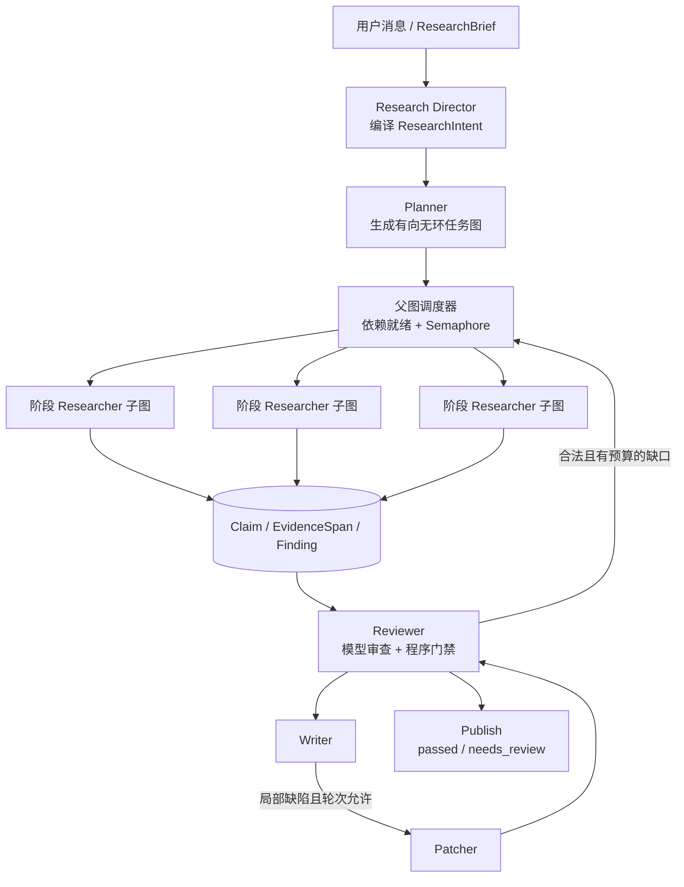
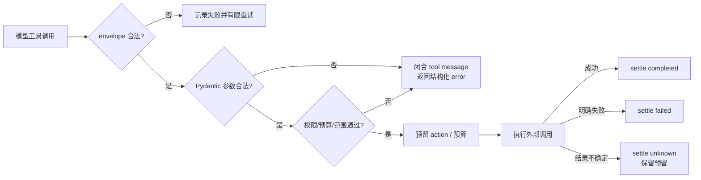

# Multi-Agent 工程实现说明

本文档对应 **Deep Research Agent v0.4.0-rc.1**，回答系统编排、记忆、恢复、安全和可观测性问题。内容以当前仓库代码为准；标为“当前限制”或“建议”的部分不是已实现能力。

## 先看整体边界

本项目采用受控工作流，而不是多个自治 Agent 自由对话：

语义工作由模型完成；调度、权限、预算、状态转换、ID、引用绑定、恢复和最终门禁由应用与 PostgreSQL 控制。核心实现位于 [`graph.py`](../src/research_agent/graph.py)、[`gateway.py`](../src/research_agent/gateway.py)、[`db.py`](../src/research_agent/db.py)、[`context.py`](../src/research_agent/context.py) 和 [`memory.py`](../src/research_agent/memory.py)。

## 1. 如何编排 Multi-Agent，如何编排单个 Agent

### 系统级编排

父 LangGraph 固定为：`intake → scope → plan → research → review → write/patch → publish`。其中：

- `Research Director` 把自由输入编译为 `ResearchIntent`，冻结要做的论文阶段、研究方法、来源角色、假设和能力缺口。
- `Planner` 只在已批准的阶段和方法内生成 `ResearchTask`，并把阶段依赖映射为任务 `depends_on`。
- `research` 按拓扑依赖找出 ready tasks，以 `asyncio.Semaphore` 控制并发；默认最多 3 个 Researcher，B0 基线强制串行。
- 依赖失败的任务被标记为 `cancelled/dependency_failed`，而不是带着不完整输入继续执行。
- `Reviewer` 可提出 gap task，但程序再次验证其 `stage/method` 是否属于冻结意图，并受任务数、补证轮数、预算和 95% 降级阈值限制。
- `Writer` 只消费审查可见的 Claim / EvidenceSpan；`Patcher` 只替换 Reviewer 指定的稳定节点 ID。

任务 DAG 在 Pydantic contract 中拒绝未知依赖、自依赖和环；运行时如果仍找不到 ready task，会以 `unschedulable_plan` 终止，而不是盲目轮询。

### 单个 Agent 编排

每个 Researcher 是独立 LangGraph 子图：`decide → tools → decide ... → extract → END`。

1. `decide` 收到冻结 brief、当前任务、依赖工件、紧凑进度 capsule 和当轮剩余额度。
2. 模型只能从本轮动态下发的工具 schema 中选择工具。
3. `tools` 用 Pydantic 二次校验参数，并执行来源授权、URL 候选、预算和范围检查。
4. 完整 assistant/tool 配对闭合后，消息被清空，状态折叠进 `ResearchProgress`。
5. 模型停止调用工具、达到轮次上限、连续两轮无增益或进入 95% 降级时，转入 `extract`。
6. Source Analyst 最多从每个已读切片抽取 4 个原子 Claim；应用复制原文 passage、验证 source ID 与字符范围，再持久化 Claim / EvidenceSpan。

阶段差异不是不同进程或不同模型实例，而是 `introduction`、`related_work`、`methodology` 等专用角色协议。当前没有 Agent 自主 spawn，也没有让 Agent 改写父图。

## 2. Agent 间协作与动态切换机制

Agent 不共享自由形式聊天历史，协作介质是版本化工件：

- 上游任务输出 `Finding`、Claim ID 和 EvidenceSpan ID；
- 下游任务只继承其依赖任务的上述工件和相关来源；
- Reviewer、Writer、Patcher 按稳定 ID 读取边界化证据 bundle；
- 完整事实源仍留在 PostgreSQL，跨 Agent 上下文被截断时记录 omitted IDs。

动态切换由父图条件边实现：

- Reviewer 发现可修复证据缺口：`review → gaps → research`；
- 首次审查后没有报告：`review → write → review`；
- 报告存在错误且 patch 轮次未耗尽：`review → patch → review`；
- 预算耗尽、无增益、补证/修订轮次到顶或没有错误：转 `publish`。

因此“切换”是可审计的状态迁移，不是 Agent 临场把控制权交给另一个任意角色。默认最多 2 轮 gap、2 轮 patch、8 个任务；实际值由冻结的 `RunProfile` 约束。

## 3. Agent 的长短期记忆如何存、粒度和使用方式

系统把“执行状态”“对话记忆”“长期知识”分开，避免把所有内容都塞进 prompt。

| 层次 | 存储 | 粒度 | 使用方式 |
|---|---|---|---|
| Researcher 工作记忆 | 子图 PostgreSQL checkpoint + `ResearchProgress` | 单任务；source ID、URL、合并读取范围、检索命中、覆盖项、未解决项、最近结果、无增益轮数 | 下一工具轮重建上下文；不重放完整 provider 历史 |
| Run 短期状态 | 父图 checkpoint、`records`、`actions`、`run_events` | 图节点、任务、动作、Claim、Span、报告 revision | 崩溃恢复、幂等重放、审计与 SSE 补读 |
| 对话记忆 | `messages`、`conversation_summaries`、conversation checkpoint | 消息为事实源；累计摘要按闭合 assistant 边界覆盖一段消息 | 每轮装配最近 12 条闭合消息（约 6 轮）和语义摘要 |
| 项目知识 | `project_memories` + evidence links | 一条目标、约束、结论或偏好事实 | 只有 v2、`confirmed` 记录自动注入；candidate 可显式搜索/阅读但不当作证据 |
| Observation | `observations` + relations/evidence | 一条 semantic、procedural 或 episodic 观察 | 项目级或当前用户全局；支持 complements / contradicts / supersedes |
| Profile | `profile_signals` | 一个 category/field/value 信号 | active/frozen 且 v2 的信号进入上下文；敏感字段拒绝学习 |

`MemoryBroker` 的总记忆预算为 `max(2k, min(24k, prompt_limit × 20%))`，初始配额为 recent 30%、summary 25%、memories 25%、observations 15%、profile 5%，未用额度可再分配。所有实际注入项记录 ID、分数、文本 hash 和省略原因。

长期记忆检索结合精确命中、全文检索和向量相似度，再做 RRF 融合。自动蒸馏使用独立 memory model，每个 job 最多产出 8 条 memory、8 条 observation、4 条 profile signal；只有用户开启长期学习时才调度，模型产物先进入 `candidate`。记忆是规划上下文，不能代替报告所需的原始来源和 Claim/EvidenceSpan。

语义压缩在上下文容量达到 85% 时触发，也可手动入队。摘要只接受已有 message/evidence ID，失败时降级为确定性摘录摘要；摘要目标不超过约 38.4k token。`messages` 和摘要是事实源，conversation checkpoint 只是可重建缓存。

## 4. 多轮对话管理、抗跑偏、中断恢复

多轮对话按 `Project → Conversation → Message → Research Run` 组织。同一 Conversation 同时只允许一个 queued/running Run；创建用户消息、assistant 占位和 Run 在同一事务内完成，并受 Idempotency-Key 保护。

抗跑偏依赖以下硬边界：

- 每个 Run 冻结 `ResearchBrief`、`ResearchIntent`、`RunProfile`、来源快照和运行时指纹；
- system policy 明确把来源、工具结果和 Agent finding 视为不可信数据；
- Planner 和 Reviewer 生成的新任务必须落在冻结 stage/method 矩阵内；
- 上下文 snapshot 保存约束 hash、选择/省略 ID 和 token 估算；
- 搜索摘要只能发现 URL，报告事实必须落到已读原文的 Claim/EvidenceSpan；
- 每轮状态转换和 action 都写入持久事件/账本。

中断恢复使用两级 checkpoint：父图 thread ID 是 Run ID，Researcher 子图 thread ID 是 `run_id:researcher:task_id`。Worker 重启后重新领取过期租约、增加 fencing token，并从 checkpoint 继续；已完成 action 的稳定 ID会直接复用。恢复前若 runtime fingerprint 不一致，Run 会转 `interrupted/runtime_version_mismatch`，避免新代码续跑旧状态。

用户取消会持久化 `cancelled`、递增 fence 并清除租约；旧 Worker 后续写入会被 `guard()` 拒绝。只有 `interrupted` Run 可 resume，已完成、失败或取消的终态需新建 Run。

## 5. 防止路径震荡、死循环和重复调用

| 风险 | 检测 | 治理 |
|---|---|---|
| 计划环或不可调度 | contract 拓扑校验；运行时无 ready task | 拒绝 Plan 或报 `unschedulable_plan` |
| Researcher 工具震荡 | `progress_signal` 对来源、范围、命中、覆盖等稳定状态做 hash | 连续 2 轮无新增信号即停止并抽取已有证据 |
| 重复读取 | 合并每个 source 的字符区间；检查请求范围是否已被覆盖 | 返回 `deduplicated`，不重复送正文 |
| 重复外部动作 | 稳定 `action_id=logical-key:attempt:n`；执行前查 action 账本 | 已 `completed` 直接复用；`reserved/unknown` 不冒充完成 |
| gap/patch 往返 | 比较证据 signal、限制 gap/patch 轮数和总任务数 | 无增益、达到上限或预算阈值后发布 `needs_review` |
| 图自身无限递归 | LangGraph `recursion_limit`：父图 100、子图 200 | 超限中断，由 Worker 保存部分结果/错误状态 |
| 创建请求重放 | tenant/scope/key advisory lock + request hash | 同 payload 回放结果；不同 payload 复用同 key 返回冲突 |

这里的“无增益”是结构信号，不是模型主观判断。它能阻止明显重复路径，但不能证明语义上已收敛；报告仍会披露 unresolved 项。

## 6. 子 Agent 超时、失联和并发修改冲突

当前 Researcher 是同一 Worker 进程内的协程，而非独立远程进程，因此没有每个子 Agent 的独立心跳。现有处理是：

- 模型与记忆请求默认 HTTP timeout 为 90 秒，搜索/抓取为 30 秒，DNS 解析为 5 秒；Run 每次预留动作时检查 `max_seconds`，默认总时限 1200 秒；
- Worker 每 10 秒续租，默认租约 45 秒；Worker 失联后另一 Worker 可回收过期 Run 并增加 fence；
- 旧 Worker 的 checkpoint、record、action settle 和终态写入都会因 fence 过期被拒绝；
- 子图 checkpoint 允许回到最后提交节点；恢复时未结算的 `reserved` attempt 标为 `unknown`，保留可能已发生的外部费用；后续可能在有限重试额度内进入下一个 attempt，因此不承诺外部副作用 exactly-once；
- 任务使用稳定且不同的 record ID，并发预算预留、状态更新在数据库事务和行锁内完成；同一 Run 又只有一个有效租约持有者。

Memory job 有独立租约、重试和 `dead_letter`，不会改变研究报告的终态。Conversation checkpoint 以 `memory_revision` 做比较后写入，revision 已变化就拒绝陈旧覆盖。

当前限制：没有对单个 Researcher 协程单独设置 wall-clock timeout，也没有分布式子 Agent 的独立 lease；`asyncio.gather` 会等待同一 ready batch。若要把 Researcher 拆成远程执行单元，应为 task 增加独立 lease/fence、超时取消、结果 CAS 和冲突合并协议，不能只依赖父 Run 租约。

## 7. 如何处理 Agent 的“任务幻觉”

项目不把模型文本当作完成凭据：

- 工具调用必须先形成 action reservation；只有工具真实返回并成功 `settle` 才是 `completed`。
- 模型生成的 tool envelope、JSON schema、ID、参数、来源授权和读取范围都由程序校验。
- Claim 只能引用已提供 passage ID；quote 由应用从原文复制，并校验 source、字符偏移和 hash。
- Reviewer 只能接受数据库中且本次上下文可见的 Claim ID。
- 报告发布前再次检查 Claim 状态、Span、来源版本、quote hash、表格单元格引用和数字可追溯性。
- `Experiment` 明确区分 planned / executed / blocked；当前没有实验执行器，因此没有运行产物时不得写 executed。
- Worker 的 `completed` 仅表示工作流收口；研究质量单独标为 `passed` 或 `needs_review`。

如果模型或工具响应不确定，action 进入 `unknown`，不会被当成已执行；预算或供应商失败时发布带缺口的部分报告，而不是补写不存在的结果。

## 8. Agent 连接数据库时如何防越权、泄漏和查询幻觉

当前系统**没有向模型暴露通用 SQL 工具**。Agent 只能调用 `search`、`fetch`、`search_sources`、`read_source`、`search_memory`、`read_memory`，数据库访问由应用的固定 repository 方法执行。这是最重要的边界：不让模型生成任意 SQL，也不让模型选择 tenant 条件。

已实现控制包括：

- API key 映射 tenant；每个事务使用 `set_config('app.tenant_id', tenant, true)`；
- 业务表和 checkpoint 表启用并强制 PostgreSQL RLS；运行角色是 `NOSUPERUSER NOBYPASSRLS`，启动时还会自检；
- project、conversation、source、memory ID 在服务端再次验证所属范围；
- 模型只能看到最小化的 context bundle，Trace 不记录来源正文或 reasoning；MinIO 私有桶按 tenant 命名空间隔离；
- 抓取只允许无凭证的公网 HTTP(S) 80/443，并做 DNS、重定向、类型、体积和超时检查，降低 SSRF 风险；
- profile 学习拒绝一组敏感属性字段，推断信号先为 candidate。

查询幻觉通过“固定查询 + typed contract + 结果 ID 校验”规避，而不是让模型解释 SQL 是否正确。若以后增加外部数据库 connector，最低要求应是只读最小权限账号、schema/table/column allowlist、参数化查询或受控查询 DSL、行列级策略、结果脱敏与上限、查询审计、成本/超时门禁，以及写操作的人工审批；这些外部 connector 能力当前尚未实现。

注意：action 表会保存受 RLS 保护的模型请求以便恢复和审计，因此生产部署还需配置数据库加密、备份权限、保留期和日志脱敏。本仓库没有宣称已经完成企业级密钥管理或跨集群合规治理。

## 9. 线上延迟升高时如何通过 Trace 定位和优化

`Gateway` 为每个 model/tool action 创建 OpenTelemetry span，并写入 `run_id`、`action_id`；成功 action 的 usage 同时保存 `latency_ms`、trace ID、span ID、token、缓存命中和费用，失败 action 仍有 started/finished 时间与错误类型。设置 `RESEARCH_TRACE_FILE` 后，当前 exporter 把不含正文和 reasoning 的 span metadata 写为 JSONL。节点阶段另有 `run.phase` 事件。

建议按以下顺序排查：

1. 用 Run ID 拉取 usage summary 和 events，确定延迟发生在 scope/plan、research、review 还是 write，而不是先看总耗时。
2. 由 action 的 trace/span ID 关联 Trace，按 `kind`、role、task ID、provider model 和状态比较 p50/p95/p99。
3. 将 `latency_ms` 与 `estimated_input_tokens`、实际 input/output tokens、cache hit、serialized bytes 联合看：输入变大通常指向上下文装配，输出变大指向 schema/提示，缓存骤降指向稳定前缀被破坏。
4. 搜索 `failed/unknown` 与 retry attempt；429/5xx、transport timeout 会产生额外尾延迟，`unknown` 还会占住预留预算。
5. 对 research 阶段拆分 search、fetch、retrieve、read 和 model；检查索引是否 fallback、抓取是否受站点影响、ready batch 是否被一个慢协程拖住。
6. 优化时优先减少无效上下文、重复证据和工具暴露，调整任务粒度或并发；只有确认 provider/网络瓶颈后再处理连接池、timeout 或供应商容量。

当前限制：内置 exporter 是开发用同步 JSONL exporter，没有 OTLP collector、跨服务自动传播、直方图或告警面板；span 属性也未完整写入 role/task/provider/status。因此当前可以从 action 账本精确定位单次调用，但生产级聚合需要补充 OTLP exporter、标准属性、采样策略和 SLO 告警。

## 10. Agent 的上下文工程

上下文分为四层，并按稳定顺序组装：

1. 固定 system policy：角色边界、来源不可信、禁止伪造与 schema 要求；
2. pinned context：冻结 brief、当前任务、验收条件、阶段协议和剩余额度；
3. 状态 capsule：授权来源、已读范围、检索命中、覆盖、未解决项和无增益计数；
4. artifacts：按问题相关性和稳定 ID 排序的 Claim/EvidenceSpan bundle，最多 16 组。

`build_context` 先保证 pinned context 能放入窗口，再逐个装入完整 artifact bundle，避免 Claim 被保留但 Span 被截掉。生成的 `ContextSnapshot` 记录裁剪前后估算、选择/省略 ID 和 constraints hash。模型请求还预留约 12k 空间给 policy、schema、消息和工具定义。

Researcher 每完成一个合法工具批次便丢弃 provider messages，下一轮从 capsule 重建；只有 action 账本保存完整受保护请求/响应。跨对话的 `MemoryBroker` 则独立按 recent/summary/memory/observation/profile 配额装配。可变的剩余额度放在消息尾部，固定前缀顺序不变，以提高 prompt cache 复用。

系统同时区分 `serialized_bytes`、保守 `estimated_input_tokens` 和 provider actual tokens：前两者用于窗口与调度，最后一个才是账单和 hard cap 事实源。

## 11. 工具很多时如何做 Tool Routing

当前只有 6 个 Researcher 工具，采用“代码先过滤、模型后选择”的两级 routing：

- 静态层：工具只定义在 `TOOL_MODELS`，参数 schema 为 `extra=forbid`；未知工具必定拒绝。
- 动态层：`decide` 根据 search/retrieval/task/run 剩余额度、retrieval fallback、85% 降级阈值，移除当前不可用工具后再把 schema 发给模型。
- 执行层：即使模型看到了工具，执行前仍检查 stage、来源 ID、URL 是否来自候选集、memory 是否有 project、读取范围和全局/单任务预算。
- 语义层：提示告诉 Agent 先 fetch/read 原文、memory 只是线索、搜索摘要不是证据。

这种方式减少无效 schema token，也避免把权限交给模型。工具规模继续增长时，建议增加确定性的 capability registry：先根据任务阶段和方法选工具域，再根据资源状态选具体工具；路由结果进入 context snapshot，并用离线 confusion matrix 评测误选率。当前未实现 embedding/LLM tool-router，也没有动态插件发现。

## 12. 工具调用非法、参数错误、超时或失败时如何容错

处理链如下：

- 非法 tool envelope、空响应、结构化 JSON/schema 错误或输出截断会转为 `ProviderError`；系统附带不含原始敏感数据的诊断提示，在 `max_retries` 内要求模型修复。截断时可在冻结上限内扩大 output ceiling。
- 参数使用 Pydantic 严格校验；工具拒绝会作为合法 `role=tool` 消息返回，保证 assistant/tool 协议闭合，Agent 可用其他工具或结束。
- 429 和 5xx 可重试；非 retryable 4xx 直接失败。重试有稳定 attempt ID 和 1/2/4 秒有界退避。
- provider 对 transport/5xx 等无法确认结果的异常会标记 `unknown`；通用工具异常只在该工具有计费预留时标记 `unknown`。已完成 action 在恢复时直接复用；未知 attempt 不会冒充成功或用同一 attempt ID 覆盖，但逻辑动作仍可能在总重试上限内进入下一个 attempt。
- 单项检索配额耗尽只移除该工具或降级，不让整个 Run 崩溃；研究/审查预算耗尽则进入受控 Review/Writer/partial report，质量标记 `needs_review`。
- Worker 失去 lease 或用户取消会取消本地 execution；后续所有写入还需通过 fence guard。

当前 exactly-once 边界是“已提交 action 可复用”。外部供应商已经返回、但本地尚未 settle 时仍可能处于未知窗口；系统会保留费用预留和人工可见状态，并把后续有限重试可能造成的重复风险显式留在账本中。未来若加入有副作用的工具，还必须由工具端提供幂等键或去重协议。

## 运行参数速查

| 参数 | 默认值 | 作用 |
|---|---:|---|
| `RunProfile.concurrency` | 3 | 同一 ready batch 的 Researcher 并发上限 |
| `max_tasks` | 8 | 初始任务与 gap task 总上限 |
| `max_gap_rounds` / `max_patch_rounds` | 2 / 2 | Review 循环上限 |
| `max_task_tools` | 12 | 非 B0 单任务工具调用上限 |
| `max_tool_calls` / `max_model_calls` | 80 / 40 | Run 级调用上限 |
| `max_seconds` | 1200 | Run 动作预留时检查的总时限 |
| `request_timeout` | 90 秒 | 默认模型/记忆 HTTP 超时 |
| `lease_seconds` / `heartbeat_seconds` | 45 / 10 秒 | Run 租约与续租周期 |
| soft / hard token | 180k / 250k | 分阶段软收口与绝对上限 |

## 已知工程边界

- 全局队列当前只允许 1 个有效 running Run；单 Run 内最多 3 个 Researcher 并发，不是跨集群调度器。
- Reviewer 与 Writer 可能使用同一模型，独立角色不能消除相关性错误。
- 内置 Trace 更适合单机开发排障，尚不是完整生产 observability stack。
- 没有通用数据库 Agent、远程子 Agent lease、实验执行沙箱或自动人工审批流。
- fixture 验证的是工程闭环；真实研究质量、记忆召回质量和长期线上 SLO 仍需 shadow/heldout 评测。

测试证据和尚未验证项见 [`verification-results.md`](verification-results.md)；Token 和上下文细节见 [`multi-agent-token-strategy.md`](multi-agent-token-strategy.md)。
