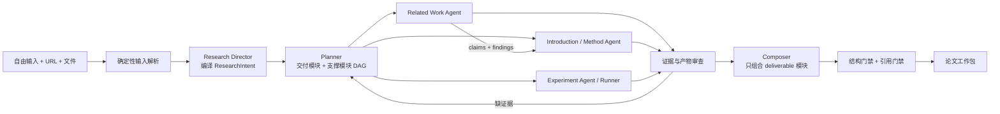

# Research Agent V2：从“报告模板”到“论文工作编排器”

## 1. 产品定义

V2 不要求用户先理解系统的表单和模板。用户只需提供一段自然语言，以及零到多个 URL 或文件。系统把它编译成一份可执行的 `ResearchIntent`，自行判断需要完成论文工作的哪些部分，以及每部分采用什么研究方法。

核心对象不再是 `technical_comparison / paper_review / general_research` 三选一，而是两个正交维度：

- **论文阶段**：Introduction、Related Work、Methodology、Experiment、Results、Discussion、Conclusion。
- **工作方法**：文献检索、材料综合、缺口分析、复现、实验执行、证据审计。

同一个请求可以跨阶段。例如“读这篇论文，找可改进点并设计验证实验”应被编译为 `related_work + methodology + experiment`，而不是被塞进一个 `paper_review` 模板。这里必须区分：

- `role=deliverable`：用户明确或隐含要求看到的最终产出模块；
- `role=supporting`：为了完成交付模块而在内部执行的依赖模块，不自动变成最终报告章节。

例如用户只要 Method，Research Director 可以生成 `Related Work (supporting) → Method (deliverable)`。Related Work Agent 负责找基线、机制与不足，Method Agent 消费这些证据形成设计，最终只交付 Method。用户要求 Introduction 时也常形成 `Related Work (supporting) → Introduction (deliverable)`。

## 2. 单一输入模型

首页只保留：

1. 一个自由输入框：问题、约束、粘贴的 URL 都可出现；
2. 一个附件入口：PDF、Markdown、HTML、文本；
3. 一个开始按钮。

处理分两层：

- **确定性解析**识别 URL、附件 ID、语言和显式格式要求，不消耗模型，也避免模型漏掉 URL。
- **语义编译**判断每个来源的角色（主论文、支持文献、领域种子、用户材料），归一化目标，选择论文阶段、方法和交付物，并披露能力缺口。

只有当缺失信息会导致成本、外部副作用或研究方向发生实质变化时才阻塞追问；其他歧义写成可见假设，先继续研究。

## 3. 工作流

当前仓库已落地 `A → H` 的兼容式骨架；`E3` 的真实执行器尚未实现，因此系统必须把此类请求标成能力缺口，并输出可执行实验方案而非伪造结果。

## 4. 各论文阶段的最小交付协议

| 阶段 | 必须回答 | 推荐结构 | 质量门禁 |
|---|---|---|---|
| Introduction | 为什么值得做、具体缺口是什么、要做什么 | 背景 → 已知边界 → 缺口 → 目标/假设 → 方法直觉 → 意义 | 缺口必须由相关工作支持；目标必须对应缺口；意义不能空泛 |
| Related Work | 已有工作如何分群、结论和条件有何异同 | taxonomy + 对比矩阵 + 冲突/局限 | 优先原始论文；逐项引用；区分不可比实验条件 |
| Methodology | 方法怎样工作、相对基线改了什么 | 设计目标 + 原理 + 算法/接口 + 假设 + 失败模式 | 每个设计选择关联缺口；推断与来源陈述分开 |
| Experiment | 怎样证伪/证实假设，或实际执行发生了什么 | 假设 + 数据 + baseline + protocol + metric + analysis + risk | `planned/executed/blocked` 必须明确；无运行产物不得写 `executed` |
| Results | 观察到了什么 | 结果表 + 不确定性 + 消融 + 失败案例 | 只接收运行产物或明确的作者报告值；两者不可混称 |
| Discussion | 结果意味着什么、边界在哪 | 解释 + 替代解释 + 威胁 + 外推边界 | 不得超出证据适用范围 |
| Conclusion | 最终回答和下一步 | 回答 + 置信边界 + 下一步 | 不引入正文未建立的新事实 |

## 5. 当前代码映射

| 能力 | 当前改造点 | 后续演进 |
|---|---|---|
| 意图编译 | `contracts.py::ResearchIntent`、`graph.py::understand` | 加用户确认/编辑 intent 的轻量交互 |
| 自动 URL 路由 | `service.py::extract_urls` | DOI/arXiv/GitHub 等标识解析和去重 |
| 阶段化计划 | `ResearchTask.stage/method/deliverable/output_role` | 继续把各阶段的产物升级为独立 schema |
| 模块依赖 | `StageDecision.role/depends_on`，Planner 映射成任务 DAG | 增加产物级依赖和按需重跑 |
| 模块 Agent | Researcher 按阶段加载专用角色协议，后置模块继承依赖模块的 claims/findings | 独立上下文预算、模型和验收器 |
| 阶段化报告 | `ReportNode.stage/output_mode/execution_status` | 把通用 node 升级为各阶段独立 schema |
| 结构门禁 | `graph.py::report_checks` | 为 Introduction 论证链、Related Work 覆盖率和实验产物增加专门 validator |
| UI | 单一输入 + AI Research Brief + 阶段卡片 | 支持用户在执行前一键删改阶段，而非填写复杂表单 |
| 实验执行 | 当前只披露 capability gap | 新增隔离的 `ExperimentRunner` 子图与 artifact store |

## 6. 实验执行器边界

不能把 shell 工具直接塞进现有 Researcher。实验运行需要独立信任边界：

1. `ReproductionSpec`：仓库/版本、环境、数据许可、命令、资源、成功条件；
2. `ExecutionApproval`：网络、密钥、GPU、费用和最大运行时间的显式授权；
3. 临时工作区或容器：固定依赖、默认断网、资源限额、只暴露批准目录；
4. `ExperimentArtifact`：代码 diff、配置、日志、指标、图表、环境哈希；
5. `ResultReviewer`：检查运行是否成功、基线是否公平、指标是否来自产物；
6. Writer 只能依据 `ExperimentArtifact` 生成 `experiment_result/executed` 节点。

失败也必须成为有效结果：保存日志和阻塞原因，输出 `blocked`，绝不由语言模型补全“可能的结果”。

## 7. 迁移顺序

### Phase 1：意图与输出协议（本次纵切）

- 单一输入；自动抽取 URL；
- `ResearchIntent`、交付/支撑角色和模块依赖 DAG；
- 阶段化报告元数据；
- 缺阶段、伪实验结果的确定性门禁；
- 保持旧 `template` 字段和 JSONB 数据兼容，不做数据库迁移。

### Phase 2：专用阶段 Agent

- Introduction Agent 只产论证图，不先写散文，并消费 Related Work 的证据产物；
- Related Work Agent 产 taxonomy、论文矩阵和冲突集；
- Method Agent 产设计规格和可证伪假设；
- Experiment Designer 产机器可执行的 `ExperimentSpec`；
- Composer 只组合 `role=deliverable` 的模块；支撑模块只贡献证据和中间产物。

### Phase 3：实验与复现

- 实现 `ExperimentRunner`、审批、沙箱和产物协议；
- 接入仓库、数据集和计算资源；
- 将“作者报告结果”“本系统复现结果”“新实验结果”设为不同 provenance 类型。

### Phase 4：质量闭环

- 建立按请求类型分层的测试集，而不是只测三种模板；
- 加入研究者盲评和成对偏好评测；
- 用失败样例更新 intent、阶段 validator 和检索策略，而不是仅调 Writer prompt。

## 8. 验收指标

基础工程指标继续保留（恢复、预算、租户隔离、引用可定位），新增研究质量指标：

- **Intent accuracy**：应选阶段、方法和来源角色的 macro F1；
- **Argument completeness**：Introduction 的 gap → objective → rationale → significance 链覆盖率；
- **Related-work coverage**：关键论文召回、原始来源占比、跨来源综合率、冲突识别率；
- **Experiment honesty**：无产物却声称执行的比例必须为 0；
- **Claim support**：引用蕴含率、限定条件保留率、数字可追溯率；
- **Actionability**：研究者能否直接据此开始写作或运行实验；
- **Interaction cost**：首次提交前字段数、完成任务所需追问轮数。

建议先建立 30–50 个真实请求的小型 golden set，覆盖“用户已给切入点”“需要 AI 找切入点”“只做相关工作”“复现参考工作”“设计/执行实验”和混合请求。V2 是否变好，应以这些任务上的盲评为准，而不是以报告长度或 Agent 数量为准。
